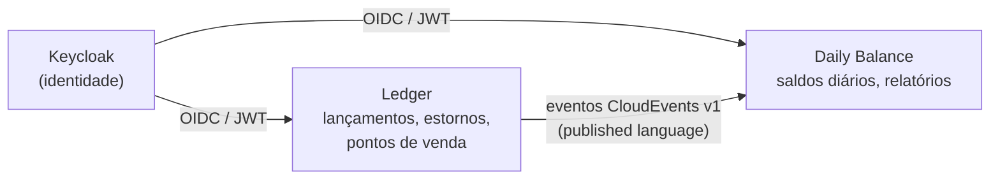
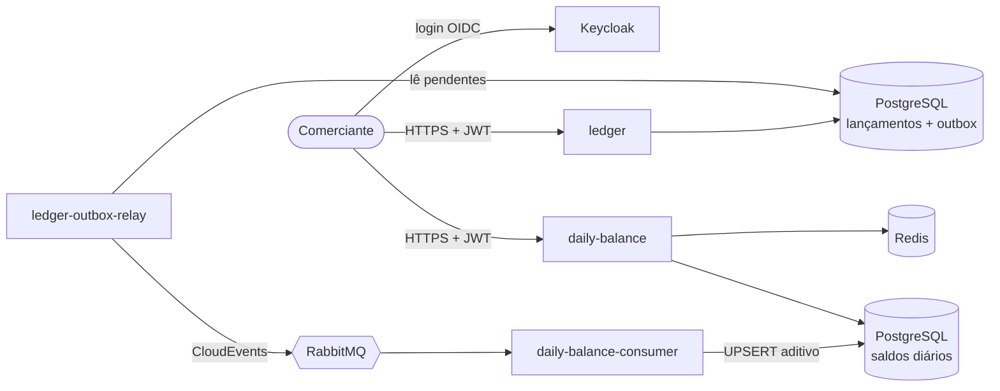
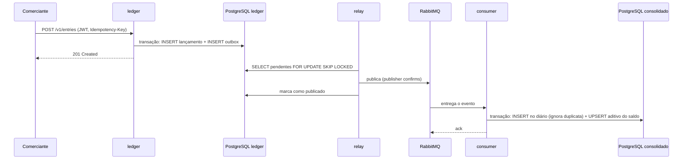
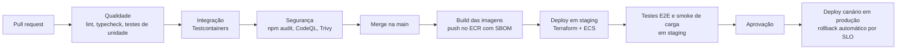

# Cash Flow — Controle de Fluxo de Caixa

Solução para o controle diário de fluxo de caixa de um comerciante: registro de lançamentos (débitos e créditos) e relatório de saldo diário consolidado.

A arquitetura é composta por **dois serviços independentes que se comunicam apenas por eventos**. O registro de lançamentos continua disponível mesmo com o consolidado fora do ar, e o consolidado responde a partir de um modelo de leitura pré-calculado.

Os dois requisitos não funcionais do desafio são comprovados por testes automatizados contra o ambiente completo:

| Requisito                                                             | Resultado medido                                                                                    |
| --------------------------------------------------------------------- | --------------------------------------------------------------------------------------------------- |
| O registro de lançamentos não fica indisponível se o consolidado cair | 900 lançamentos gravados com o consolidado fora do ar: **0 falhas**, 900 de 900 consolidados depois |
| Consolidado com 50 req/s no pico e no máximo 5% de perda              | 6.001 requisições em 2 minutos: **0% de perda**, p95 de 6,5 ms (também 0% com Redis ou banco fora)  |

## Sumário

1. [Domínios e capacidades](#domínios-e-capacidades)
2. [Requisitos](#requisitos)
3. [Arquitetura alvo](#arquitetura-alvo)
4. [Decisões de arquitetura e tecnologia](#decisões-de-arquitetura-e-tecnologia)
5. [Segurança](#segurança)
6. [Observabilidade](#observabilidade)
7. [Resiliência e testes de carga](#resiliência-e-testes-de-carga)
8. [Como executar](#como-executar)
9. [APIs](#apis)
10. [CI/CD (proposta)](#cicd-proposta)
11. [Testes E2E (proposta)](#testes-e2e-proposta)
12. [Evoluções futuras](#evoluções-futuras)

## Domínios e capacidades

Registrar lançamentos e consultar o saldo consolidado são necessidades com perfis opostos: a primeira é transacional, é a fonte da verdade e não pode parar; a segunda é de leitura, derivada, recebe picos de consulta e pode ficar alguns segundos atrás. Por isso viraram dois bounded contexts.

| Subdomínio                  | Tipo     | Solução                                                   |
| --------------------------- | -------- | --------------------------------------------------------- |
| Lançamentos (ledger)        | Núcleo   | Serviço `ledger`: lançamentos, estornos e pontos de venda |
| Saldo diário consolidado    | Núcleo   | Serviço `daily-balance`: consolidação e relatórios        |
| Identidade e acesso         | Genérico | Keycloak (OIDC)                                           |
| Mensageria, observabilidade | Genérico | RabbitMQ, OpenTelemetry e stack Grafana                   |



O único artefato compartilhado entre os contextos é o contrato dos eventos ([`packages/contracts`](packages/contracts)), sem lógica de negócio. O consolidado traduz o evento para o seu próprio modelo (camada anticorrupção).

| Capacidade                       | Contexto      | O que faz                                                                                |
| -------------------------------- | ------------- | ---------------------------------------------------------------------------------------- |
| Registrar e estornar lançamentos | Ledger        | Crédito ou débito com data de competência; correção sempre por estorno, nunca por edição |
| Configurar pontos de venda       | Ledger        | Fuso horário de cada loja, usado para definir o dia do caixa                             |
| Publicar eventos                 | Ledger        | Entregar cada lançamento ao consolidado, sem perder nenhum                               |
| Consolidar saldos diários        | Daily Balance | Somar créditos e débitos por comerciante e dia, aplicando cada lançamento uma única vez  |
| Relatórios de saldo              | Daily Balance | Saldo do dia e relatório de período com saldo acumulado                                  |
| Reprocessar e recuperar          | Daily Balance | Reconstruir um dia e devolver à fila eventos que falharam                                |
| Autenticar, autorizar e isolar   | Ambos         | Cada usuário só acessa os dados do próprio comerciante                                   |

**Linguagem ubíqua:** lançamento (_entry_), crédito/débito (_credit/debit_), estorno (_reversal_), data de competência (_business date_, o dia do caixa, que pode diferir do instante do registro), ponto de venda (_point of sale_), saldo diário (_daily balance_), saldo de abertura e de fechamento (_opening/closing balance_).

## Requisitos

### Funcionais

| ID    | Requisito                                                                                                 |
| ----- | --------------------------------------------------------------------------------------------------------- |
| RF-01 | Registrar crédito ou débito para o comerciante autenticado, com retentativa segura por `Idempotency-Key`  |
| RF-02 | Estornar um lançamento (uma única vez; um estorno não pode ser estornado)                                 |
| RF-03 | Consultar um lançamento e listar lançamentos por período (até 92 dias, paginado)                          |
| RF-04 | Configurar o fuso horário (IANA) de um ponto de venda                                                     |
| RF-05 | Consolidar cada lançamento no saldo do seu dia, exatamente uma vez                                        |
| RF-06 | Consultar o saldo de um dia e o relatório de um período (até 92 dias) com saldos de abertura e fechamento |
| RF-07 | Reconstruir o saldo de um dia e recuperar eventos que falharam                                            |
| RF-08 | Autenticar usuários, autorizar por papel e isolar os dados de cada comerciante                            |

### Regras de negócio

- Valores em centavos inteiros e positivos, apenas em BRL; ponto flutuante nunca é usado para dinheiro.
- A data de competência é o dia do caixa no fuso do ponto de venda (sem ponto de venda, `America/Sao_Paulo`); não pode ser futura nem anterior a 30 dias.
- O instante do registro é gravado em UTC junto com o fuso vigente; a hora local é derivada, não armazenada.
- Lançamentos são imutáveis: correções são feitas por estorno, que usa a mesma data de competência do original.
- Saldo do dia = créditos − débitos. Saldo de fechamento = saldo de abertura (soma dos dias anteriores) + saldo do dia.

### Não funcionais

| ID     | Requisito                                                             | Meta e resultado                                               |
| ------ | --------------------------------------------------------------------- | -------------------------------------------------------------- |
| RNF-01 | O ledger não fica indisponível se o consolidado cair (**do desafio**) | 0 falhas com o consolidado fora do ar                          |
| RNF-02 | 50 req/s no consolidado com no máximo 5% de perda (**do desafio**)    | 0% de perda no pico                                            |
| RNF-03 | Latência p95 do consolidado abaixo de 500 ms                          | 6,5 ms a 50 req/s                                              |
| RNF-04 | Lançamento refletido no saldo em até 30 s (p95)                       | 0,5 s                                                          |
| RNF-05 | Nenhum lançamento perdido ou contado duas vezes                       | Conciliação do teste de resiliência igual ao centavo           |
| RNF-06 | Escalar horizontalmente e tolerar falhas de cache, broker e banco     | 400 req/s com uma réplica; 0% de perda com Redis ou banco fora |
| RNF-07 | Acesso autenticado, menor privilégio e isolamento entre comerciantes  | JWT, escopos por papel, comerciante vindo do token             |
| RNF-08 | Rastreabilidade de ponta a ponta, métricas e alertas                  | OpenTelemetry, dashboard e 10 alertas                          |

**Premissas:** "perda" é toda requisição sem resposta de sucesso (erro, timeout ou limitação); o pico pode vir de um único comerciante; o consolidado pode ser eventualmente consistente, desde que convirja rápido e com exatidão.

## Arquitetura alvo



| Processo                 | Responsabilidade                                                                                             |
| ------------------------ | ------------------------------------------------------------------------------------------------------------ |
| `ledger`                 | API de lançamentos. Grava o lançamento e o evento na mesma transação (outbox); não conhece o broker          |
| `ledger-outbox-relay`    | Lê o outbox e publica os eventos no RabbitMQ. Se cair, a API continua registrando e o backlog fica no outbox |
| `daily-balance-consumer` | Consome os eventos e atualiza o saldo diário, uma única vez por lançamento                                   |
| `daily-balance`          | API do relatório. Lê o modelo pré-calculado, com cache Redis e circuit breakers                              |
| `keycloak`               | Autentica usuários e emite tokens JWT com o comerciante e os escopos                                         |

### Fluxo de um lançamento



- **Nenhum evento é perdido:** o evento é gravado com o lançamento; o relay só marca como publicado após a confirmação do broker; as filas são duráveis (_quorum queues_).
- **Nenhum evento é contado duas vezes:** a entrega é _at-least-once_, e o consumidor registra cada evento em um diário (`applied_movements`) com chave pelo id do evento e pelo id do lançamento, na mesma transação da soma.
- **Falhas no consumo:** falhas transitórias voltam após 10 s por uma fila de espera; mensagens inválidas ou que esgotam 5 tentativas vão para uma DLQ, de onde podem ser devolvidas com um comando.
- **Leitura:** a consulta lê linhas já somadas por comerciante e dia (sem somar lançamentos), com cache Redis de 5 s. Se o banco falhar, a API responde com o último relatório conhecido (`x-cache: STALE`).

### Arquitetura interna: hexagonal

Cada serviço segue Ports and Adapters. O domínio e os casos de uso dependem apenas de interfaces; banco, broker, HTTP e cache ficam nos adapters.

```
services/<service>/src/
├─ domain/          # entidades, value objects e regras puras
├─ application/     # casos de uso e ports (inbound e outbound)
├─ adapters/
│  ├─ inbound/      # HTTP (Fastify), consumidor de fila, worker do relay
│  └─ outbound/     # PostgreSQL, RabbitMQ, Redis, telemetria
├─ container.ts     # composition root
└─ main.ts          # inicialização (mais relay.ts, consumer.ts e comandos)
```

Em microsserviços, os contratos de comunicação são a parte que mais muda (campo novo, versão `.v2`, troca de broker). Com a arquitetura hexagonal, essas mudanças ficam restritas aos adapters: trocar RabbitMQ por SQS, por exemplo, exige apenas um novo adapter de publicação e um de consumo, sem tocar em domínio e casos de uso.

### Implantação em produção (AWS)

| Camada     | Serviço                                                                                                              |
| ---------- | -------------------------------------------------------------------------------------------------------------------- |
| Entrada    | API Gateway ou ALB, com WAF e TLS                                                                                    |
| Computação | ECS Fargate, um serviço por processo, em pelo menos duas zonas de disponibilidade, com autoscaling                   |
| Dados      | RDS PostgreSQL Multi-AZ, um banco por serviço; ElastiCache (Redis) com réplica                                       |
| Mensageria | SNS + SQS (mais barato que um cluster de broker para este volume) ou Amazon MQ para RabbitMQ (sem mudança de código) |
| Identidade | Keycloak no Fargate ou Amazon Cognito                                                                                |
| Segredos   | Secrets Manager e KMS                                                                                                |
| Telemetria | Collector OpenTelemetry com Amazon Managed Prometheus e Grafana                                                      |

## Decisões de arquitetura e tecnologia

### Tipo de arquitetura: microsserviços orientados a eventos

O requisito mais forte é que o registro de lançamentos não pare se o consolidado cair. Isso exige isolamento de falha real: processos, bancos e deploys separados, sem chamada síncrona entre eles. A divisão foi feita apenas onde o requisito exige: dois serviços, um por bounded context.

| Alternativa      | Por que não                                                                                 |
| ---------------- | ------------------------------------------------------------------------------------------- |
| Monólito         | Um erro ou pico no relatório derrubaria também o registro de lançamentos                    |
| Monólito modular | Separa bem o domínio, mas compartilha processo, pool de conexões e deploy; não isola falhas |
| Serverless       | Atende a carga, mas dificulta a execução local e aumenta o acoplamento ao provedor          |

### Padrões

| Padrão                                          | Por quê                                                                                        |
| ----------------------------------------------- | ---------------------------------------------------------------------------------------------- |
| Comunicação assíncrona por eventos              | O ledger não conhece nem espera o consolidado                                                  |
| Transactional Outbox com relay separado         | Evita a escrita dupla (banco + broker) e tira o broker do caminho crítico do registro          |
| CQRS com modelo de leitura materializado        | O saldo é atualizado a cada evento, não calculado na consulta; isso torna 50 req/s trivial     |
| Consumidor idempotente                          | Torna seguras as reentregas da entrega _at-least-once_                                         |
| Cache com reserva para falhas e circuit breaker | Mantém o relatório disponível com Redis ou banco fora do ar                                    |
| CloudEvents e contrato versionado               | Envelope padrão de mercado; mudanças de contrato explícitas (`.v1`)                            |
| Arquitetura hexagonal e DDD tático              | Regras de negócio isoladas de infraestrutura; value objects impedem dados inválidos no domínio |

### Tecnologias

| Tecnologia                                        | Por quê                                                                                                 |
| ------------------------------------------------- | ------------------------------------------------------------------------------------------------------- |
| Node.js 22 + TypeScript estrito                   | I/O não bloqueante para APIs e consumidores; tipagem forte para modelar o domínio                       |
| Fastify + TypeBox                                 | Alto desempenho; um único schema valida a entrada, tipa o código e gera o OpenAPI (`/docs`)             |
| PostgreSQL 17, um por serviço                     | ACID para dinheiro e para o outbox; `SKIP LOCKED` para relays concorrentes; UPSERT aditivo; constraints |
| RabbitMQ 4                                        | Filas duráveis, DLQ nativa e simples de operar; Kafka seria desproporcional para dezenas de eventos/s   |
| Redis                                             | Cache compartilhado entre réplicas para absorver picos                                                  |
| Keycloak                                          | Provedor OIDC open source, com o realm versionado como código                                           |
| OpenTelemetry + Prometheus, Tempo, Loki e Grafana | Instrumentação padrão e neutra; os serviços só conhecem OTLP                                            |
| SQL explícito com `pg`                            | Controle total das construções de concorrência (`SKIP LOCKED`, `ON CONFLICT`), que um ORM esconderia    |
| Vitest, Testcontainers e k6                       | Testes rápidos; integração contra bancos e broker reais; carga e resiliência automatizadas              |

**Por que relacional e não NoSQL:** o domínio é financeiro e precisa de transações ACID envolvendo o lançamento e o evento, constraints que garantem invariantes sob concorrência (um único estorno por lançamento, valor positivo) e somas atômicas. Com MongoDB ou DynamoDB, essas garantias exigiriam desenhos mais complexos.

**Decisões de domínio:** valores em centavos inteiros; data de competência separada do instante do registro, com fuso por ponto de venda (o Brasil tem quatro fusos, e uma venda às 00h30 em Fernando de Noronha seria rejeitada como data futura com um fuso único); idempotência por `Idempotency-Key` gravada na mesma transação do lançamento; erros no padrão Problem Details (RFC 9457).

## Segurança

| Controle              | Como                                                                                                                                                    |
| --------------------- | ------------------------------------------------------------------------------------------------------------------------------------------------------- |
| Autenticação          | Keycloak (OIDC). Os serviços validam o JWT localmente com as chaves públicas (JWKS): assinatura RS256, emissor, audiência e expiração                   |
| Isolamento            | O comerciante vem da claim `merchant_id` do token, um atributo que só o administrador altera; não existe parâmetro de comerciante na API                |
| Autorização           | Escopos por rota (`ledger:write`, `ledger:read`, `balance:read`), concedidos pelos papéis `merchant-operator` e `merchant-viewer`                       |
| Proteção contra abuso | Rate limiting por comerciante (ledger: 20 req/s; consolidado: 100 req/s, o dobro do pico), limite de corpo e headers de segurança                       |
| Entrada               | Toda requisição validada por JSON Schema; os value objects validam novamente                                                                            |
| Erros                 | `401`/`403` no padrão Bearer (RFC 6750); erros internos sem detalhes de implementação                                                                   |
| Disponibilidade       | O Keycloak não está no caminho de cada requisição: as chaves públicas ficam em cache, então uma queda dele não afeta requisições com tokens já emitidos |

**Em produção:** TLS no gateway, segredos no Secrets Manager, criptografia em repouso (KMS), um usuário de broker por serviço com privilégio mínimo, e o fluxo de login por senha (habilitado apenas para testes locais) desabilitado em favor de Authorization Code com PKCE.

## Observabilidade

Os quatro processos usam **OpenTelemetry** e enviam traces, métricas e logs a um Collector, que distribui para **Tempo**, **Prometheus** e **Loki**. O **Grafana** (http://localhost:3000) abre com o dashboard **Cash Flow**.

- **Trace de ponta a ponta:** o contexto do trace é gravado no próprio evento (`traceparent`, extensão de tracing do CloudEvents), então um único trace vai do `POST /v1/entries` até a gravação do saldo, passando pelo outbox e pelo broker.
- **Correlação:** toda resposta traz o header `x-trace-id`, e todo log traz `trace_id`, com links entre logs e traces no Grafana.
- **Métricas próprias:** lançamentos registrados, eventos pendentes no outbox e idade do mais antigo, resultado do consumidor, tempo entre registro e consolidação, origem das respostas do cache e estado dos circuit breakers, além da profundidade das filas e da DLQ.
- **Alertas** ([`alerts.yml`](infra/prometheus/alerts.yml)): perda acima de 5% no consolidado, erros no ledger, latência, atraso do outbox e da consolidação, mensagens na DLQ, circuito aberto e serviço que parou de reportar.

## Resiliência e testes de carga

Todos os cenários abaixo foram executados derrubando componentes com o ambiente do Docker Compose em execução.

| Componente fora do ar | Registro de lançamentos | Consulta do consolidado                                           |
| --------------------- | ----------------------- | ----------------------------------------------------------------- |
| Consolidado inteiro   | `201`                   | Indisponível; os eventos esperam na fila e são aplicados na volta |
| Banco do consolidado  | `201`                   | `200` com o último relatório conhecido (`STALE`)                  |
| Redis                 | Não afetado             | `200` pelo banco; o circuit breaker evita latência extra          |
| RabbitMQ ou relay     | `201`                   | Dados até o momento; os eventos acumulam no outbox                |
| Consumidor            | `201`                   | Dados até o momento; os eventos acumulam na fila                  |

Testes automatizados com [k6](https://k6.io), em um MacBook Air M1 com todos os containers na mesma máquina:

| Teste                                                  | Comando                            | Resultado                                                                 |
| ------------------------------------------------------ | ---------------------------------- | ------------------------------------------------------------------------- |
| Lançamentos a 10 req/s com o consolidado fora por 30 s | `npm run test:resilience`          | 900 gravados, 0 falhas, 900 de 900 consolidados, totais iguais ao centavo |
| Pico de 50 req/s por 2 minutos                         | `npm run test:load`                | 6.001 requisições, 0% de falhas, p95 de 6,5 ms                            |
| Pico com o Redis fora por 30 s                         | `npm run test:resilience:redis`    | 0% de falhas, p95 de 22 ms                                                |
| Pico com o banco do consolidado fora por 30 s          | `npm run test:resilience:database` | 0% de falhas, p95 de 8,3 ms                                               |
| Estresse com uma única réplica                         | Ver abaixo                         | 0% de falhas a 400 req/s (8× o pico), p95 de 20,9 ms                      |

Para o teste de estresse, o limite de requisições por comerciante (100 req/s) é desativado só durante a medição:

```bash
DAILY_BALANCE_RATE_LIMIT_MAX=1000000 docker compose up -d daily-balance
docker compose run --rm -e RATE=400 -e DURATION=60s k6 run /scripts/load/daily-balance-peak.js
docker compose up -d daily-balance
```

## Como executar

**Pré-requisitos:** Docker com Docker Compose v2. Node.js 22 apenas para desenvolvimento e testes fora do Docker. `jq` para os exemplos de linha de comando.

```bash
docker compose up -d --build
docker compose ps
```

| Recurso             | Endereço                                               |
| ------------------- | ------------------------------------------------------ |
| ledger              | http://localhost:3001 (OpenAPI em `/docs`)             |
| daily-balance       | http://localhost:3002 (OpenAPI em `/docs`)             |
| Keycloak            | http://localhost:8180 (administração: `admin`/`admin`) |
| Grafana             | http://localhost:3000                                  |
| Prometheus          | http://localhost:9090                                  |
| RabbitMQ Management | http://localhost:15672 (`cashflow`/`cashflow`)         |

### Usuários de demonstração

Todos com a senha `cashflow`:

| Usuário           | Papel                                     | Comerciante                            |
| ----------------- | ----------------------------------------- | -------------------------------------- |
| `operador.centro` | `merchant-operator` (registra e consulta) | `6f1c2a5e-8d4b-4c3a-9e2f-1a2b3c4d5e6f` |
| `analista.centro` | `merchant-viewer` (apenas consulta)       | `6f1c2a5e-8d4b-4c3a-9e2f-1a2b3c4d5e6f` |
| `operador.norte`  | `merchant-operator`                       | `9a8b7c6d-5e4f-4a3b-8c2d-1e0f9a8b7c6d` |

### Testes

| Comando                             | O que cobre                                                                                              |
| ----------------------------------- | -------------------------------------------------------------------------------------------------------- |
| `npm test`                          | 307 testes de unidade: domínio, casos de uso, rotas HTTP, mensageria e segurança, sem infraestrutura     |
| `npm run test:integration`          | 41 testes contra PostgreSQL, RabbitMQ, Redis e Keycloak reais via Testcontainers, incluindo concorrência |
| `npm run test:load`                 | Carga de 50 req/s com k6                                                                                 |
| `npm run test:resilience`           | Queda do consolidado durante o registro de lançamentos                                                   |
| `npm run lint`, `npm run typecheck` | Análise estática e verificação de tipos                                                                  |

### Desenvolvimento local

```bash
npm install
cp services/ledger/.env.example services/ledger/.env
cp services/daily-balance/.env.example services/daily-balance/.env
docker compose up -d postgres-ledger postgres-daily-balance rabbitmq redis keycloak
npm run dev -w services/ledger
npm run dev:relay -w services/ledger
npm run dev -w services/daily-balance
npm run dev:consumer -w services/daily-balance
```

Para enviar telemetria em desenvolvimento, suba também o `otel-collector`; sem ele, remova as variáveis `OTEL_*` dos arquivos `.env` dos serviços.

## APIs

Todas as rotas de negócio exigem `Authorization: Bearer <token>`. Também é possível testar pelo Swagger (`/docs` de cada serviço), que mostra os schemas de cada body. Para obter um token:

```bash
TOKEN=$(curl -s http://localhost:8180/realms/cash-flow/protocol/openid-connect/token \
  -d grant_type=password -d client_id=cash-flow-app \
  -d username=operador.centro -d password=cashflow | jq -r .access_token)
```

| Serviço       | Rota                               | Escopo         | Descrição                                                |
| ------------- | ---------------------------------- | -------------- | -------------------------------------------------------- |
| ledger        | `POST /v1/entries`                 | `ledger:write` | Registra um crédito ou débito (aceita `Idempotency-Key`) |
| ledger        | `POST /v1/entries/{id}/reversal`   | `ledger:write` | Estorna um lançamento                                    |
| ledger        | `GET /v1/entries/{id}`             | `ledger:read`  | Consulta um lançamento                                   |
| ledger        | `GET /v1/entries?from=&to=`        | `ledger:read`  | Lista lançamentos por período, paginado                  |
| ledger        | `PUT /v1/points-of-sale/{id}`      | `ledger:write` | Configura o fuso de um ponto de venda                    |
| daily-balance | `GET /v1/daily-balances/{data}`    | `balance:read` | Saldo de um dia, com saldos de abertura e fechamento     |
| daily-balance | `GET /v1/daily-balances?from=&to=` | `balance:read` | Relatório de até 92 dias, dia a dia                      |

Exemplos prontos para cada rota (o token acima é de um operador; o `analista.centro` só consegue as consultas):

```bash
POS=3e4d5c6b-7a89-4b0c-9d1e-2f3a4b5c6d7e
HOJE=$(TZ=America/Sao_Paulo date +%F)
ONTEM=$(TZ=America/Sao_Paulo date -v-1d +%F 2>/dev/null || TZ=America/Sao_Paulo date -d yesterday +%F)

# Configurar o fuso de um ponto de venda
curl -X PUT http://localhost:3001/v1/points-of-sale/$POS \
  -H "authorization: Bearer $TOKEN" -H "content-type: application/json" \
  -d '{"timeZone":"America/Manaus"}'

# Registrar um crédito (venda) nesse ponto de venda; repetir com a mesma chave devolve a resposta original
CHAVE=venda-$(date +%s)
ENTRY_ID=$(curl -s -X POST http://localhost:3001/v1/entries \
  -H "authorization: Bearer $TOKEN" -H "content-type: application/json" \
  -H "idempotency-key: $CHAVE" \
  -d "{\"type\":\"CREDIT\",\"amountInCents\":15990,\"description\":\"Venda 1024\",\"pointOfSaleId\":\"$POS\"}" | jq -r .id)

# Registrar um débito (pagamento), sem ponto de venda
curl -X POST http://localhost:3001/v1/entries \
  -H "authorization: Bearer $TOKEN" -H "content-type: application/json" \
  -d '{"type":"DEBIT","amountInCents":3000,"description":"Pagamento fornecedor"}'

# Registrar um lançamento retroativo (data de competência explícita, até 30 dias atrás)
curl -X POST http://localhost:3001/v1/entries \
  -H "authorization: Bearer $TOKEN" -H "content-type: application/json" \
  -d "{\"type\":\"CREDIT\",\"amountInCents\":10000,\"description\":\"Venda de ontem\",\"businessDate\":\"$ONTEM\"}"

# Estornar a venda (o corpo é opcional)
curl -X POST http://localhost:3001/v1/entries/$ENTRY_ID/reversal \
  -H "authorization: Bearer $TOKEN" -H "content-type: application/json" \
  -d '{"reason":"Venda cancelada pelo cliente"}'

# Consultar um lançamento e listar os do período
curl http://localhost:3001/v1/entries/$ENTRY_ID -H "authorization: Bearer $TOKEN"
curl "http://localhost:3001/v1/entries?from=$HOJE&to=$HOJE&page=1&pageSize=50" -H "authorization: Bearer $TOKEN"

# Saldo do dia e relatório do período
curl http://localhost:3002/v1/daily-balances/$HOJE -H "authorization: Bearer $TOKEN"
curl "http://localhost:3002/v1/daily-balances?from=$ONTEM&to=$HOJE" -H "authorization: Bearer $TOKEN"
```

| Campo do lançamento | Obrigatório | Formato                                               |
| ------------------- | ----------- | ----------------------------------------------------- |
| `type`              | Sim         | `CREDIT` ou `DEBIT`                                   |
| `amountInCents`     | Sim         | Inteiro positivo em centavos (`15990` = R$ 159,90)    |
| `description`       | Sim         | De 1 a 140 caracteres                                 |
| `businessDate`      | Não         | `YYYY-MM-DD`; padrão é hoje no fuso do ponto de venda |
| `pointOfSaleId`     | Não         | UUID de um ponto de venda configurado                 |
| `currency`          | Não         | Apenas `BRL`                                          |

Resposta do saldo do dia:

```json
{
  "merchantId": "6f1c2a5e-8d4b-4c3a-9e2f-1a2b3c4d5e6f",
  "businessDate": "2026-10-09",
  "totalCreditsInCents": 20000,
  "totalDebitsInCents": 18000,
  "balanceInCents": 2000,
  "entryCount": 4,
  "openingBalanceInCents": 10000,
  "closingBalanceInCents": 12000,
  "generatedAt": "2026-10-09T18:32:22.488Z"
}
```

Erros seguem o padrão Problem Details (RFC 9457), com um `code` estável: `VALIDATION_ERROR` (400), `UNAUTHORIZED` (401), `INSUFFICIENT_SCOPE` (403), `ENTRY_NOT_FOUND` (404), `ENTRY_ALREADY_REVERSED` (409), `BUSINESS_DATE_OUT_OF_RANGE` (422), `RATE_LIMITED` (429) e `BALANCE_REPORT_UNAVAILABLE` (503).

Os eventos publicados são `cashflow.ledger.entry.recorded.v1` e `cashflow.ledger.entry.reversed.v1`, no formato CloudEvents 1.0, no exchange `cash-flow.ledger.events`.

### Operação

```bash
docker compose exec daily-balance-consumer node dist/rebuild-day.js --merchant <merchant-id> --date 2026-10-09
docker compose exec daily-balance-consumer node dist/redrive-dead-letters.js --limit 1000
```

O primeiro recalcula o saldo de um dia a partir do diário de movimentos (pode rodar com o consumidor ativo). O segundo devolve à fila as mensagens da DLQ depois de corrigida a causa.

## CI/CD (proposta)

O pipeline não está implementado neste repositório. A proposta, com GitHub Actions e implantação na AWS:



| Etapa        | O que acontece                                                                                                                   |
| ------------ | -------------------------------------------------------------------------------------------------------------------------------- |
| Pull request | Lint, verificação de tipos, testes de unidade e de integração; análise de vulnerabilidades no código (CodeQL) e nas dependências |
| Build        | Uma imagem por serviço, com a versão do commit, escaneada com Trivy e publicada no ECR com SBOM                                  |
| Staging      | Infraestrutura com Terraform, migrations aplicadas na subida, testes E2E e um teste de carga curto contra o ambiente             |
| Produção     | Deploy canário no ECS (10% e depois 100%), com rollback automático se os alertas de SLO dispararem                               |

Regra para as migrations: sempre compatíveis com a versão anterior do código (_expand/contract_), o que permite deploy sem parada e rollback seguro. Elas já são aplicadas automaticamente na subida, com lock para que várias réplicas não as executem ao mesmo tempo.

## Testes E2E (proposta)

Os testes de unidade, de integração e de carga já existem. Falta uma suíte E2E funcional, não implementada neste repositório, que exercite o sistema completo como um cliente real: login no Keycloak, chamadas HTTP ao ledger, evento passando por outbox, relay, RabbitMQ e consumidor, e conferência na API do consolidado.

- **Ferramenta:** Vitest em `tests/e2e/`, contra o Docker Compose localmente e contra staging no pipeline (`npm run test:e2e`).
- **Isolamento:** cada teste lê o saldo antes e confere a variação depois, então a suíte pode rodar várias vezes sem limpar os bancos.
- **Assincronia:** um helper consulta o consolidado até o valor esperado aparecer, com timeout (a consolidação leva cerca de 0,5 s).

| Cenário                                                             | O que prova                                      |
| ------------------------------------------------------------------- | ------------------------------------------------ |
| Venda registrada aparece no saldo do dia                            | Fluxo completo do ledger até o consolidado       |
| Estorno anula o efeito da venda no saldo                            | Estorno de ponta a ponta                         |
| POST repetido com a mesma `Idempotency-Key`                         | A retentativa não duplica no ledger nem no saldo |
| Lançamento retroativo altera o saldo de abertura dos dias seguintes | Data de competência e saldo acumulado            |
| Lançamento de um ponto de venda em `America/Manaus`                 | O fuso do ponto de venda define o dia do caixa   |
| Analista consulta, mas recebe `403` ao registrar                    | Autorização por papel com token real             |
| Outra loja não vê o lançamento nem o saldo                          | Isolamento entre comerciantes                    |
| Resposta traz `x-trace-id` e o trace existe no Tempo                | Rastreabilidade de ponta a ponta                 |

## Evoluções futuras

- **Mensageria:** adapters SNS + SQS para produção; CDC com Debezium no lugar do polling do outbox; limpeza periódica do outbox e das chaves de idempotência.
- **Produto:** fechamento de períodos, categorias de lançamento, conciliação bancária, previsão de caixa e integrações com PDV e adquirentes.
- **Plataforma:** implementação do pipeline de CI/CD descrito acima, infraestrutura como código (Terraform) e rate limiting compartilhado entre réplicas.
- **Qualidade:** suíte E2E descrita acima, testes de contrato (Pact) para APIs e eventos e experimentos de caos no pipeline.

## Convenções

- Código, nomes e mensagens de commit em inglês; o README em português.
- Código sem comentários: nomes expressivos e funções pequenas tornam a intenção explícita.
- SOLID e Clean Code, reforçados por regras de lint (complexidade máxima, número máximo de parâmetros).
- Commits seguindo [Conventional Commits](https://www.conventionalcommits.org/).
