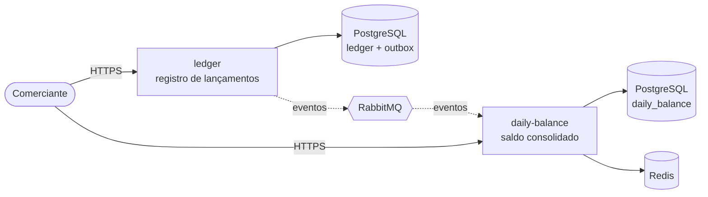

# Cash Flow — Controle de Fluxo de Caixa

Solução para o controle diário de fluxo de caixa de um comerciante: registro de lançamentos (débitos e créditos) e relatório de saldo diário consolidado.

A arquitetura é composta por **dois serviços independentes que se comunicam apenas por eventos**. O serviço de lançamentos continua disponível mesmo quando o serviço de consolidado está fora do ar, e o consolidado responde a partir de um modelo de leitura pré-calculado, suportando picos de 50 requisições por segundo.

> Projeto em construção, desenvolvido em fases. Cada fase corresponde a um ou mais commits. Veja o [roteiro](#roteiro-de-desenvolvimento).

## Visão geral



| Serviço         | Responsabilidade                                                            | Porta local |
| --------------- | --------------------------------------------------------------------------- | ----------- |
| `ledger`        | Registrar, estornar e consultar lançamentos. Publica eventos via outbox.    | `3001`      |
| `daily-balance` | Consumir eventos, manter o saldo diário materializado e servir o relatório. | `3002`      |

## Stack

| Camada         | Tecnologia                            | Motivo                                                           |
| -------------- | ------------------------------------- | ---------------------------------------------------------------- |
| Runtime        | Node.js 22 LTS + TypeScript           | Tipagem estática, ecossistema maduro, I/O não bloqueante         |
| HTTP           | Fastify                               | Alto desempenho, validação por schema, logger estruturado (pino) |
| Configuração   | Zod                                   | Validação das variáveis de ambiente na inicialização             |
| Banco de dados | PostgreSQL 17 (um por serviço)        | ACID para o ledger, UPSERT aditivo, `SKIP LOCKED` para o outbox  |
| Mensageria     | RabbitMQ 4                            | Filas duráveis e DLQ; volume não justifica Kafka                 |
| Cache          | Redis 7                               | Cache de leitura do consolidado                                  |
| Testes         | Vitest                                | Rápido, compatível com ESM e TypeScript                          |
| Qualidade      | ESLint (typescript-eslint) + Prettier | Padronização e regras de complexidade                            |
| Contêineres    | Docker + Docker Compose               | Ambiente local idêntico ao de produção                           |

## Arquitetura hexagonal (Ports and Adapters)

Cada serviço segue a mesma organização. As dependências apontam sempre para dentro: o domínio não conhece frameworks, banco ou mensageria.

```
services/<service>/
├─ src/
│  ├─ domain/                 # entidades, value objects e regras de negócio puras
│  ├─ application/
│  │  ├─ use-cases/           # orquestração dos casos de uso
│  │  └─ ports/
│  │     ├─ inbound/          # contratos que o mundo externo usa para acionar a aplicação
│  │     └─ outbound/         # contratos que a aplicação usa (repositórios, publisher, cache)
│  ├─ adapters/
│  │  ├─ inbound/             # HTTP (Fastify), consumidores de fila
│  │  └─ outbound/            # PostgreSQL, RabbitMQ, Redis
│  ├─ config/                 # leitura e validação de ambiente
│  └─ main.ts                 # composition root: instancia adapters e injeta nos casos de uso
└─ test/                      # espelha a estrutura de src/
```

## Como executar

### Pré-requisitos

- Docker e Docker Compose v2
- Node.js 22 (apenas para desenvolvimento e testes fora do Docker)

### Subindo tudo com Docker

```bash
cp .env.example .env
docker compose up -d --build
docker compose ps
```

Verificando os serviços:

```bash
curl http://localhost:3001/health/live
curl http://localhost:3002/health/ready
```

| Recurso                  | Endereço                                                      |
| ------------------------ | ------------------------------------------------------------- |
| ledger                   | http://localhost:3001                                         |
| daily-balance            | http://localhost:3002                                         |
| RabbitMQ Management      | http://localhost:15672 (usuário/senha: `cashflow`/`cashflow`) |
| PostgreSQL ledger        | `localhost:5432`                                              |
| PostgreSQL daily-balance | `localhost:5433`                                              |
| Redis                    | `localhost:6379`                                              |

Para parar e remover os volumes:

```bash
docker compose down -v
```

> **Rede corporativa ou VPN:** se o `npm ci` falhar dentro do build com `Exit handler never called!` ou `Connection reset by peer`, o Docker não está conseguindo acessar o registro do npm. É possível informar um mirror apenas para o build: `NPM_REGISTRY=https://registry.npmmirror.com/ docker compose up -d --build`.

### Desenvolvimento local

```bash
npm install
docker compose up -d postgres-ledger postgres-daily-balance rabbitmq redis
npm run dev -w services/ledger
npm run dev -w services/daily-balance
```

### Comandos

| Comando             | Descrição                              |
| ------------------- | -------------------------------------- |
| `npm test`          | Executa os testes de todos os serviços |
| `npm run lint`      | Análise estática                       |
| `npm run typecheck` | Verificação de tipos                   |
| `npm run format`    | Formata o código com Prettier          |
| `npm run build`     | Compila os serviços para `dist/`       |

## Regras de negócio do ledger

| Regra               | Descrição                                                                                                                                                                             |
| ------------------- | ------------------------------------------------------------------------------------------------------------------------------------------------------------------------------------- |
| Valor               | Inteiro positivo em centavos (`amountInCents`), evitando erros de arredondamento de ponto flutuante                                                                                   |
| Moeda               | Apenas `BRL`                                                                                                                                                                          |
| Tipo                | `CREDIT` ou `DEBIT`                                                                                                                                                                   |
| Data de competência | Formato `YYYY-MM-DD`, calculada no fuso `America/Sao_Paulo`; não pode ser futura nem anterior a 30 dias                                                                               |
| Descrição           | Obrigatória, de 1 a 140 caracteres                                                                                                                                                    |
| Imutabilidade       | Lançamentos nunca são alterados ou excluídos; correções são feitas por estorno                                                                                                        |
| Estorno             | Gera um lançamento de tipo oposto, mesmo valor e mesma data de competência, referenciando o original; um lançamento só pode ser estornado uma vez e um estorno não pode ser estornado |
| Isolamento          | Um comerciante só acessa os próprios lançamentos                                                                                                                                      |
| Consulta            | Por período de até 92 dias, paginada (máximo de 100 itens por página)                                                                                                                 |

Cada lançamento registrado gera um evento de domínio (`EntryRecorded` ou `EntryReversed`), que será persistido no outbox e publicado para o serviço de consolidado.

## Roteiro de desenvolvimento

| Fase | Entrega                                                                                                                                                                              | Status       |
| ---- | ------------------------------------------------------------------------------------------------------------------------------------------------------------------------------------ | ------------ |
| 0    | **Fundação**: monorepo com workspaces, TypeScript, lint, testes, Dockerfile multi-stage, Docker Compose com a infraestrutura, health checks, README                                  | ✅ Concluída |
| 1    | **Domínio do ledger**: entidade de lançamento, value objects (dinheiro em centavos, tipo, data de competência), estorno, casos de uso e ports, testes unitários                      | ✅ Concluída |
| 2    | **Adapters do ledger**: API HTTP, repositório PostgreSQL, migrations, idempotência (`Idempotency-Key`), tabela de outbox na mesma transação, testes de integração com Testcontainers | ⏳ Próxima   |
| 3    | **Publicação de eventos**: contrato versionado dos eventos, outbox relay com `FOR UPDATE SKIP LOCKED`, publisher RabbitMQ, exchange e filas com DLQ                                  | Pendente     |
| 4    | **Consolidação diária**: domínio do saldo diário, consumidor idempotente por `event_id`, UPSERT aditivo, retentativas e DLQ, reprocessamento de um dia                               | Pendente     |
| 5    | **API do consolidado**: consulta por dia e por período, saldo acumulado, cache Redis com fallback para o banco e circuit breaker                                                     | Pendente     |
| 6    | **Segurança**: Keycloak (OIDC), validação de JWT, escopos, `merchant_id` vindo do token, rate limiting, headers de segurança                                                         | Pendente     |
| 7    | **Observabilidade**: OpenTelemetry (traces, métricas, logs), correlation id ponta a ponta, Prometheus, Grafana, Tempo e Loki, dashboards e alertas                                   | Pendente     |
| 8    | **Resiliência e carga**: teste que derruba o consolidado e prova que o ledger continua respondendo; k6 com 50 req/s e limite de 5% de falhas                                         | Pendente     |
| 9    | **Documentação**: domínios e capacidades, requisitos, arquitetura alvo e de transição, ADRs, segurança, observabilidade e estimativa de custos em `docs/`                            | Pendente     |
| 10   | **CI/CD**: GitHub Actions com lint, testes, cobertura, CodeQL e Trivy; Terraform opcional para AWS                                                                                   | Pendente     |

## Convenções

- Código, nomes, mensagens de commit e documentação técnica em inglês; o README em português.
- Código sem comentários: nomes expressivos, funções pequenas e responsabilidade única tornam a intenção explícita. As decisões ficam registradas nos ADRs.
- Princípios SOLID e Clean Code, reforçados por regras de lint (complexidade ciclomática, número máximo de parâmetros, imports de tipo).
- Commits seguindo [Conventional Commits](https://www.conventionalcommits.org/).
