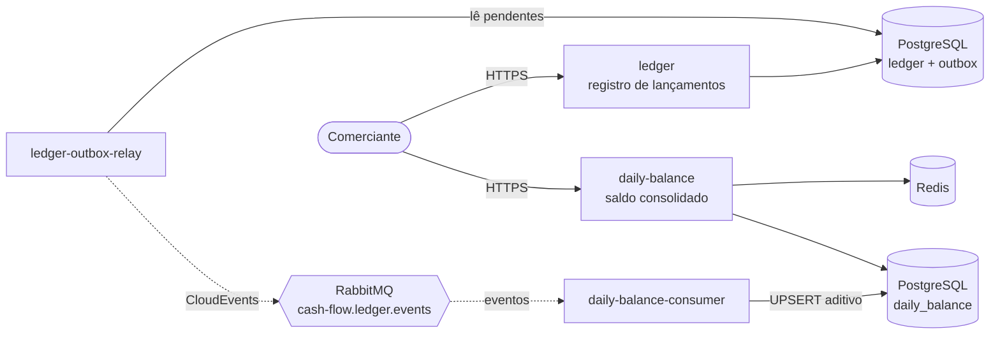
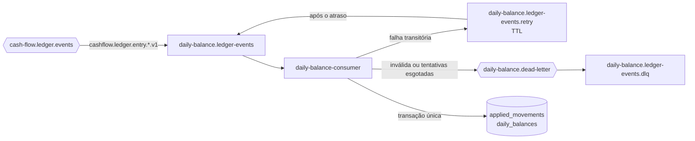

# Cash Flow — Controle de Fluxo de Caixa

Solução para o controle diário de fluxo de caixa de um comerciante: registro de lançamentos (débitos e créditos) e relatório de saldo diário consolidado.

A arquitetura é composta por **dois serviços independentes que se comunicam apenas por eventos**. O serviço de lançamentos continua disponível mesmo quando o serviço de consolidado está fora do ar, e o consolidado responde a partir de um modelo de leitura pré-calculado, suportando picos de 50 requisições por segundo.

> Projeto em construção, desenvolvido em fases. Cada fase corresponde a um ou mais commits. Veja o [roteiro](#roteiro-de-desenvolvimento).

## Visão geral



| Serviço                  | Responsabilidade                                                                                                                            | Porta local |
| ------------------------ | ------------------------------------------------------------------------------------------------------------------------------------------- | ----------- |
| `ledger`                 | Registrar, estornar e consultar lançamentos. Publica eventos via outbox.                                                                    | `3001`      |
| `ledger-outbox-relay`    | Ler o outbox e publicar os eventos no RabbitMQ. Processo separado da API: uma falha na publicação nunca afeta o registro de lançamentos.    | `—`         |
| `daily-balance`          | Servir o relatório de saldo diário a partir do modelo de leitura materializado (API completa na fase 5). Aplica as migrations do seu banco. | `3002`      |
| `daily-balance-consumer` | Consumir os eventos do ledger e manter o saldo diário materializado. Processo separado da API: a carga de consumo não afeta as consultas.   | `—`         |

## Justificativa das decisões de arquitetura e tecnologia

### Tipo de arquitetura

**Escolha: microsserviços orientados a eventos, com dois serviços.**

O requisito não funcional mais forte do desafio é que _o serviço de lançamentos não fique indisponível se o consolidado cair_. Isso exige isolamento de falha real: processos, bancos e deploys separados, sem chamada síncrona entre eles. A divisão foi feita apenas onde o requisito exige, em dois serviços alinhados aos dois bounded contexts do domínio, e não em vários serviços pequenos.

| Alternativa         | Por que não foi escolhida                                                                                                                                                              |
| ------------------- | -------------------------------------------------------------------------------------------------------------------------------------------------------------------------------------- |
| Monólito            | Um erro, vazamento de memória ou pico no relatório derrubaria também o registro de lançamentos                                                                                         |
| Monólito modular    | Resolve bem a separação de domínio, mas compartilha processo, pool de conexões e deploy; continua sem garantir o isolamento de falha exigido. Seria a escolha se não houvesse esse RNF |
| Serverless (Lambda) | Atende à carga, mas dificulta a execução local exigida no desafio, aumenta o acoplamento ao provedor e sofre com cold start em picos                                                   |
| Microsserviços      | **Escolhida.** Isolamento de falha e escala independente; o custo operacional extra é compensado por Docker Compose, health checks e observabilidade desde o início                    |

### Arquitetura interna de cada serviço: hexagonal (Ports and Adapters)

**Escolha: arquitetura hexagonal em todos os serviços.**

Em microsserviços, os contratos de comunicação entre as aplicações são justamente a parte com maior chance de mudar. Os eventos trocados entre o ledger e o consolidado tendem a evoluir com o negócio: um campo novo, uma nova versão do evento (`.v1` para `.v2`), um formato de envelope diferente ou até a troca do broker (RabbitMQ por SQS ou Kafka). O mesmo vale para a API HTTP consumida por outros sistemas.

A arquitetura hexagonal isola essas mudanças nas bordas do serviço. O domínio e os casos de uso não conhecem o formato dos eventos nem o protocolo de transporte: eles falam apenas com interfaces (ports), e a tradução entre o modelo interno e o contrato externo fica em um único adapter. Com isso, **uma alteração de contrato fica restrita a poucos arquivos, sempre na camada de adapters**, e o núcleo do negócio permanece intacto.

| Mudança no contrato                              | O que precisa ser alterado                                                                                                                                        | O que não muda                                     |
| ------------------------------------------------ | ----------------------------------------------------------------------------------------------------------------------------------------------------------------- | -------------------------------------------------- |
| Novo campo ou nova versão do evento (`.v2`)      | O schema em `packages/contracts` e o mapper que converte o evento de domínio no contrato (`ledger-event-mapper`); no consolidado, o adapter que recebe a mensagem | Entidades, value objects, regras e casos de uso    |
| Publicar `v1` e `v2` ao mesmo tempo na transição | Apenas o mapper, que passa a gerar as duas versões a partir do mesmo evento de domínio                                                                            | Domínio, casos de uso e o outro serviço            |
| Troca do broker (RabbitMQ por SQS ou Kafka)      | Um novo adapter que implementa o port `EventPublisher` (e, no consolidado, o adapter consumidor), escolhido na composição em `container.ts`/`relay.ts`            | Domínio, casos de uso, outbox e contratos          |
| Nova rota, versão da API HTTP ou outro protocolo | Um adapter de entrada (rotas e schemas HTTP), que chama os mesmos casos de uso                                                                                    | Domínio e casos de uso                             |
| Troca do banco de dados                          | Os adapters de repositório que implementam os ports de persistência                                                                                               | Domínio, casos de uso e testes unitários do núcleo |

Benefícios adicionais:

- **Testabilidade:** o núcleo é testado com fakes em memória, sem banco ou broker; os adapters têm testes de integração próprios contra infraestrutura real.
- **Evolução independente:** cada serviço pode mudar sua implementação interna sem coordenar deploy com o outro, desde que o contrato publicado seja respeitado.
- **Leitura clara:** a estrutura de pastas (`domain`, `application`, `adapters`) mostra onde cada tipo de mudança deve ser feito.

O custo é mais interfaces e mais arquivos do que uma organização em camadas simples. Esse custo foi aceito porque é pequeno diante da redução do impacto das mudanças de contrato, que são frequentes em sistemas distribuídos.

### Padrões arquiteturais

| Padrão                                                   | Problema que resolve                                                                                                                                                                                                                                                      |
| -------------------------------------------------------- | ------------------------------------------------------------------------------------------------------------------------------------------------------------------------------------------------------------------------------------------------------------------------- |
| Comunicação assíncrona por eventos                       | O ledger não conhece nem espera o consolidado. Se o consolidado cair, os eventos ficam na fila e são processados quando ele voltar                                                                                                                                        |
| Transactional Outbox                                     | Evita a escrita dupla (banco + broker). O lançamento e o evento são gravados na mesma transação; um relay publica depois. Nem o RabbitMQ fica no caminho crítico do registro                                                                                              |
| CQRS com modelo de leitura materializado                 | O saldo diário é atualizado a cada evento, não calculado na consulta. A leitura vira uma busca por chave primária com cache, o que torna 50 req/s trivial e mantém a perda de requisições bem abaixo dos 5% tolerados                                                     |
| Consumidor idempotente                                   | A entrega é _at-least-once_. A deduplicação por `event_id` e por `entry_id`, na mesma transação da atualização do saldo, garante que um evento repetido (ou o mesmo lançamento publicado em duas versões de contrato) não altere o saldo duas vezes                       |
| Diário de movimentos aplicados                           | Cada evento consolidado fica registrado na tabela `applied_movements`. Ela serve ao mesmo tempo para deduplicação e como fonte para reconstruir o saldo de um dia sem depender do ledger                                                                                  | Reconstruir a partir do ledger, o que acoplaria os serviços em tempo de execução                                      |
| Retentativa por fila de espera e DLQ                     | Falhas transitórias vão para uma fila de espera com TTL e voltam à fila principal depois do atraso, sem laço quente nem bloqueio das demais mensagens. Mensagens inválidas ou que esgotam as tentativas vão para a DLQ com o motivo registrado                            | `nack` com reenfileiramento imediato, que gera laço quente enquanto o banco estiver fora                              |
| Consumidor como processo separado                        | A API de consulta e o consumidor usam a mesma imagem, com comandos diferentes. Um pico de eventos não degrada as consultas e cada um escala de forma independente                                                                                                         | Consumidor dentro da API                                                                                              |
| Adapters de infraestrutura duplicados entre serviços     | Conexão com o PostgreSQL, migrator e conexão com o RabbitMQ existem em cada serviço. Só os contratos de eventos são compartilhados, para que cada serviço evolua sua infraestrutura sem coordenar deploy com o outro                                                      | Biblioteca interna compartilhada, que reduziria código repetido ao custo de acoplar as versões dos serviços           |
| CloudEvents como envelope dos eventos                    | Especificação aberta (CNCF) para metadados de eventos: `id`, `source`, `type`, `time` e `subject` têm significado padronizado e são entendidos por ferramentas de mercado                                                                                                 | Formato próprio, que exigiria documentar e manter cada campo de metadado                                              |
| Pacote de contratos compartilhado (_published language_) | O ledger publica e o consolidado consome o mesmo schema TypeBox, versionado no nome do tipo (`.v1`). O pacote contém apenas schemas e validação, sem lógica de negócio, então não acopla os serviços                                                                      | Schema registry (ex.: Confluent, Apicurio), mais adequado quando há muitos times e serviços; registrado como evolução |
| Relay como processo separado                             | A API e o relay usam a mesma imagem, com comandos diferentes. Escalam e falham de forma independente: se o relay cair, a API continua registrando e o backlog fica no outbox                                                                                              | Relay como tarefa em background dentro da API, que compartilharia recursos e ciclo de vida                            |
| Relay por polling com `FOR UPDATE SKIP LOCKED`           | Um worker consulta o outbox a cada 500 ms (ou imediatamente enquanto houver backlog). O `SKIP LOCKED` permite várias réplicas sem publicação duplicada, sem precisar de lock distribuído. Detalhes em [Como o relay do outbox funciona](#como-o-relay-do-outbox-funciona) | `LISTEN/NOTIFY` ou CDC com Debezium, com menor latência porém mais complexidade; registrados como evolução            |
| Exchange `topic` com publicação `mandatory`              | O roteamento por padrão (`cashflow.ledger.entry.*.v1`) permite novos consumidores sem alterar o produtor; o `mandatory` garante que nenhum evento seja descartado silenciosamente por falta de fila                                                                       | Alternate exchange, que preservaria a mensagem em uma fila de estacionamento, mas exigiria reprocessamento manual     |
| Arquitetura hexagonal (Ports and Adapters)               | Regras de negócio isoladas de framework, banco e mensageria. Casos de uso dependem apenas de interfaces (ports), o que permite testar o domínio sem infraestrutura e trocar adapters (ex.: RabbitMQ por SQS) sem tocar no núcleo                                          |
| DDD tático                                               | Value objects garantem que nenhum dado inválido exista no domínio (`Money`, `BusinessDate`, `TimeZone`); o agregado `Entry` concentra as regras de estorno e emite os eventos de domínio                                                                                  |

### Tecnologias

| Tecnologia                                 | Por que                                                                                                                                                                                                                | Alternativas consideradas                                                                                       |
| ------------------------------------------ | ---------------------------------------------------------------------------------------------------------------------------------------------------------------------------------------------------------------------- | --------------------------------------------------------------------------------------------------------------- |
| Node.js 22 LTS                             | I/O não bloqueante adequado a APIs e consumidores de fila; versão LTS com suporte de longo prazo                                                                                                                       | .NET e Java teriam o mesmo desenho; a escolha seguiu o domínio da linguagem                                     |
| TypeScript (modo estrito)                  | Tipagem estática para modelar o domínio com segurança e refatorar com confiança                                                                                                                                        | JavaScript puro, descartado por perder garantias em tempo de compilação                                         |
| Fastify                                    | Alto desempenho, validação de entrada por JSON Schema, logger estruturado (pino) nativo e testes sem abrir porta (`inject`)                                                                                            | Express (mais lento e sem validação nativa), NestJS (mais opinativo e pesado para o escopo)                     |
| Zod                                        | Valida variáveis de ambiente na inicialização: o serviço falha rápido se estiver mal configurado                                                                                                                       | Leitura manual de `process.env`                                                                                 |
| PostgreSQL 17, um por serviço              | ACID para o ledger; `CHECK` constraints; `FOR UPDATE SKIP LOCKED` para o outbox com várias instâncias; UPSERT aditivo para o consolidado; bancos separados preservam o isolamento                                      | MongoDB, DynamoDB (ver seção seguinte)                                                                          |
| RabbitMQ 4                                 | Filas duráveis, DLQ nativa, simples de operar localmente. As filas do consumidor são _quorum queues_ (replicadas via Raft, recomendadas para dados críticos). Na AWS, a mesma abstração é atendida por SNS + SQS       | Kafka, descartado porque o volume (dezenas de eventos por segundo) não justifica seu custo operacional          |
| Redis 7                                    | Cache de leitura do consolidado, reduzindo latência e carga no banco nos picos                                                                                                                                         | Cache em memória do processo, que não é compartilhado entre réplicas                                            |
| node-postgres (`pg`) com SQL explícito     | Controle total sobre `FOR UPDATE SKIP LOCKED`, `ON CONFLICT` e transações; as consultas ficam visíveis e revisáveis                                                                                                    | ORMs como Prisma ou TypeORM, que escondem justamente as construções de concorrência das quais a solução depende |
| Migrations versionadas no código           | Executadas na inicialização com `pg_advisory_lock`, então várias réplicas subindo juntas não aplicam a mesma migration duas vezes; por serem módulos TypeScript, vão compiladas na imagem sem cópia de arquivos extras | Ferramentas externas de migration, que adicionariam mais um passo ao deploy                                     |
| TypeBox + `@fastify/type-provider-typebox` | Um único schema valida a requisição, tipa o handler em TypeScript e gera a documentação OpenAPI, sem duplicar contratos                                                                                                | Zod nas rotas, que exigiria conversão adicional para JSON Schema                                                |
| Swagger UI (`@fastify/swagger`)            | Documentação navegável e sempre sincronizada com o código em `/docs`                                                                                                                                                   | Documentação manual, que diverge do código com o tempo                                                          |
| UUID v7                                    | Identificadores ordenados no tempo: mantêm as inserções no índice B-tree próximas, ao contrário do UUID v4 aleatório                                                                                                   | UUID v4, IDs sequenciais do banco                                                                               |
| Testcontainers                             | Testes de integração contra um PostgreSQL real e descartável, cobrindo constraints, transações e concorrência que um mock não reproduz                                                                                 | Banco em memória (SQLite, pg-mem), com comportamento diferente do PostgreSQL                                    |
| amqplib 2.x                                | Cliente AMQP oficial da comunidade Node.js, com reconexão automática com backoff e jitter e suporte a publisher confirms                                                                                               | Bibliotecas de mais alto nível, que escondem o controle de confirmação e retorno de mensagens                   |
| pino                                       | Logger estruturado em JSON de baixo custo, o mesmo usado internamente pelo Fastify                                                                                                                                     | Winston, mais lento e sem integração nativa com o Fastify                                                       |
| Vitest                                     | Rápido, suporte nativo a ESM e TypeScript, cobertura com V8                                                                                                                                                            | Jest, que exige configuração adicional para ESM                                                                 |
| ESLint + Prettier                          | Padronização automática e regras que reforçam Clean Code: complexidade ciclomática máxima de 8, no máximo 3 parâmetros por função, proibição de comentários inline                                                     | -                                                                                                               |
| Docker + Docker Compose                    | Um único `Dockerfile` multi-stage para os dois serviços; imagem final só com dependências de produção e usuário não-root; ambiente local completo com um comando                                                       | -                                                                                                               |

### Banco de dados: por que relacional (PostgreSQL) e não NoSQL

O domínio é financeiro e transacional. Quase todas as garantias de que a solução depende são nativas do PostgreSQL; em um banco não relacional, várias delas precisariam ser reconstruídas na aplicação.

| Necessidade da solução                                                   | Como o PostgreSQL atende                                                                                                                                                      | Custo em um banco NoSQL                                                                                                                                                              |
| ------------------------------------------------------------------------ | ----------------------------------------------------------------------------------------------------------------------------------------------------------------------------- | ------------------------------------------------------------------------------------------------------------------------------------------------------------------------------------ |
| Gravar o lançamento e seu evento de forma atômica (Transactional Outbox) | Transação ACID comum (`BEGIN`/`COMMIT`) envolvendo as tabelas `entries` e `outbox`                                                                                            | MongoDB exige replica set para transações multi-documento, com custo de desempenho; DynamoDB limita a quantidade de itens por transação e costuma usar Streams, um desenho diferente |
| Regras financeiras válidas mesmo sob concorrência                        | Constraints declarativas: `CHECK` (valor positivo), índice único parcial (um único estorno por lançamento) e chave estrangeira composta (ponto de venda do mesmo comerciante) | Sem chaves estrangeiras nem constraints equivalentes: cada regra vira código com locks ou escritas condicionais na aplicação                                                         |
| Idempotência sem condição de corrida                                     | `INSERT ... ON CONFLICT DO NOTHING`: a segunda requisição com a mesma chave espera a primeira terminar e lê a resposta gravada                                                | Escritas condicionais e tratamento manual de requisições simultâneas                                                                                                                 |
| Vários relays lendo o outbox sem processar o mesmo evento (Fase 3)       | `SELECT ... FOR UPDATE SKIP LOCKED`                                                                                                                                           | Mecanismo de lease ou lock distribuído implementado à parte                                                                                                                          |
| Atualização do saldo diário sem perda por concorrência (Fase 4)          | UPSERT aditivo: `ON CONFLICT DO UPDATE SET total = total + EXCLUDED.total`                                                                                                    | Possível com incrementos atômicos, mas sem a deduplicação do evento na mesma transação                                                                                               |
| Saldo acumulado por período (Fase 5)                                     | Funções de janela (`SUM(...) OVER (ORDER BY data)`)                                                                                                                           | Agregação na aplicação ou pipelines específicos                                                                                                                                      |
| Dados de estrutura fixa                                                  | Schema rígido funciona como proteção: um dado fora do padrão não entra                                                                                                        | A flexibilidade de schema, principal vantagem de um banco de documentos, não traz ganho para lançamentos financeiros                                                                 |
| Volume do desafio                                                        | 50 req/s de leitura por chave, com cache, está muito abaixo da capacidade de uma única instância                                                                              | A escala horizontal massiva não resolve nenhum gargalo real deste cenário e custaria as garantias acima                                                                              |

**Onde um banco não relacional faz sentido nesta arquitetura:**

- **Cache do consolidado:** o Redis, que é não relacional, já é usado onde é forte: leitura por chave com baixa latência.
- **Modelo de leitura em escala muito maior:** com milhões de comerciantes consultando o saldo continuamente, o saldo diário (sempre consultado por comerciante e data) poderia migrar para um banco chave-valor como DynamoDB ou Cassandra. Como ele é derivado do ledger por eventos e cada serviço tem o próprio banco, essa troca afetaria apenas o serviço de consolidado.
- **Histórico e análise:** lançamentos antigos poderiam ser exportados para armazenamento colunar ou data lake (por exemplo, Parquet no S3) para relatórios analíticos.

### Decisões de domínio

| Decisão                                                   | Justificativa                                                                                                                                                                                                                                                          |
| --------------------------------------------------------- | ---------------------------------------------------------------------------------------------------------------------------------------------------------------------------------------------------------------------------------------------------------------------- |
| Valores em centavos (inteiro)                             | Ponto flutuante não representa valores monetários com exatidão (`0.1 + 0.2 !== 0.3`). Inteiros em centavos eliminam erros de arredondamento                                                                                                                            |
| Lançamentos imutáveis, correção por estorno               | Preserva a trilha de auditoria e permite reconstruir o consolidado a qualquer momento a partir do ledger. O estorno usa a mesma data de competência do original para corrigir o saldo do dia correto                                                                   |
| Data de competência separada do instante de registro      | O dia do caixa (`businessDate`) nem sempre coincide com o momento do registro (`recordedAt`): há lançamentos retroativos e diferenças de fuso. O consolidado agrupa pelo dia do caixa                                                                                  |
| Fuso horário por ponto de venda                           | O Brasil tem quatro fusos. Com um fuso único, uma venda à 00h30 em Fernando de Noronha (23h30 em Brasília) seria rejeitada como data futura. Cada ponto de venda tem seu fuso local; lançamentos sem ponto de venda usam o fuso padrão configurável                    |
| Fusos no padrão IANA, não deslocamentos                   | `America/Manaus` carrega o histórico e as regras de horário de verão; `-04:00` não. Se o horário de verão voltar, basta atualizar a base de fusos do runtime, sem alterar código                                                                                       |
| Instante em UTC + fuso gravado, sem hora local armazenada | A hora local é derivada do instante e do fuso, então armazená-la seria redundante e poderia divergir. Gravar o fuso vigente em cada lançamento garante que mudar a configuração do ponto de venda não reinterprete lançamentos passados                                |
| O consolidado não lida com fusos                          | O evento carrega apenas a data de competência já resolvida. Toda a lógica de fuso fica no ledger, que é onde o lançamento nasce                                                                                                                                        |
| Estorno consolidado como movimento do seu próprio tipo    | O estorno de um crédito chega como um débito de mesmo valor e mesma data. O consolidado apenas soma créditos e débitos: o saldo do dia é corrigido e os totais continuam mostrando o que de fato foi movimentado, como em um extrato                                   |
| Saldo calculado pelo banco                                | `balance_cents` é uma coluna gerada (`total_credits_cents - total_debits_cents`), então o saldo nunca diverge dos totais                                                                                                                                               |
| Idempotência por `Idempotency-Key`                        | Em rede instável o cliente não sabe se o lançamento foi gravado e repete a requisição. A chave, a resposta e o lançamento são gravados na mesma transação: uma retentativa devolve a resposta original e nunca duplica o lançamento, mesmo com requisições simultâneas |
| Erros no padrão Problem Details (RFC 9457)                | Formato padronizado (`application/problem+json`) com um `code` estável que o cliente pode tratar; erros internos nunca expõem detalhes de implementação                                                                                                                |
| Regras críticas também no banco                           | Constraints garantem as invariantes mesmo sob concorrência: valor positivo, um único estorno por lançamento (índice único) e ponto de venda pertencente ao mesmo comerciante (chave estrangeira composta)                                                              |
| Identificadores UUID                                      | Gerados pela aplicação antes de persistir, o que permite montar o agregado e seus eventos sem depender do banco; não expõem volume de negócio como IDs sequenciais                                                                                                     |

## Arquitetura hexagonal (Ports and Adapters)

Cada serviço segue a mesma organização. As dependências apontam sempre para dentro: o domínio não conhece frameworks, banco ou mensageria.

```
packages/contracts/           # contratos de eventos versionados (schemas e validação, sem lógica)

services/<service>/
├─ src/
│  ├─ domain/                 # entidades, value objects e regras de negócio puras
│  ├─ application/
│  │  ├─ use-cases/           # orquestração dos casos de uso
│  │  └─ ports/
│  │     ├─ inbound/          # contratos que o mundo externo usa para acionar a aplicação
│  │     └─ outbound/         # contratos que a aplicação usa (repositórios, publisher, cache)
│  ├─ adapters/
│  │  ├─ inbound/             # HTTP (Fastify), consumidores de fila, workers de polling
│  │  └─ outbound/            # PostgreSQL, RabbitMQ, Redis
│  ├─ config/                 # leitura e validação de ambiente
│  ├─ container.ts            # composition root: instancia adapters e injeta nos casos de uso
│  ├─ main.ts                 # inicialização da API
│  ├─ relay.ts                # inicialização do relay do outbox (somente no ledger)
│  ├─ consumer.ts             # inicialização do consumidor de eventos (somente no daily-balance)
│  ├─ rebuild-day.ts          # comando de reconstrução do saldo de um dia (somente no daily-balance)
│  └─ redrive-dead-letters.ts # comando que devolve mensagens da DLQ à fila (somente no daily-balance)
└─ test/                      # espelha a estrutura de src/
```

## Como executar

### Pré-requisitos

- Docker e Docker Compose v2
- Node.js 22 (apenas para desenvolvimento e testes fora do Docker)

### Subindo tudo com Docker

```bash
cp .env.example .env
docker compose up -d --build
docker compose ps
```

Verificando os serviços:

```bash
curl http://localhost:3001/health/live
curl http://localhost:3002/health/ready
```

| Recurso                  | Endereço                                                      |
| ------------------------ | ------------------------------------------------------------- |
| ledger                   | http://localhost:3001                                         |
| daily-balance            | http://localhost:3002                                         |
| RabbitMQ Management      | http://localhost:15672 (usuário/senha: `cashflow`/`cashflow`) |
| PostgreSQL ledger        | `localhost:5432`                                              |
| PostgreSQL daily-balance | `localhost:5433`                                              |
| Redis                    | `localhost:6379`                                              |

Para parar e remover os volumes:

```bash
docker compose down -v
```

> **Rede corporativa ou VPN:** se o `npm ci` falhar dentro do build com `Exit handler never called!` ou `Connection reset by peer`, o Docker não está conseguindo acessar o registro do npm. É possível informar um mirror apenas para o build: `NPM_REGISTRY=https://registry.npmmirror.com/ docker compose up -d --build`.

### Desenvolvimento local

```bash
npm install
cp services/ledger/.env.example services/ledger/.env
cp services/daily-balance/.env.example services/daily-balance/.env
docker compose up -d postgres-ledger postgres-daily-balance rabbitmq redis
npm run dev -w services/ledger
npm run dev:relay -w services/ledger
npm run dev -w services/daily-balance
npm run dev:consumer -w services/daily-balance
```

As migrations do banco são aplicadas automaticamente na inicialização do serviço.

### Testes

| Tipo       | Comando                                    | O que cobre                                                                                                                                  |
| ---------- | ------------------------------------------ | -------------------------------------------------------------------------------------------------------------------------------------------- |
| Unidade    | `npm test`                                 | Domínio, casos de uso, rotas HTTP e tratamento de mensagens com adapters em memória; não exige infraestrutura                                |
| Integração | `npm run test:integration`                 | Repositórios, outbox, migrations, idempotência, API, relay e consumidor contra PostgreSQL e RabbitMQ reais via Testcontainers (exige Docker) |
| Cobertura  | `npm run test:coverage -w services/ledger` | Relatório de cobertura dos testes de unidade                                                                                                 |

Os testes de integração verificam inclusive cenários de concorrência e falha: duas requisições simultâneas com a mesma chave de idempotência gravam um único lançamento; dois estornos simultâneos resultam em um sucesso e um conflito; três relays em paralelo publicam cada evento exatamente uma vez; um evento sem fila de destino fica pendente com nova tentativa agendada, sem bloquear os demais. No consolidado: o mesmo evento entregue três vezes em paralelo é somado uma única vez; uma reconstrução executada durante o consumo termina com o saldo igual ao diário; falhas transitórias passam pela fila de espera e são aplicadas; e mensagens inválidas ou com tentativas esgotadas vão para a DLQ e podem ser devolvidas à fila.

### Comandos

| Comando                    | Descrição                                      |
| -------------------------- | ---------------------------------------------- |
| `npm test`                 | Executa os testes de unidade                   |
| `npm run test:integration` | Executa os testes de integração (exige Docker) |
| `npm run lint`             | Análise estática                               |
| `npm run typecheck`        | Verificação de tipos                           |
| `npm run format`           | Formata o código com Prettier                  |
| `npm run build`            | Compila os serviços para `dist/`               |

## API do ledger

A documentação interativa (OpenAPI) fica em **http://localhost:3001/docs**.

Até a fase de segurança, o comerciante é identificado pelo header `x-merchant-id` (UUID). Na Fase 6 ele passa a ser extraído do token JWT.

| Método | Rota                                    | Descrição                                                |
| ------ | --------------------------------------- | -------------------------------------------------------- |
| `PUT`  | `/v1/points-of-sale/{pointOfSaleId}`    | Cria ou atualiza um ponto de venda com seu fuso local    |
| `POST` | `/v1/entries`                           | Registra um crédito ou débito (aceita `Idempotency-Key`) |
| `POST` | `/v1/entries/{entryId}/reversal`        | Estorna um lançamento (aceita `Idempotency-Key`)         |
| `GET`  | `/v1/entries/{entryId}`                 | Consulta um lançamento                                   |
| `GET`  | `/v1/entries?from=&to=&page=&pageSize=` | Lista lançamentos por período de data de competência     |
| `GET`  | `/health/live` e `/health/ready`        | Liveness e readiness (o readiness verifica o PostgreSQL) |

### Exemplos

```bash
MERCHANT=6f1c2a5e-8d4b-4c3a-9e2f-1a2b3c4d5e6f
POS=3e4d5c6b-7a89-4b0c-9d1e-2f3a4b5c6d7e

curl -X PUT http://localhost:3001/v1/points-of-sale/$POS \
  -H "content-type: application/json" -H "x-merchant-id: $MERCHANT" \
  -d '{"timeZone":"America/Manaus"}'

curl -X POST http://localhost:3001/v1/entries \
  -H "content-type: application/json" -H "x-merchant-id: $MERCHANT" \
  -H "idempotency-key: venda-1024" \
  -d "{\"type\":\"CREDIT\",\"amountInCents\":15990,\"description\":\"Venda 1024\",\"pointOfSaleId\":\"$POS\"}"

curl "http://localhost:3001/v1/entries?from=2026-10-01&to=2026-10-31" -H "x-merchant-id: $MERCHANT"
```

Resposta de um lançamento (`201 Created`, com header `Location`):

```json
{
  "id": "01a12170-5d59-70fd-b181-3c8a5960d348",
  "merchantId": "6f1c2a5e-8d4b-4c3a-9e2f-1a2b3c4d5e6f",
  "pointOfSaleId": "3e4d5c6b-7a89-4b0c-9d1e-2f3a4b5c6d7e",
  "type": "CREDIT",
  "amountInCents": 15990,
  "currency": "BRL",
  "businessDate": "2026-10-09",
  "description": "Venda 1024",
  "reversalOf": null,
  "recordedAt": "2026-10-09T16:12:54.487Z",
  "recordedAtLocal": "2026-10-09T12:12:54-04:00",
  "timeZone": "America/Manaus"
}
```

### Idempotência

Envie um `Idempotency-Key` único por operação. Ao repetir a mesma requisição com a mesma chave, a API devolve a resposta original com o header `idempotent-replayed: true` e não grava um novo lançamento. Reutilizar a chave com um corpo diferente resulta em `422 IDEMPOTENCY_KEY_REUSED`. Se a operação falhar, a chave é liberada e a requisição pode ser repetida.

### Erros

Todas as respostas de erro seguem o padrão [Problem Details (RFC 9457)](https://www.rfc-editor.org/rfc/rfc9457):

```json
{
  "type": "about:blank",
  "title": "Unprocessable Entity",
  "status": 422,
  "detail": "Business date 2030-01-01 must be between today and 30 days ago",
  "code": "BUSINESS_DATE_OUT_OF_RANGE"
}
```

| Status | `code`                       | Quando                                                         |
| ------ | ---------------------------- | -------------------------------------------------------------- |
| 400    | `VALIDATION_ERROR`           | Corpo, parâmetros ou headers inválidos                         |
| 404    | `ENTRY_NOT_FOUND`            | Lançamento inexistente ou de outro comerciante                 |
| 404    | `ROUTE_NOT_FOUND`            | Rota inexistente                                               |
| 409    | `ENTRY_ALREADY_REVERSED`     | O lançamento já foi estornado                                  |
| 422    | `BUSINESS_DATE_OUT_OF_RANGE` | Data de competência futura ou além da janela de retroatividade |
| 422    | `REVERSAL_OF_REVERSAL`       | Tentativa de estornar um estorno                               |
| 422    | `POINT_OF_SALE_NOT_FOUND`    | Ponto de venda não configurado para o comerciante              |
| 422    | `IDEMPOTENCY_KEY_REUSED`     | Chave de idempotência reutilizada com outra requisição         |
| 500    | `INTERNAL_ERROR`             | Erro inesperado (detalhes apenas no log)                       |

## Eventos de integração

O ledger publica seus eventos no exchange `cash-flow.ledger.events` (tipo `topic`, durável) do RabbitMQ. O contrato é versionado e fica no pacote compartilhado [`packages/contracts`](packages/contracts), que também expõe o validador usado pelos consumidores.

| Tipo (routing key)                  | Quando                     | Campos de `data`                                                                                   |
| ----------------------------------- | -------------------------- | -------------------------------------------------------------------------------------------------- |
| `cashflow.ledger.entry.recorded.v1` | Um lançamento é registrado | `entryId`, `merchantId`, `pointOfSaleId`, `entryType`, `amountInCents`, `currency`, `businessDate` |
| `cashflow.ledger.entry.reversed.v1` | Um lançamento é estornado  | Os mesmos campos do estorno, mais `reversedEntryId`                                                |

Consumidores podem se inscrever em todos os eventos de lançamento com o binding `cashflow.ledger.entry.*.v1`.

Exemplo de mensagem ([CloudEvents 1.0](https://cloudevents.io), `content-type: application/cloudevents+json`):

```json
{
  "specversion": "1.0",
  "id": "01a12170-5d59-70fd-b181-3c8a5960d348",
  "source": "/cash-flow/ledger",
  "type": "cashflow.ledger.entry.recorded.v1",
  "subject": "0b9f8e7d-6c5b-4a49-8382-716051403928",
  "time": "2026-10-09T15:00:00.000Z",
  "datacontenttype": "application/json",
  "data": {
    "entryId": "0b9f8e7d-6c5b-4a49-8382-716051403928",
    "merchantId": "6f1c2a5e-8d4b-4c3a-9e2f-1a2b3c4d5e6f",
    "pointOfSaleId": null,
    "entryType": "CREDIT",
    "amountInCents": 15990,
    "currency": "BRL",
    "businessDate": "2026-10-09"
  }
}
```

### Como o relay do outbox funciona

O `ledger-outbox-relay` é um processo à parte (mesma imagem do ledger, comando `node dist/relay.js`) que roda um worker em loop. Cada ciclo:

1. Abre uma transação no PostgreSQL.
2. Seleciona até `OUTBOX_BATCH_SIZE` (padrão 100) eventos pendentes e já liberados para tentativa, travando as linhas com `FOR UPDATE SKIP LOCKED`.
3. Publica os eventos em paralelo no RabbitMQ e aguarda a confirmação do broker (_publisher confirms_) de cada um.
4. Marca os confirmados como publicados (`published_at`) e agenda nova tentativa, com backoff, para os rejeitados.
5. Faz o commit. Se houver falha de infraestrutura (banco ou broker indisponível), a transação inteira é desfeita e os eventos continuam pendentes.

Ritmo do loop:

| Situação                                  | Próximo ciclo                                                                   |
| ----------------------------------------- | ------------------------------------------------------------------------------- |
| O ciclo publicou eventos                  | Imediatamente, para drenar o backlog rapidamente                                |
| Não havia eventos pendentes               | Após `OUTBOX_POLL_INTERVAL_MS` (padrão 500 ms)                                  |
| Falha de infraestrutura (banco ou broker) | Backoff exponencial: 1 s, 2 s, 4 s... até `OUTBOX_MAX_BACKOFF_MS` (padrão 30 s) |

Em operação normal, a defasagem entre o registro do lançamento e a publicação do evento é de no máximo cerca de meio segundo.

**Várias instâncias.** O Docker Compose sobe uma réplica, que atende com folga o volume esperado. Graças ao `SKIP LOCKED`, cada relay ignora as linhas já travadas por outro, então é possível escalar sem publicar o mesmo evento duas vezes; uma segunda réplica serve para alta disponibilidade:

```bash
docker compose up -d --scale ledger-outbox-relay=3
```

Um teste de integração comprova esse comportamento: três relays concorrentes publicam 40 eventos e cada evento sai exatamente uma vez.

**Custos do polling.** Quando ocioso, o relay faz uma consulta a cada 500 ms, barata porque usa um índice parcial (`outbox_pending_idx`) que contém apenas eventos pendentes. A latência adicional é de até 500 ms, irrelevante para um consolidado diário.

**Evoluções possíveis:**

| Alternativa                       | Ganho                                                                 | Custo                                                                  |
| --------------------------------- | --------------------------------------------------------------------- | ---------------------------------------------------------------------- |
| `LISTEN/NOTIFY` do PostgreSQL     | O relay acorda assim que um evento é gravado, sem esperar o intervalo | Uma conexão dedicada a mais; o polling continua como rede de segurança |
| CDC com Debezium (leitura do WAL) | Latência de milissegundos e nenhum polling                            | Mais infraestrutura para operar (Kafka Connect ou Debezium Server)     |
| Limpeza periódica do outbox       | Mantém a tabela pequena                                               | Um job adicional para remover eventos publicados há mais de N dias     |

O polling foi escolhido por ser o mais simples de operar e de testar, e por atender o requisito com folga.

### Garantias de entrega

| Garantia                                         | Como é obtida                                                                                                                                                                    |
| ------------------------------------------------ | -------------------------------------------------------------------------------------------------------------------------------------------------------------------------------- |
| Nenhum evento é perdido                          | O evento é gravado no outbox na mesma transação do lançamento; o relay só marca como publicado após a confirmação do broker (publisher confirms) e as mensagens são persistentes |
| Entrega pelo menos uma vez (_at-least-once_)     | Se o relay cair entre publicar e marcar, o evento é publicado novamente. O `id` do CloudEvent (também enviado como `messageId`) permite que o consumidor descarte duplicatas     |
| Sem perda por falta de consumidor                | As mensagens são publicadas com `mandatory`: se nenhuma fila estiver ligada ao exchange, o broker devolve a mensagem e ela continua pendente no outbox                           |
| Uma mensagem problemática não bloqueia as demais | Rejeições por mensagem recebem backoff exponencial próprio (`attempts`, `last_error`, `next_attempt_at`), de 1 s até 5 min, enquanto o restante do lote segue normalmente        |
| Indisponibilidade do broker não afeta o registro | O ledger não conhece o RabbitMQ. O relay reconecta automaticamente com backoff; durante a queda os eventos acumulam no outbox e são publicados quando o broker volta             |
| Ordem                                            | Não garantida, e não é necessária: o consolidado soma valores, e a soma é comutativa                                                                                             |

## Regras de negócio do ledger

| Regra               | Descrição                                                                                                                                                                                                                                                                                                                 |
| ------------------- | ------------------------------------------------------------------------------------------------------------------------------------------------------------------------------------------------------------------------------------------------------------------------------------------------------------------------- |
| Valor               | Inteiro positivo em centavos (`amountInCents`), evitando erros de arredondamento de ponto flutuante                                                                                                                                                                                                                       |
| Moeda               | Apenas `BRL`                                                                                                                                                                                                                                                                                                              |
| Tipo                | `CREDIT` ou `DEBIT`                                                                                                                                                                                                                                                                                                       |
| Data de competência | Formato `YYYY-MM-DD`, é o dia do caixa no fuso do ponto de venda; não pode ser futura nem anterior a 30 dias. Se não for informada, assume o dia atual no fuso do ponto de venda                                                                                                                                          |
| Ponto de venda      | Configurado com seu fuso local (nome IANA, ex.: `America/Manaus`). Lançamentos sem ponto de venda usam o fuso padrão (`DEFAULT_TIME_ZONE`, por padrão `America/Sao_Paulo`)                                                                                                                                                |
| Data e hora         | O instante do registro é gravado em UTC (`recordedAt`) junto com o fuso vigente no momento (`timeZone`). A hora local (`recordedAtLocal`) é derivada na resposta e não é armazenada, evitando redundância; o fuso gravado garante que mudanças futuras na configuração do ponto de venda não alterem lançamentos passados |
| Descrição           | Obrigatória, de 1 a 140 caracteres                                                                                                                                                                                                                                                                                        |
| Imutabilidade       | Lançamentos nunca são alterados ou excluídos; correções são feitas por estorno                                                                                                                                                                                                                                            |
| Estorno             | Gera um lançamento de tipo oposto, mesmo valor, mesma data de competência, mesmo ponto de venda e mesmo fuso, referenciando o original; um lançamento só pode ser estornado uma vez e um estorno não pode ser estornado                                                                                                   |
| Isolamento          | Um comerciante só acessa os próprios lançamentos                                                                                                                                                                                                                                                                          |
| Consulta            | Por período de até 92 dias, paginada (máximo de 100 itens por página)                                                                                                                                                                                                                                                     |

Cada lançamento registrado gera um evento de domínio (`EntryRecorded` ou `EntryReversed`), que é persistido no outbox e publicado para o serviço de consolidado.

## Consolidação diária

O `daily-balance-consumer` consome os eventos do ledger e mantém, para cada comerciante e dia de competência, o total de créditos, o total de débitos, o saldo e a quantidade de lançamentos. O saldo é atualizado a cada evento (modelo de leitura materializado), então a consulta do relatório não precisa somar lançamentos.



### Processamento de um evento

1. Valida a mensagem contra o contrato `LedgerEventV1` do pacote `@cash-flow/contracts`.
2. Traduz o evento em um comando da aplicação (camada anticorrupção: o domínio não conhece o formato do evento).
3. Em uma única transação:
   - registra o movimento em `applied_movements`, cuja chave primária é o `event_id` e que tem índice único em `entry_id`;
   - se o registro já existia, o evento é uma duplicata e nada mais é feito;
   - caso contrário, soma o movimento ao saldo do dia com um UPSERT aditivo (`INSERT ... ON CONFLICT DO UPDATE SET total = total + valor`), que é atômico mesmo com vários consumidores atualizando o mesmo dia.
4. Confirma a mensagem (`ack`) somente depois do commit.

### Tratamento de falhas

| Situação                                                 | Tratamento                                                                                                                              |
| -------------------------------------------------------- | --------------------------------------------------------------------------------------------------------------------------------------- |
| Mensagem que não é JSON ou não segue o contrato          | Vai direto para a DLQ com o motivo no header `x-dead-letter-reason`, sem retentativas: repetir não resolveria                           |
| Dados rejeitados pelo domínio (ex.: data inválida)       | Mesmo tratamento: DLQ imediata                                                                                                          |
| Falha transitória (ex.: banco do consolidado fora)       | A mensagem vai para a fila de espera com `x-attempt` incrementado e volta à fila principal após `CONSUMER_RETRY_DELAY_MS` (padrão 10 s) |
| Tentativas esgotadas (`CONSUMER_MAX_ATTEMPTS`, padrão 5) | DLQ com o último erro no motivo                                                                                                         |
| Consumidor fora do ar                                    | As mensagens acumulam na fila durável e são processadas quando ele volta. O ledger continua registrando normalmente                     |
| Queda do RabbitMQ ou do canal                            | O consumidor reconecta com backoff e volta a consumir; mensagens sem `ack` são reentregues e a deduplicação evita contagem dupla        |

A republicação na fila de espera ou na DLQ usa publisher confirms, e a mensagem original só recebe `ack` depois da confirmação. Assim, nenhuma mensagem se perde nessas transições.

### Operação

Reconstruir o saldo de um dia a partir do diário de movimentos (por exemplo, após uma correção manual no banco):

```bash
docker compose exec daily-balance-consumer node dist/rebuild-day.js --merchant <merchant-id> --date 2026-10-09
```

A reconstrução trava a linha do dia antes de ler o diário. Por isso ela pode rodar com o consumidor ativo: um evento consolidado ao mesmo tempo entra no saldo reconstruído ou é somado depois dele, nunca é perdido nem contado duas vezes.

Devolver as mensagens da DLQ para a fila principal depois de corrigir a causa (por exemplo, após uma queda longa do banco):

```bash
docker compose exec daily-balance-consumer node dist/redrive-dead-letters.js --limit 1000
```

As mensagens podem ser inspecionadas antes no RabbitMQ Management (http://localhost:15672), na fila `daily-balance.ledger-events.dlq`. Como o consumidor é idempotente, devolver uma mensagem já aplicada não altera o saldo.

| Variável                  | Padrão  | Descrição                                          |
| ------------------------- | ------- | -------------------------------------------------- |
| `CONSUMER_PREFETCH`       | `20`    | Mensagens processadas em paralelo por réplica      |
| `CONSUMER_MAX_ATTEMPTS`   | `5`     | Tentativas antes de enviar uma mensagem para a DLQ |
| `CONSUMER_RETRY_DELAY_MS` | `10000` | Tempo que uma mensagem aguarda na fila de espera   |

## Roteiro de desenvolvimento

| Fase | Entrega                                                                                                                                                                              | Status       |
| ---- | ------------------------------------------------------------------------------------------------------------------------------------------------------------------------------------ | ------------ |
| 0    | **Fundação**: monorepo com workspaces, TypeScript, lint, testes, Dockerfile multi-stage, Docker Compose com a infraestrutura, health checks, README                                  | ✅ Concluída |
| 1    | **Domínio do ledger**: entidade de lançamento, value objects (dinheiro em centavos, tipo, data de competência), estorno, casos de uso e ports, testes unitários                      | ✅ Concluída |
| 2    | **Adapters do ledger**: API HTTP, repositório PostgreSQL, migrations, idempotência (`Idempotency-Key`), tabela de outbox na mesma transação, testes de integração com Testcontainers | ✅ Concluída |
| 3    | **Publicação de eventos**: contrato versionado dos eventos, outbox relay com `FOR UPDATE SKIP LOCKED`, publisher RabbitMQ com confirms e `mandatory`                                 | ✅ Concluída |
| 4    | **Consolidação diária**: domínio do saldo diário, consumidor idempotente por `event_id`, UPSERT aditivo, retentativas e DLQ, reprocessamento de um dia                               | ✅ Concluída |
| 5    | **API do consolidado**: consulta por dia e por período, saldo acumulado, cache Redis com fallback para o banco e circuit breaker                                                     | ⏳ Próxima   |
| 6    | **Segurança**: Keycloak (OIDC), validação de JWT, escopos, `merchant_id` vindo do token, rate limiting, headers de segurança                                                         | Pendente     |
| 7    | **Observabilidade**: OpenTelemetry (traces, métricas, logs), correlation id ponta a ponta, Prometheus, Grafana, Tempo e Loki, dashboards e alertas                                   | Pendente     |
| 8    | **Resiliência e carga**: teste que derruba o consolidado e prova que o ledger continua respondendo; k6 com 50 req/s e limite de 5% de falhas                                         | Pendente     |
| 9    | **Documentação**: domínios e capacidades, requisitos, arquitetura alvo e de transição, ADRs, segurança, observabilidade e estimativa de custos em `docs/`                            | Pendente     |
| 10   | **CI/CD**: GitHub Actions com lint, testes, cobertura, CodeQL e Trivy; Terraform opcional para AWS                                                                                   | Pendente     |

## Convenções

- Código, nomes, mensagens de commit e documentação técnica em inglês; o README em português.
- Código sem comentários: nomes expressivos, funções pequenas e responsabilidade única tornam a intenção explícita. As decisões ficam registradas na seção de justificativas e nos ADRs.
- Princípios SOLID e Clean Code, reforçados por regras de lint (complexidade ciclomática, número máximo de parâmetros, imports de tipo).
- Commits seguindo [Conventional Commits](https://www.conventionalcommits.org/).
