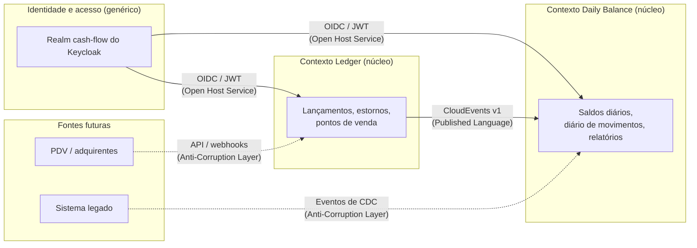

# Domínios de Negócio e Capacidades

Este documento mapeia o problema de negócio em domínios funcionais, bounded contexts e capacidades de negócio. É o ponto de partida de todas as decisões de arquitetura: a divisão em serviços, o estilo de integração e a posse dos dados decorrem dos limites definidos aqui.

## Contexto de negócio

Um comerciante precisa controlar o fluxo de caixa diário do negócio:

- toda movimentação de dinheiro (uma venda recebida, um fornecedor pago, uma correção) é registrada como um **lançamento**, que é um **crédito** ou um **débito**;
- a qualquer momento, o comerciante precisa de um **relatório com o saldo consolidado de cada dia**, para saber quanto entrou, quanto saiu e quanto sobrou.

Essas duas necessidades têm características muito diferentes:

| Aspecto               | Registro de lançamentos                                             | Relatório de saldo diário                                           |
| --------------------- | ------------------------------------------------------------------- | ------------------------------------------------------------------- |
| Natureza              | Escrita, transacional, fonte da verdade                             | Leitura, dado derivado                                              |
| Correção              | Todo lançamento deve ser gravado exatamente uma vez e nunca perdido | Deve refletir, em algum momento, cada lançamento exatamente uma vez |
| Disponibilidade       | Precisa continuar funcionando mesmo com o relatório fora do ar      | Pode ficar alguns segundos atrás; precisa absorver picos            |
| Perfil de carga       | Acompanha a operação do comerciante (vendas ao longo do dia)        | Picos de 50 req/s (fim do dia, fechamento, painéis)                 |
| Frequência de mudança | Regras estáveis (semântica contábil)                                | Formatos e agregações do relatório evoluem com o negócio            |

Essa diferença é o principal motivo para a solução separá-las em dois bounded contexts.

## Cadeia de valor

## Classificação dos domínios

Usando os padrões estratégicos do Domain-Driven Design:

| Subdomínio                                                                 | Tipo                       | Por quê                                                                                                     | Solução                                                    |
| -------------------------------------------------------------------------- | -------------------------- | ----------------------------------------------------------------------------------------------------------- | ---------------------------------------------------------- |
| Ledger de caixa                                                            | Núcleo (core)              | O registro confiável de cada movimentação é a razão de existir do sistema; erros aqui são erros financeiros | Bounded context `ledger`, desenvolvido internamente        |
| Saldo diário (consolidação e relatórios)                                   | Núcleo (core)              | A visão consolidada é o que o comerciante usa para decidir; é o valor visível do produto                    | Bounded context `daily-balance`, desenvolvido internamente |
| Configuração de pontos de venda                                            | Suporte                    | Necessária para resolver a data de competência correta em cada fuso; não é um diferencial por si só         | Parte do contexto `ledger`                                 |
| Identidade e acesso                                                        | Genérico                   | Autenticação e autorização são problemas resolvidos por produtos maduros                                    | Keycloak (OIDC), configurado como código                   |
| Mensageria e integração                                                    | Genérico                   | Entrega assíncrona confiável é infraestrutura                                                               | RabbitMQ com Transactional Outbox                          |
| Observabilidade e operação                                                 | Genérico                   | Monitoramento, tracing e alertas são infraestrutura                                                         | OpenTelemetry, Prometheus, Tempo, Loki, Grafana            |
| Conciliação bancária, previsão de caixa, integrações com PDV e adquirentes | Núcleo ou suporte (futuro) | Capacidades naturais seguintes, fora do escopo do desafio                                                   | Ver [Evoluções futuras](08-future-evolutions.md)           |

## Bounded contexts e mapa de contexto

| Relação                                     | Padrão                                       | Implementação                                                                                                                                                             |
| ------------------------------------------- | -------------------------------------------- | ------------------------------------------------------------------------------------------------------------------------------------------------------------------------- |
| Ledger → Daily Balance                      | Customer/Supplier com **Published Language** | Contrato CloudEvents versionado em [`packages/contracts`](../packages/contracts) (`cashflow.ledger.entry.recorded.v1`, `cashflow.ledger.entry.reversed.v1`)               |
| Daily Balance consumindo eventos            | **Anti-Corruption Layer** (tradutor)         | [`ledger-event-translator.ts`](../services/daily-balance/src/adapters/inbound/messaging/ledger-event-translator.ts) converte o contrato no `Movement` próprio do contexto |
| Identidade → ambos os contextos             | **Open Host Service**                        | Tokens OIDC padrão; cada serviço lê apenas a claim `merchant_id` e os escopos                                                                                             |
| Ledger ↔ Daily Balance em tempo de execução | **Separate Ways** para chamadas síncronas    | Não existe chamada síncrona entre eles. É isso que mantém o ledger disponível quando o consolidado está fora do ar                                                        |
| Fontes futuras                              | **Anti-Corruption Layer**                    | Ver [Arquitetura de transição](04-transition-architecture.md)                                                                                                             |

O único artefato compartilhado entre os contextos é o pacote de contratos de eventos, que contém apenas schemas e validação, sem lógica de negócio. Cada contexto é dono do próprio banco e do próprio modelo de domínio: a palavra "lançamento" é um registro do ledger em um contexto e vira um "movimento" aplicado a um saldo no outro.

## Mapa de capacidades de negócio

```mermaid
flowchart TB
  CF["Gestão do fluxo de caixa"]
  CF --> EM["Gestão de lançamentos"]
  CF --> BC["Consolidação de saldos"]
  CF --> BR["Relatórios de saldo"]
  CF --> MA["Acesso e segurança do comerciante"]
  CF --> OP["Operação"]

  EM --> EM1["Registrar crédito / débito"]
  EM --> EM2["Estornar lançamento"]
  EM --> EM3["Consultar e listar lançamentos"]
  EM --> EM4["Configurar fuso do ponto de venda"]
  EM --> EM5["Retentativas seguras (idempotência)"]

  BC --> BC1["Consolidar lançamentos em totais diários"]
  BC --> BC2["Descartar entregas duplicadas"]
  BC --> BC3["Reconstruir um dia"]
  BC --> BC4["Tratar eventos inválidos e com falha"]

  BR --> BR1["Saldo do dia"]
  BR --> BR2["Relatório do período com saldos de abertura e fechamento"]
  BR --> BR3["Leituras resilientes e em cache"]

  MA --> MA1["Autenticar usuários"]
  MA --> MA2["Autorizar por papel e escopo"]
  MA --> MA3["Isolar os dados de cada comerciante"]
  MA --> MA4["Proteger contra abuso"]

  OP --> OP1["Rastrear, medir e registrar logs"]
  OP --> OP2["Alertar sobre violação de SLO"]
  OP --> OP3["Recuperar de falhas"]
```

| Capacidade (nível 2)                                    | Descrição                                                                                                      | Bounded context    | Processo / componente                                    | Status       |
| ------------------------------------------------------- | -------------------------------------------------------------------------------------------------------------- | ------------------ | -------------------------------------------------------- | ------------ |
| Registrar crédito / débito                              | Registrar uma movimentação com valor, tipo, data de competência, descrição e ponto de venda opcional           | Ledger             | API `ledger`, `RecordEntryService`                       | Implementada |
| Estornar lançamento                                     | Corrigir um erro registrando a movimentação oposta; lançamentos nunca são editados nem excluídos               | Ledger             | API `ledger`, `ReverseEntryService`                      | Implementada |
| Consultar e listar lançamentos                          | Obter um lançamento ou os lançamentos de um período, com paginação                                             | Ledger             | `GetEntryService`, `ListEntriesService`                  | Implementada |
| Configurar fuso do ponto de venda                       | Definir o fuso IANA usado para resolver a data de competência de cada ponto de venda                           | Ledger             | `ConfigurePointOfSaleService`                            | Implementada |
| Retentativas seguras                                    | Repetir uma requisição com a mesma `Idempotency-Key` nunca duplica um lançamento                               | Ledger             | `IdempotencyGuard`                                       | Implementada |
| Publicar eventos de lançamento                          | Entregar cada lançamento registrado aos contextos interessados, pelo menos uma vez, sem perder nenhum          | Ledger             | Transactional Outbox + `ledger-outbox-relay`             | Implementada |
| Consolidar lançamentos em totais diários                | Manter créditos, débitos, saldo e quantidade de lançamentos por comerciante e data de competência              | Daily Balance      | `daily-balance-consumer`, `ConsolidateMovementService`   | Implementada |
| Descartar entregas duplicadas                           | Aplicar cada evento e cada lançamento uma única vez                                                            | Daily Balance      | Diário `applied_movements`                               | Implementada |
| Reconstruir um dia                                      | Recalcular o saldo de um dia a partir do diário de movimentos                                                  | Daily Balance      | `RebuildDailyBalanceService`, comando `rebuild-day`      | Implementada |
| Tratar eventos inválidos e com falha                    | Retentar falhas transitórias com atraso; separar eventos inválidos ou esgotados em uma DLQ; devolvê-los à fila | Daily Balance      | Fila de espera, DLQ, comando `redrive-dead-letters`      | Implementada |
| Saldo do dia                                            | Totais consolidados de um dia mais os saldos acumulados de abertura e fechamento                               | Daily Balance      | API `daily-balance`, `GetBalanceReportService`           | Implementada |
| Relatório do período                                    | Relatório dia a dia de até 92 dias com os totais do período                                                    | Daily Balance      | API `daily-balance`                                      | Implementada |
| Leituras resilientes e em cache                         | Servir relatórios do Redis; servir o último relatório conhecido se o banco falhar                              | Daily Balance      | `CachedBalanceReport`, circuit breakers                  | Implementada |
| Autenticar e autorizar                                  | Login OIDC, validação de JWT, escopos vinculados a papéis                                                      | Identidade / ambos | Keycloak, plugin `authentication`                        | Implementada |
| Isolar os dados de cada comerciante                     | Um usuário só vê os dados do comerciante presente no token                                                     | Ambos              | Claim `merchant_id`, consultas filtradas por comerciante | Implementada |
| Proteger contra abuso                                   | Limite de requisições por comerciante, limite de corpo, headers de segurança                                   | Ambos              | Plugins do Fastify                                       | Implementada |
| Rastrear, medir, registrar logs, alertar                | Traces de ponta a ponta, métricas técnicas e de negócio, alertas                                               | Operação           | OpenTelemetry + stack Grafana                            | Implementada |
| Conciliação bancária, previsão, categorias, integrações | Próximas capacidades do produto                                                                                | Futuro             | —                                                        | Futura       |

## Contexto Ledger

| Item               | Descrição                                                                                                                                                                                         |
| ------------------ | ------------------------------------------------------------------------------------------------------------------------------------------------------------------------------------------------- |
| Propósito          | Ser a fonte única da verdade de toda movimentação de dinheiro de um comerciante                                                                                                                   |
| Agregados          | `Entry` (lançamento, com as regras de estorno e os eventos de domínio), `PointOfSale` (fuso horário)                                                                                              |
| Value objects      | `Money` (centavos inteiros positivos, BRL), `EntryType`, `BusinessDate`, `TimeZone` (IANA), `Description`, identificadores                                                                        |
| Invariantes        | Valor positivo; data de competência não futura e dentro da janela de retroatividade; um lançamento pode ser estornado uma única vez; um estorno não pode ser estornado; lançamentos são imutáveis |
| Comandos           | Registrar lançamento, estornar lançamento, configurar ponto de venda                                                                                                                              |
| Consultas          | Obter lançamento, listar lançamentos por período                                                                                                                                                  |
| Eventos publicados | `EntryRecorded`, `EntryReversed` (como CloudEvents v1)                                                                                                                                            |
| Dados próprios     | `entries`, `points_of_sale`, `outbox`, `idempotency_keys`                                                                                                                                         |
| Consistência       | Forte: o lançamento e seu evento são gravados na mesma transação                                                                                                                                  |

## Contexto Daily Balance

| Item               | Descrição                                                                                                                                             |
| ------------------ | ----------------------------------------------------------------------------------------------------------------------------------------------------- |
| Propósito          | Oferecer ao comerciante uma visão rápida e sempre disponível do saldo consolidado de cada dia e período                                               |
| Agregados          | `DailyBalance` (totais de um comerciante em uma data de competência), `BalanceReport` (visão do período com saldos de abertura e fechamento)          |
| Value objects      | `Movement`, `ReportPeriod` (até 92 dias), `BusinessDate`, `Money`                                                                                     |
| Invariantes        | Um movimento só se aplica ao saldo do seu comerciante e da sua data; os totais nunca estouram; cada evento e cada lançamento é aplicado uma única vez |
| Eventos consumidos | `cashflow.ledger.entry.recorded.v1`, `cashflow.ledger.entry.reversed.v1`                                                                              |
| Dados próprios     | `daily_balances` (modelo de leitura), `applied_movements` (diário usado para deduplicação e reconstrução)                                             |
| Consistência       | Eventual: p95 medido de 0,5 s entre o registro e a consolidação                                                                                       |

## Eventos de domínio

| Evento                              | Emitido quando             | Dados                                                                                              |
| ----------------------------------- | -------------------------- | -------------------------------------------------------------------------------------------------- |
| `cashflow.ledger.entry.recorded.v1` | Um lançamento é registrado | `entryId`, `merchantId`, `pointOfSaleId`, `entryType`, `amountInCents`, `currency`, `businessDate` |
| `cashflow.ledger.entry.reversed.v1` | Um lançamento é estornado  | Os mesmos campos, descrevendo o lançamento de estorno, mais `reversedEntryId`                      |

O estorno de um crédito é publicado como um débito do mesmo valor e da mesma data de competência. O consolidado apenas soma movimentos, então o dia é corrigido e os totais continuam mostrando o que de fato foi movimentado, como em um extrato bancário.

## Linguagem ubíqua

O negócio fala português e o código fala inglês. A tabela mantém os dois alinhados.

| Termo de negócio (PT)    | Termo no código (EN)         | Significado                                                                                                   |
| ------------------------ | ---------------------------- | ------------------------------------------------------------------------------------------------------------- |
| Comerciante              | Merchant (`merchantId`)      | O negócio cujo fluxo de caixa é controlado; identificado pela claim `merchant_id` do token                    |
| Lançamento               | Entry                        | Uma movimentação de dinheiro registrada                                                                       |
| Crédito / Débito         | Credit / Debit (`EntryType`) | Entrada / saída de dinheiro                                                                                   |
| Estorno                  | Reversal                     | Lançamento de tipo oposto que anula outro lançamento                                                          |
| Data de competência      | Business date                | O dia do caixa ao qual o lançamento pertence, no fuso do ponto de venda; pode diferir do instante do registro |
| Instante do registro     | Recorded at (`recordedAt`)   | Quando o lançamento foi registrado, em UTC                                                                    |
| Ponto de venda           | Point of sale                | Uma loja ou terminal do comerciante, com o próprio fuso horário                                               |
| Fuso horário             | Time zone (IANA)             | Por exemplo, `America/Sao_Paulo`, `America/Manaus`                                                            |
| Movimento                | Movement                     | Um lançamento visto pelo contexto do consolidado                                                              |
| Saldo diário consolidado | Daily balance                | Créditos menos débitos de um comerciante em uma data de competência                                           |
| Saldo de abertura        | Opening balance              | Saldo acumulado antes de um dia ou período                                                                    |
| Saldo de fechamento      | Closing balance              | Saldo de abertura mais o saldo do dia (ou do período)                                                         |
| Relatório do período     | Balance report               | Saldos dia a dia de um período, com os totais                                                                 |
| Reprocessar um dia       | Rebuild a day                | Recalcular o saldo de um dia a partir do diário de movimentos                                                 |
| Chave de idempotência    | Idempotency key              | Chave enviada pelo cliente que torna as retentativas seguras                                                  |

## Próximos documentos

- [Requisitos](02-requirements.md): requisitos funcionais e não funcionais refinados a partir deste mapa, com critérios de aceite e evidências.
- [Arquitetura alvo](03-target-architecture.md): como os bounded contexts viram serviços, bancos de dados e integrações.
