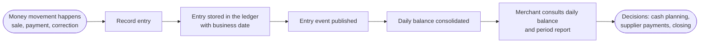
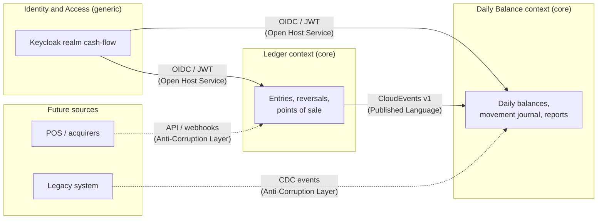

# Business Domains and Capabilities

This document maps the business problem into functional domains, bounded contexts and business capabilities. It is the starting point for every architectural decision: the split into services, the integration style and the ownership of data all follow from the boundaries defined here.

## Business context

A merchant needs to control the daily cash flow of the business:

- every money movement (a sale received, a supplier paid, a correction) is recorded as an **entry**, either a **credit** or a **debit**;
- at any time, the merchant needs a **report with the consolidated balance of each day**, to know how much came in, how much went out and how much is left.

These two needs have very different characteristics:

| Aspect           | Recording entries                                           | Daily balance report                                     |
| ---------------- | ----------------------------------------------------------- | -------------------------------------------------------- |
| Nature           | Write-heavy, transactional, source of truth                 | Read-heavy, derived data                                 |
| Correctness      | Every entry must be stored exactly once and never lost      | Must eventually reflect every entry, exactly once        |
| Availability     | Must keep working even if reporting is down                 | May lag a few seconds behind; must absorb peaks          |
| Load profile     | Follows the merchant's operation (sales throughout the day) | Peaks of 50 req/s (end of day, closing, dashboards)      |
| Change frequency | Rules are stable (accounting semantics)                     | Report formats and aggregations evolve with the business |

This difference is the main reason the solution separates them into two bounded contexts.

## Value stream

## Domain classification

Using Domain-Driven Design strategic patterns:

| Subdomain                                                   | Type                   | Why                                                                                                           | Solution                                         |
| ----------------------------------------------------------- | ---------------------- | ------------------------------------------------------------------------------------------------------------- | ------------------------------------------------ |
| Cash Ledger                                                 | Core                   | The reliable record of every money movement is the reason the system exists; errors here are financial errors | `ledger` bounded context, built in-house         |
| Daily Balance (consolidation and reporting)                 | Core                   | The consolidated view is what the merchant uses to decide; it is the visible value of the product             | `daily-balance` bounded context, built in-house  |
| Point of Sale configuration                                 | Supporting             | Needed to resolve the correct business date in each time zone; not a differentiator by itself                 | Part of the `ledger` context                     |
| Identity and Access                                         | Generic                | Authentication and authorization are solved problems with mature products                                     | Keycloak (OIDC), configured as code              |
| Messaging and integration                                   | Generic                | Reliable asynchronous delivery is infrastructure                                                              | RabbitMQ with the Transactional Outbox           |
| Observability and operations                                | Generic                | Monitoring, tracing and alerting are infrastructure                                                           | OpenTelemetry, Prometheus, Tempo, Loki, Grafana  |
| Bank reconciliation, forecasting, POS/acquirer integrations | Future core/supporting | Natural next capabilities, out of the scope of the challenge                                                  | See [Future evolutions](08-future-evolutions.md) |

## Bounded contexts and context map

| Relationship                      | Pattern                                         | Implementation                                                                                                                                                        |
| --------------------------------- | ----------------------------------------------- | --------------------------------------------------------------------------------------------------------------------------------------------------------------------- |
| Ledger → Daily Balance            | Customer/Supplier with a **Published Language** | Versioned CloudEvents contract in [`packages/contracts`](../packages/contracts) (`cashflow.ledger.entry.recorded.v1`, `cashflow.ledger.entry.reversed.v1`)            |
| Daily Balance consuming events    | **Anti-Corruption Layer** (translator)          | [`ledger-event-translator.ts`](../services/daily-balance/src/adapters/inbound/messaging/ledger-event-translator.ts) maps the contract to the context's own `Movement` |
| Identity → both contexts          | **Open Host Service**                           | Standard OIDC tokens; each service only reads the `merchant_id` claim and the scopes                                                                                  |
| Ledger ↔ Daily Balance at runtime | **Separate Ways** for synchronous calls         | There is no synchronous call between them. This is what keeps the ledger available when the daily balance is down                                                     |
| Future sources                    | **Anti-Corruption Layer**                       | See [Transition architecture](04-transition-architecture.md)                                                                                                          |

The only artifact shared between the contexts is the event contract package, which contains schemas and validation only, with no business logic. Each context owns its database and its domain model; the word "entry" means a ledger record in one context and becomes a "movement" applied to a balance in the other.

## Business capability map

```mermaid
flowchart TB
  CF["Cash Flow Management"]
  CF --> EM["Entry Management"]
  CF --> BC["Balance Consolidation"]
  CF --> BR["Balance Reporting"]
  CF --> MA["Merchant Access and Security"]
  CF --> OP["Operations"]

  EM --> EM1["Record credit / debit"]
  EM --> EM2["Reverse entry"]
  EM --> EM3["Query and list entries"]
  EM --> EM4["Configure point of sale time zone"]
  EM --> EM5["Safe retries (idempotency)"]

  BC --> BC1["Consolidate entries into daily totals"]
  BC --> BC2["Deduplicate deliveries"]
  BC --> BC3["Rebuild a day"]
  BC --> BC4["Handle poison and failed events"]

  BR --> BR1["Daily balance"]
  BR --> BR2["Period report with opening and closing balances"]
  BR --> BR3["Resilient, cached reads"]

  MA --> MA1["Authenticate users"]
  MA --> MA2["Authorize by role and scope"]
  MA --> MA3["Isolate merchant data"]
  MA --> MA4["Protect against abuse"]

  OP --> OP1["Trace, measure and log"]
  OP --> OP2["Alert on SLO breaches"]
  OP --> OP3["Recover from failures"]
```

| Capability (L2)                                            | Description                                                                                        | Bounded context | Process / component                                    | Status      |
| ---------------------------------------------------------- | -------------------------------------------------------------------------------------------------- | --------------- | ------------------------------------------------------ | ----------- |
| Record credit / debit                                      | Register a money movement with amount, type, business date, description and optional point of sale | Ledger          | `ledger` API, `RecordEntryService`                     | Implemented |
| Reverse entry                                              | Correct a mistake by recording the opposite movement; entries are never edited or deleted          | Ledger          | `ledger` API, `ReverseEntryService`                    | Implemented |
| Query and list entries                                     | Retrieve one entry or the entries of a period, paginated                                           | Ledger          | `GetEntryService`, `ListEntriesService`                | Implemented |
| Configure point of sale time zone                          | Define the IANA time zone used to resolve the business date of each point of sale                  | Ledger          | `ConfigurePointOfSaleService`                          | Implemented |
| Safe retries                                               | Repeating a request with the same `Idempotency-Key` never duplicates an entry                      | Ledger          | `IdempotencyGuard`                                     | Implemented |
| Publish entry events                                       | Deliver every recorded entry to interested contexts, at least once, without losing any             | Ledger          | Transactional Outbox + `ledger-outbox-relay`           | Implemented |
| Consolidate entries into daily totals                      | Keep credits, debits, balance and entry count per merchant and business date                       | Daily Balance   | `daily-balance-consumer`, `ConsolidateMovementService` | Implemented |
| Deduplicate deliveries                                     | Apply each event and each entry only once                                                          | Daily Balance   | `applied_movements` journal                            | Implemented |
| Rebuild a day                                              | Recompute a day's balance from the movement journal                                                | Daily Balance   | `RebuildDailyBalanceService`, `rebuild-day` command    | Implemented |
| Handle poison and failed events                            | Retry transient failures with delay; park invalid or exhausted events in a DLQ; redrive them       | Daily Balance   | Retry queue, DLQ, `redrive-dead-letters` command       | Implemented |
| Daily balance                                              | Consolidated totals of a day plus accumulated opening and closing balances                         | Daily Balance   | `daily-balance` API, `GetBalanceReportService`         | Implemented |
| Period report                                              | Day-by-day report of up to 92 days with period totals                                              | Daily Balance   | `daily-balance` API                                    | Implemented |
| Resilient, cached reads                                    | Serve reports from Redis; serve the last known report if the database fails                        | Daily Balance   | `CachedBalanceReport`, circuit breakers                | Implemented |
| Authenticate and authorize                                 | OIDC login, JWT validation, role-bound scopes                                                      | Identity / both | Keycloak, `authentication` plugin                      | Implemented |
| Isolate merchant data                                      | A user only sees the data of the merchant in the token                                             | Both            | `merchant_id` claim, repository queries by merchant    | Implemented |
| Protect against abuse                                      | Rate limiting per merchant, body limits, security headers                                          | Both            | Fastify plugins                                        | Implemented |
| Trace, measure, log, alert                                 | End-to-end traces, business and technical metrics, alerts                                          | Operations      | OpenTelemetry + Grafana stack                          | Implemented |
| Bank reconciliation, forecasting, categories, integrations | Next product capabilities                                                                          | Future          | —                                                      | Future      |

## Ledger context

| Item             | Description                                                                                                                                                            |
| ---------------- | ---------------------------------------------------------------------------------------------------------------------------------------------------------------------- |
| Purpose          | Be the single source of truth of every money movement of a merchant                                                                                                    |
| Aggregates       | `Entry` (with reversal rules and domain events), `PointOfSale` (time zone)                                                                                             |
| Value objects    | `Money` (positive integer cents, BRL), `EntryType`, `BusinessDate`, `TimeZone` (IANA), `Description`, identifiers                                                      |
| Invariants       | Amount positive; business date not in the future and within the backdating window; an entry can be reversed once; a reversal cannot be reversed; entries are immutable |
| Commands         | Record entry, reverse entry, configure point of sale                                                                                                                   |
| Queries          | Get entry, list entries by period                                                                                                                                      |
| Events published | `EntryRecorded`, `EntryReversed` (as CloudEvents v1)                                                                                                                   |
| Data owned       | `entries`, `points_of_sale`, `outbox`, `idempotency_keys`                                                                                                              |
| Consistency      | Strong: the entry and its event are committed in the same transaction                                                                                                  |

## Daily Balance context

| Item            | Description                                                                                                                       |
| --------------- | --------------------------------------------------------------------------------------------------------------------------------- |
| Purpose         | Give the merchant a fast, always available view of the consolidated balance of each day and period                                |
| Aggregates      | `DailyBalance` (totals of a merchant and business date), `BalanceReport` (period view with opening and closing balances)          |
| Value objects   | `Movement`, `ReportPeriod` (up to 92 days), `BusinessDate`, `Money`                                                               |
| Invariants      | A movement only applies to the balance of its merchant and date; totals never overflow; each event and each entry is applied once |
| Events consumed | `cashflow.ledger.entry.recorded.v1`, `cashflow.ledger.entry.reversed.v1`                                                          |
| Data owned      | `daily_balances` (read model), `applied_movements` (journal used for deduplication and rebuilds)                                  |
| Consistency     | Eventual: measured p95 of 0.5 s between recording and consolidation                                                               |

## Domain events

| Event                               | Emitted when         | Data                                                                                               |
| ----------------------------------- | -------------------- | -------------------------------------------------------------------------------------------------- |
| `cashflow.ledger.entry.recorded.v1` | An entry is recorded | `entryId`, `merchantId`, `pointOfSaleId`, `entryType`, `amountInCents`, `currency`, `businessDate` |
| `cashflow.ledger.entry.reversed.v1` | An entry is reversed | Same fields describing the reversal entry, plus `reversedEntryId`                                  |

A reversal of a credit is published as a debit of the same amount and business date. The daily balance simply adds movements, so the day is corrected and the totals still show what actually moved, as in a bank statement.

## Ubiquitous language

The business speaks Portuguese and the code speaks English. The table keeps both aligned.

| Business term (PT)       | Code term (EN)               | Meaning                                                                                                  |
| ------------------------ | ---------------------------- | -------------------------------------------------------------------------------------------------------- |
| Comerciante              | Merchant (`merchantId`)      | The business whose cash flow is controlled; identified by the `merchant_id` claim of the token           |
| Lançamento               | Entry                        | A recorded money movement                                                                                |
| Crédito / Débito         | Credit / Debit (`EntryType`) | Money in / money out                                                                                     |
| Estorno                  | Reversal                     | An entry of the opposite type that cancels another entry                                                 |
| Data de competência      | Business date                | The cash day the entry belongs to, in the point of sale time zone; may differ from the recording instant |
| Instante do registro     | Recorded at (`recordedAt`)   | When the entry was recorded, in UTC                                                                      |
| Ponto de venda           | Point of sale                | A store or terminal of the merchant, with its own time zone                                              |
| Fuso horário             | Time zone (IANA)             | E.g. `America/Sao_Paulo`, `America/Manaus`                                                               |
| Movimento                | Movement                     | An entry as seen by the daily balance context                                                            |
| Saldo diário consolidado | Daily balance                | Credits minus debits of a merchant on a business date                                                    |
| Saldo de abertura        | Opening balance              | Accumulated balance before a day or period                                                               |
| Saldo de fechamento      | Closing balance              | Opening balance plus the day's (or period's) balance                                                     |
| Relatório do período     | Balance report               | Day-by-day balances of a period, with totals                                                             |
| Reprocessar um dia       | Rebuild a day                | Recompute a day's balance from the movement journal                                                      |
| Chave de idempotência    | Idempotency key              | Client-provided key that makes retries safe                                                              |

## Next documents

- [Requirements](02-requirements.md): functional and non-functional requirements refined from this map, with acceptance criteria and evidence.
- [Target architecture](03-target-architecture.md): how the bounded contexts become services, data stores and integrations.
