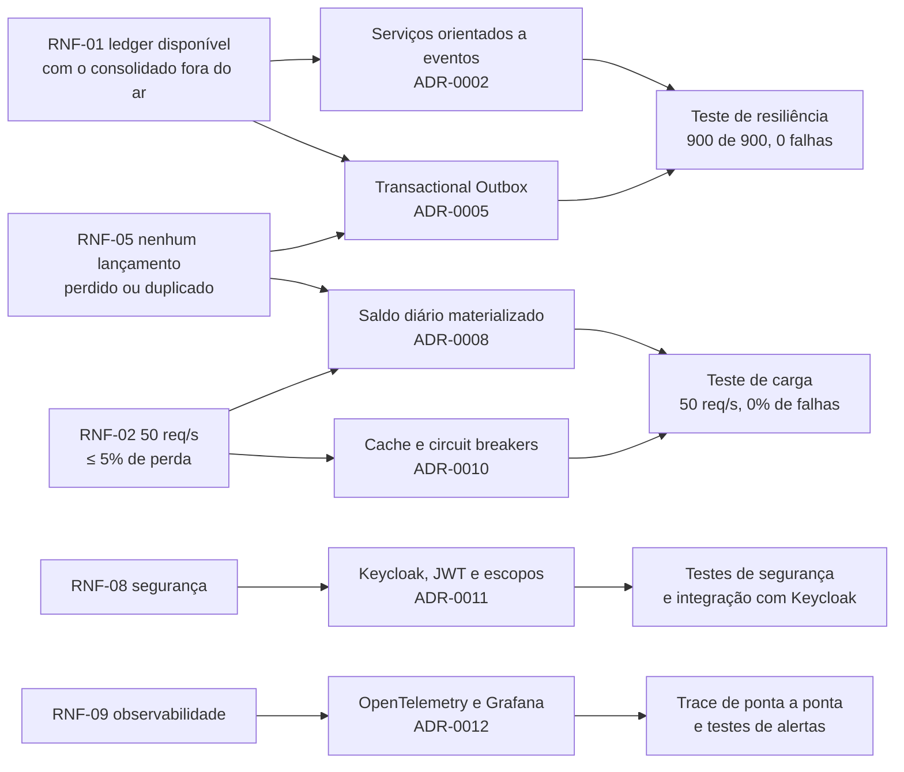

# Requisitos

Este documento refina os requisitos do desafio em afirmações precisas e verificáveis. Cada requisito tem critérios de aceite e aponta onde está implementado e como é verificado. O enunciado original era curto ("um serviço que faça o controle de lançamentos" e "um serviço do consolidado diário", mais dois requisitos não funcionais). Todo o resto é refinamento, e cada premissa está escrita para poder ser questionada.

## Atores

| Ator                         | Descrição                                                                               | Papel no provedor de identidade |
| ---------------------------- | --------------------------------------------------------------------------------------- | ------------------------------- |
| Operador do comerciante      | Registra lançamentos e estornos e consulta saldos                                       | `merchant-operator`             |
| Leitor do comerciante        | Contador ou gestor que apenas consulta lançamentos e saldos                             | `merchant-viewer`               |
| Equipe de operação           | Monitora o sistema, trata alertas, reconstrói saldos e devolve eventos com falha à fila | Acesso à infraestrutura         |
| Sistemas integrados (futuro) | PDV, adquirentes ou ERPs que registram lançamentos automaticamente                      | Cliente OAuth (futuro)          |

## Requisitos funcionais

| ID    | Requisito                                                                                  | Critérios de aceite                                                                                                                                                                                                                       | Implementação                                                              | Verificação                                                                                       |
| ----- | ------------------------------------------------------------------------------------------ | ----------------------------------------------------------------------------------------------------------------------------------------------------------------------------------------------------------------------------------------- | -------------------------------------------------------------------------- | ------------------------------------------------------------------------------------------------- |
| RF-01 | Registrar um crédito ou um débito para o comerciante autenticado                           | `POST /v1/entries` retorna `201` com o lançamento e o header `Location`; o lançamento e seu evento são gravados de forma atômica                                                                                                          | `RecordEntryService`, `entry-routes.ts`                                    | `record-entry-service.test.ts`, `entry-routes.test.ts`, `ledger-http.integration.test.ts`         |
| RF-02 | Tornar o registro de lançamentos seguro para retentativas                                  | Repetir uma requisição com a mesma `Idempotency-Key` devolve a resposta original com `idempotent-replayed: true` e nunca grava um segundo lançamento, mesmo com requisições simultâneas; reutilizar a chave com outro corpo retorna `422` | `IdempotencyGuard`, tabela `idempotency_keys`                              | `idempotency-guard.test.ts`, `idempotency.integration.test.ts`                                    |
| RF-03 | Estornar um lançamento                                                                     | `POST /v1/entries/{id}/reversal` grava o lançamento oposto com o mesmo valor, data de competência, ponto de venda e fuso; um segundo estorno retorna `409`; estornar um estorno retorna `422`                                             | `ReverseEntryService`, `Entry.reverse()`                                   | `reverse-entry-service.test.ts`, `entry.test.ts`, `postgres-entry-repository.integration.test.ts` |
| RF-04 | Consultar um lançamento                                                                    | `GET /v1/entries/{id}` retorna o lançamento do comerciante; lançamentos de outros comerciantes retornam `404`                                                                                                                             | `GetEntryService`                                                          | `get-entry-service.test.ts`, `security.test.ts`, `keycloak.integration.test.ts`                   |
| RF-05 | Listar os lançamentos de um período                                                        | `GET /v1/entries?from&to` retorna os lançamentos das datas de competência do período (no máximo 92 dias), paginados (padrão de 50, no máximo 100 por página)                                                                              | `ListEntriesService`                                                       | `list-entries-service.test.ts`                                                                    |
| RF-06 | Configurar o fuso horário de um ponto de venda                                             | `PUT /v1/points-of-sale/{id}` aceita apenas fusos IANA (por exemplo, `America/Manaus`); os lançamentos desse ponto de venda usam esse fuso para resolver a data de competência                                                            | `ConfigurePointOfSaleService`, `TimeZoneResolver`                          | `point-of-sale.test.ts`, `point-of-sale-routes.test.ts`, `time-zone-resolver.test.ts`             |
| RF-07 | Consolidar cada lançamento no saldo diário do seu comerciante e da sua data de competência | Cada lançamento registrado ou estornado soma aos créditos ou aos débitos do seu dia; o saldo é igual a créditos menos débitos                                                                                                             | `ConsolidateMovementService`, consumidor                                   | `consolidate-movement-service.test.ts`, `ledger-event-consumer.integration.test.ts`               |
| RF-08 | Aplicar cada lançamento ao saldo exatamente uma vez                                        | Eventos reentregues, duplicatas simultâneas e o mesmo lançamento publicado com outro id de evento não alteram o saldo                                                                                                                     | Chave primária de `applied_movements` e `entry_id` único                   | `consolidation.integration.test.ts`                                                               |
| RF-09 | Consultar o saldo consolidado de um dia                                                    | `GET /v1/daily-balances/{date}` retorna créditos, débitos, saldo, quantidade de lançamentos e os saldos acumulados de abertura e fechamento; um dia sem movimento retorna zeros                                                           | `GetBalanceReportService`                                                  | `get-balance-report-service.test.ts`, `daily-balance-routes.test.ts`                              |
| RF-10 | Consultar um relatório dia a dia de um período                                             | `GET /v1/daily-balances?from&to` retorna uma linha por dia (no máximo 92 dias) com os saldos de abertura e fechamento acumulados, mais os totais do período                                                                               | `BalanceReport.compose`                                                    | `balance-report.test.ts`, `report-period.test.ts`                                                 |
| RF-11 | Reconstruir o saldo de um dia                                                              | `rebuild-day --merchant --date` recalcula o dia a partir do diário de movimentos, inclusive com o consumidor em execução                                                                                                                  | `RebuildDailyBalanceService`                                               | `rebuild-daily-balance-service.test.ts`, `consolidation.integration.test.ts`                      |
| RF-12 | Recuperar eventos que não puderam ser consolidados                                         | Eventos inválidos ou com falhas repetidas vão para uma dead letter queue com o motivo; `redrive-dead-letters` os devolve à fila depois que a causa é corrigida                                                                            | Fila de espera, DLQ, `RabbitMqDeadLetterRedriver`                          | `ledger-message-handler.test.ts`, `ledger-event-consumer.integration.test.ts`                     |
| RF-13 | Autenticar usuários e isolar comerciantes                                                  | As rotas de negócio exigem um JWT válido; o comerciante sempre vem do token; usuários só acessam os dados do próprio comerciante                                                                                                          | Realm do Keycloak, plugin `authentication`                                 | `security.test.ts` (nos dois serviços), `keycloak.integration.test.ts`                            |
| RF-14 | Autorizar por papel                                                                        | Operadores registram e consultam; leitores apenas consultam; a falta do escopo retorna `403`                                                                                                                                              | Escopos `ledger:write`, `ledger:read` e `balance:read` vinculados a papéis | `security.test.ts`, `keycloak.integration.test.ts`                                                |

## Regras de negócio

| ID    | Regra                                                                                                                                                         | Garantida por                                              |
| ----- | ------------------------------------------------------------------------------------------------------------------------------------------------------------- | ---------------------------------------------------------- |
| RN-01 | Valores são inteiros positivos em centavos. Ponto flutuante nunca é usado para dinheiro                                                                       | Value object `Money`, JSON Schema, constraint `CHECK`      |
| RN-02 | A única moeda é BRL                                                                                                                                           | `Money`, contrato do evento                                |
| RN-03 | Um lançamento é um `CREDIT` ou um `DEBIT`                                                                                                                     | `EntryType`, constraint `CHECK`                            |
| RN-04 | A data de competência é o dia do caixa no fuso do ponto de venda; quando omitida, é o dia atual nesse fuso                                                    | `BusinessDate.fromInstant`, `TimeZoneResolver`             |
| RN-05 | A data de competência não pode ser futura nem anterior a 30 dias (configurável por `MAX_BACKDATED_DAYS`)                                                      | `BusinessDatePolicy`                                       |
| RN-06 | Lançamentos sem ponto de venda usam o fuso padrão (`DEFAULT_TIME_ZONE`, `America/Sao_Paulo`)                                                                  | `TimeZoneResolver`                                         |
| RN-07 | O instante do registro é gravado em UTC junto com o fuso vigente; a hora local é derivada, nunca armazenada                                                   | `Entry`, `toEntryView`                                     |
| RN-08 | A descrição é obrigatória, de 1 a 140 caracteres; um estorno sem motivo recebe uma descrição padrão que referencia o lançamento original                      | `Description`, `ReverseEntryService`                       |
| RN-09 | Lançamentos são imutáveis. Correções são feitas por estorno                                                                                                   | Não existem operações de alteração ou exclusão             |
| RN-10 | Um lançamento só pode ser estornado uma vez, e um estorno não pode ser estornado                                                                              | `Entry.reverse()`, índice único `entries_reversal_of_uidx` |
| RN-11 | O saldo de um dia é a soma dos créditos menos a soma dos débitos; estornos contam como movimentos do próprio tipo                                             | `DailyBalance.apply`, coluna gerada `balance_cents`        |
| RN-12 | O saldo de abertura de um dia é a soma dos saldos de todos os dias anteriores do comerciante; o saldo de fechamento é o saldo de abertura mais o saldo do dia | `BalanceReport.compose`, `accumulatedBalanceBefore`        |
| RN-13 | Um usuário só acessa o comerciante identificado pela claim `merchant_id` do token, um atributo que apenas o administrador pode alterar                        | Perfil de usuário do Keycloak, `principalOf`               |

## Requisitos não funcionais

Os dois requisitos do enunciado do desafio são o RNF-01 e o RNF-02. Os demais são refinamentos necessários para que um sistema financeiro seja confiável em produção.

| ID     | Categoria        | Requisito e meta                                                                                                                                 | Como é atendido                                                                                                                                                               | Evidência                                                                                                                                      |
| ------ | ---------------- | ------------------------------------------------------------------------------------------------------------------------------------------------ | ----------------------------------------------------------------------------------------------------------------------------------------------------------------------------- | ---------------------------------------------------------------------------------------------------------------------------------------------- |
| RNF-01 | Disponibilidade  | **O ledger deve continuar disponível quando o consolidado estiver fora do ar.** Meta: 0 falhas de registro causadas por uma queda do consolidado | Nenhuma chamada síncrona entre serviços; o ledger não conhece o broker (Transactional Outbox); processos e bancos separados                                                   | `npm run test:resilience`: 900 lançamentos gravados com todo o consolidado fora do ar por 30 s, **0 falhas**, 900 de 900 consolidados depois   |
| RNF-02 | Vazão            | **O consolidado recebe 50 req/s no pico com no máximo 5% de perda de requisições**                                                               | Modelo de leitura materializado, cache Redis, agrupamento de leituras simultâneas, stale-if-error, circuit breakers, limite de requisições acima do pico                      | `npm run test:load`: 6.001 requisições a 50 req/s, **0% de falhas**; também 0% com o Redis e com o banco fora do ar durante o pico             |
| RNF-03 | Desempenho       | Latência p95 do consolidado abaixo de 500 ms no pico; p95 do ledger abaixo de 500 ms                                                             | Leituras por chave primária, cache, pool de conexões                                                                                                                          | Teste de pico com p95 de 6,5 ms (consolidado); teste de resiliência com p95 de 20 ms (ledger)                                                  |
| RNF-04 | Atualização      | p95 do tempo entre registrar um lançamento e vê-lo no saldo consolidado abaixo de 30 s                                                           | Relay do outbox consultando a cada 500 ms (imediatamente enquanto houver backlog), consumidor com prefetch                                                                    | `cashflow_consolidation_lag_seconds`: p50 de 0,26 s e p95 de 0,5 s sob carga                                                                   |
| RNF-05 | Durabilidade     | Nenhum lançamento registrado é perdido ou aplicado duas vezes ao saldo                                                                           | Outbox na mesma transação, publisher confirms, mensagens persistentes, publicação `mandatory`, quorum queues, consumidor idempotente, DLQ em vez de descarte                  | `outbox-relay.integration.test.ts`, `consolidation.integration.test.ts`, conciliação do teste de resiliência (créditos iguais ao centavo)      |
| RNF-06 | Escalabilidade   | Todo processo escala horizontalmente sem coordenação                                                                                             | APIs sem estado, relays com `FOR UPDATE SKIP LOCKED`, consumidores concorrentes, cache compartilhado                                                                          | Três relays em paralelo publicam cada evento uma única vez (teste de integração); uma réplica do consolidado atendeu 400 req/s com 0% de erros |
| RNF-07 | Resiliência      | Falhas do cache, do broker, do consumidor ou do banco do consolidado não devem causar erros que o sistema consiga evitar                         | Fila de espera com atraso, DLQ, reconexão com backoff, stale-if-error, circuit breakers, pools que sobrevivem à perda de conexão, readiness `degraded`                        | Tabela "Resiliência" do README; testes de queda do Redis e do banco sob carga                                                                  |
| RNF-08 | Segurança        | Acesso autenticado com menor privilégio; isolamento entre comerciantes; proteção contra abuso                                                    | OIDC/JWT (RS256), escopos vinculados a papéis, comerciante vindo do token, limite de requisições por comerciante, headers de segurança, limite de corpo, validação de entrada | `security.test.ts` (nos dois serviços), `keycloak.integration.test.ts`; ver [Segurança](06-security.md)                                        |
| RNF-09 | Observabilidade  | Toda requisição pode ser rastreada de ponta a ponta; SLOs medidos; alertas em caso de violação                                                   | Traces, métricas e logs com OpenTelemetry; contexto do trace propagado pelo outbox; dashboard e 10 regras de alerta                                                           | Trace real do `POST /v1/entries` até o upsert do consumidor; alertas testados parando o consumidor e enviando uma mensagem à DLQ               |
| RNF-10 | Consistência     | O ledger é fortemente consistente; o consolidado é eventualmente consistente e sempre pode ser reconstruído                                      | Transações ACID; diário de movimentos aplicados                                                                                                                               | Comando `rebuild-day`; teste de reconstrução simultânea ao consumo                                                                             |
| RNF-11 | Manutenibilidade | Regras de negócio isoladas de frameworks; mudanças de contrato restritas aos adapters; qualidade de código garantida por ferramentas             | Arquitetura hexagonal, contratos versionados, regras de ESLint (complexidade 8, no máximo 3 parâmetros, sem comentários inline), TypeScript estrito                           | [ADR-0003](adr/0003-hexagonal-architecture.md), lint em todas as fases                                                                         |
| RNF-12 | Portabilidade    | A solução inteira roda localmente com um comando                                                                                                 | Docker Compose com todas as dependências, realm e dashboards como código                                                                                                      | `docker compose up -d --build`                                                                                                                 |
| RNF-13 | Auditabilidade   | Toda movimentação guarda quem, quando e por quê; nada é apagado                                                                                  | Lançamentos imutáveis, estornos referenciando o original, `recordedAt` + fuso, trace ids nos logs                                                                             | Testes de domínio, constraints do banco                                                                                                        |

### Por que essas metas

- O **RNF-02** fala em "no máximo 5% de perda". A solução trata esse valor como piso: a meta interna é 99,5% de sucesso (ver [Operação](07-operations.md)), e o alerta `DailyBalanceRequestLossAboveBudget` dispara no limite de 5%.
- O **RNF-04** não está no enunciado, mas um saldo consolidado com minutos de atraso não seria útil. Trinta segundos dão margem para retentativas, enquanto o valor medido fica muito abaixo disso.
- O **RNF-05** é o que torna o desenho assíncrono aceitável para dinheiro: o desacoplamento só é seguro se nenhum evento se perde e nenhum é contado duas vezes.

## Premissas

| ID   | Premissa                                                                                                                                                |
| ---- | ------------------------------------------------------------------------------------------------------------------------------------------------------- |
| P-01 | "Perda de requisições" significa requisições que não recebem resposta de sucesso (erros, timeouts ou limitação de taxa)                                 |
| P-02 | O pico de 50 req/s pode vir de um único comerciante, então os limites por comerciante precisam comportá-lo                                              |
| P-03 | O consolidado pode ser eventualmente consistente, desde que convirja rapidamente e com exatidão                                                         |
| P-04 | O dia do caixa segue a hora local do ponto de venda; o Brasil tem quatro fusos horários                                                                 |
| P-05 | Lançamentos podem ser retroativos dentro de uma janela configurável (30 dias), para registrar movimentações atrasadas; datas futuras não são permitidas |
| P-06 | Lançamentos nunca são editados ou excluídos; a prática contábil exige correção por estorno                                                              |
| P-07 | Uma única moeda (BRL) atende os comerciantes-alvo                                                                                                       |
| P-08 | A gestão de usuários (cadastro, redefinição de senha) é delegada ao provedor de identidade                                                              |

## Fora do escopo

- Uma interface de usuário. As APIs são documentadas com OpenAPI em `/docs`.
- Conciliação bancária, previsão de caixa, categorias e integrações com PDV ou adquirentes. Elas estão listadas em [Evoluções futuras](08-future-evolutions.md).
- Múltiplas moedas e fechamento de período (bloqueio de dias passados).

## Rastreabilidade

As decisões estão registradas nos [ADRs](adr/README.md), e a arquitetura alvo que as implementa está em [Arquitetura alvo](03-target-architecture.md).
