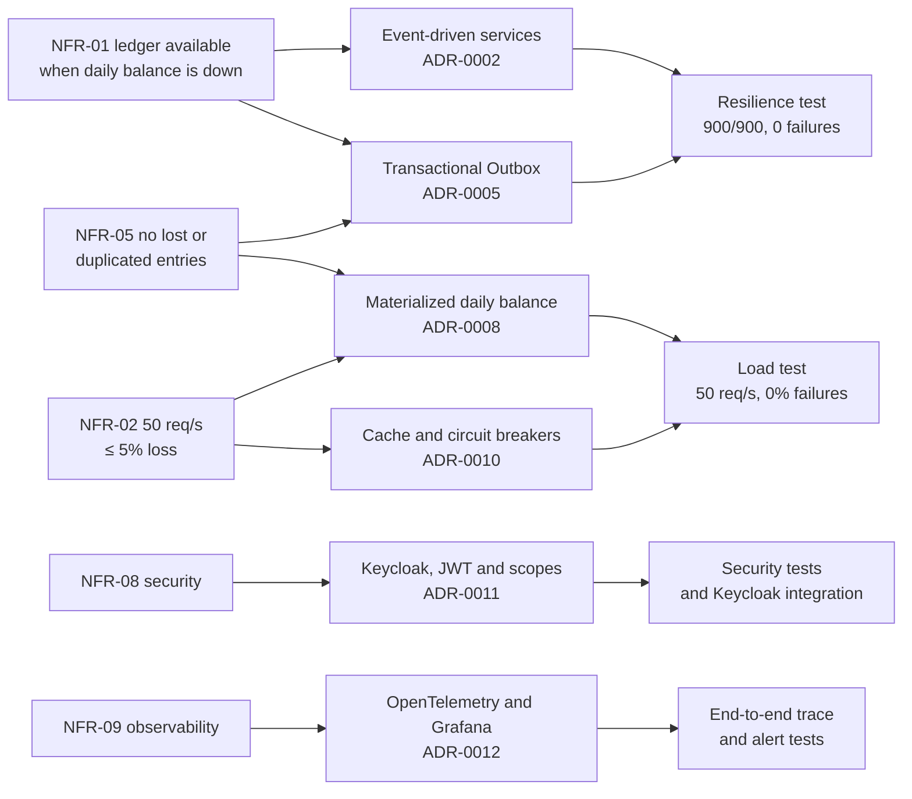

# Requirements

This document refines the requirements of the challenge into precise, verifiable statements. Each requirement has acceptance criteria and points to where it is implemented and how it is verified. The original statement was short ("a service that controls entries" and "a daily consolidated balance service", plus two non-functional requirements). Everything else here is a refinement, and every assumption is written down so it can be challenged.

## Actors

| Actor                       | Description                                                                       | Role in the identity provider |
| --------------------------- | --------------------------------------------------------------------------------- | ----------------------------- |
| Merchant operator           | Records entries and reversals and checks balances                                 | `merchant-operator`           |
| Merchant viewer             | Accountant or manager who only reads entries and balances                         | `merchant-viewer`             |
| Operations team             | Monitors the system, handles alerts, rebuilds balances and redrives failed events | Infrastructure access         |
| Integrated systems (future) | POS, acquirers or ERPs that record entries automatically                          | OAuth client (future)         |

## Functional requirements

| ID    | Requirement                                                                      | Acceptance criteria                                                                                                                                                                                                             | Implementation                                                  | Verification                                                                                      |
| ----- | -------------------------------------------------------------------------------- | ------------------------------------------------------------------------------------------------------------------------------------------------------------------------------------------------------------------------------- | --------------------------------------------------------------- | ------------------------------------------------------------------------------------------------- |
| FR-01 | Record a credit or a debit for the authenticated merchant                        | `POST /v1/entries` returns `201` with the entry and a `Location` header; the entry and its event are stored atomically                                                                                                          | `RecordEntryService`, `entry-routes.ts`                         | `record-entry-service.test.ts`, `entry-routes.test.ts`, `ledger-http.integration.test.ts`         |
| FR-02 | Make entry recording safe to retry                                               | Repeating a request with the same `Idempotency-Key` returns the original response with `idempotent-replayed: true` and never stores a second entry, even for concurrent requests; reusing a key with another body returns `422` | `IdempotencyGuard`, `idempotency_keys` table                    | `idempotency-guard.test.ts`, `idempotency.integration.test.ts`                                    |
| FR-03 | Reverse an entry                                                                 | `POST /v1/entries/{id}/reversal` records the opposite entry with the same amount, business date, point of sale and time zone; a second reversal returns `409`; reversing a reversal returns `422`                               | `ReverseEntryService`, `Entry.reverse()`                        | `reverse-entry-service.test.ts`, `entry.test.ts`, `postgres-entry-repository.integration.test.ts` |
| FR-04 | Get an entry                                                                     | `GET /v1/entries/{id}` returns the entry of the merchant; entries of other merchants return `404`                                                                                                                               | `GetEntryService`                                               | `get-entry-service.test.ts`, `security.test.ts`, `keycloak.integration.test.ts`                   |
| FR-05 | List entries of a period                                                         | `GET /v1/entries?from&to` returns the entries of the business dates in the period (at most 92 days), paginated (default 50, at most 100 per page)                                                                               | `ListEntriesService`                                            | `list-entries-service.test.ts`                                                                    |
| FR-06 | Configure the time zone of a point of sale                                       | `PUT /v1/points-of-sale/{id}` accepts IANA time zones only (e.g. `America/Manaus`); entries of that point of sale use it to resolve the business date                                                                           | `ConfigurePointOfSaleService`, `TimeZoneResolver`               | `point-of-sale.test.ts`, `point-of-sale-routes.test.ts`, `time-zone-resolver.test.ts`             |
| FR-07 | Consolidate every entry into the daily balance of its merchant and business date | Each recorded or reversed entry adds to the credits or debits of its day; the balance equals credits minus debits                                                                                                               | `ConsolidateMovementService`, consumer                          | `consolidate-movement-service.test.ts`, `ledger-event-consumer.integration.test.ts`               |
| FR-08 | Apply each entry to the balance exactly once                                     | Redelivered events, concurrent duplicates and the same entry published under another event id do not change the balance                                                                                                         | `applied_movements` primary key and unique `entry_id`           | `consolidation.integration.test.ts`                                                               |
| FR-09 | Get the consolidated balance of a day                                            | `GET /v1/daily-balances/{date}` returns credits, debits, balance, entry count, opening and closing accumulated balances; a day without movement returns zeros                                                                   | `GetBalanceReportService`                                       | `get-balance-report-service.test.ts`, `daily-balance-routes.test.ts`                              |
| FR-10 | Get a day-by-day report of a period                                              | `GET /v1/daily-balances?from&to` returns one line per day (at most 92 days) with running opening and closing balances, plus period totals                                                                                       | `BalanceReport.compose`                                         | `balance-report.test.ts`, `report-period.test.ts`                                                 |
| FR-11 | Rebuild the balance of a day                                                     | `rebuild-day --merchant --date` recomputes the day from the movement journal, also while the consumer is running                                                                                                                | `RebuildDailyBalanceService`                                    | `rebuild-daily-balance-service.test.ts`, `consolidation.integration.test.ts`                      |
| FR-12 | Recover events that could not be consolidated                                    | Invalid or repeatedly failing events go to a dead letter queue with the reason; `redrive-dead-letters` sends them back after the cause is fixed                                                                                 | Retry queue, DLQ, `RabbitMqDeadLetterRedriver`                  | `ledger-message-handler.test.ts`, `ledger-event-consumer.integration.test.ts`                     |
| FR-13 | Authenticate users and isolate merchants                                         | Business routes require a valid JWT; the merchant always comes from the token; users only access their merchant's data                                                                                                          | Keycloak realm, `authentication` plugin                         | `security.test.ts` (both services), `keycloak.integration.test.ts`                                |
| FR-14 | Authorize by role                                                                | Operators can record and read; viewers can only read; missing scope returns `403`                                                                                                                                               | Role-bound scopes `ledger:write`, `ledger:read`, `balance:read` | `security.test.ts`, `keycloak.integration.test.ts`                                                |

## Business rules

| ID    | Rule                                                                                                                                                            | Enforced by                                                |
| ----- | --------------------------------------------------------------------------------------------------------------------------------------------------------------- | ---------------------------------------------------------- |
| BR-01 | Amounts are positive integers in cents. Floating point is never used for money                                                                                  | `Money` value object, JSON schema, `CHECK` constraint      |
| BR-02 | The only currency is BRL                                                                                                                                        | `Money`, event contract                                    |
| BR-03 | An entry is a `CREDIT` or a `DEBIT`                                                                                                                             | `EntryType`, `CHECK` constraint                            |
| BR-04 | The business date is the cash day in the time zone of the point of sale; when omitted, it is today in that time zone                                            | `BusinessDate.fromInstant`, `TimeZoneResolver`             |
| BR-05 | The business date cannot be in the future nor older than 30 days (configurable with `MAX_BACKDATED_DAYS`)                                                       | `BusinessDatePolicy`                                       |
| BR-06 | Entries without a point of sale use the default time zone (`DEFAULT_TIME_ZONE`, `America/Sao_Paulo`)                                                            | `TimeZoneResolver`                                         |
| BR-07 | The instant of recording is stored in UTC together with the time zone in force; the local time is derived, never stored                                         | `Entry`, `toEntryView`                                     |
| BR-08 | The description is mandatory, from 1 to 140 characters; a reversal without a reason gets a default description referencing the original entry                   | `Description`, `ReverseEntryService`                       |
| BR-09 | Entries are immutable. Corrections are made by reversal                                                                                                         | No update or delete operations exist                       |
| BR-10 | An entry can be reversed only once, and a reversal cannot be reversed                                                                                           | `Entry.reverse()`, unique index `entries_reversal_of_uidx` |
| BR-11 | The daily balance of a day is the sum of its credits minus the sum of its debits; reversals count as movements of their own type                                | `DailyBalance.apply`, generated column `balance_cents`     |
| BR-12 | The opening balance of a day is the sum of the balances of all previous days of the merchant; the closing balance is the opening balance plus the day's balance | `BalanceReport.compose`, `accumulatedBalanceBefore`        |
| BR-13 | A user only accesses the merchant identified by the `merchant_id` claim of the access token, an attribute only an administrator can change                      | Keycloak user profile, `principalOf`                       |

## Non-functional requirements

The two requirements in the challenge statement are NFR-01 and NFR-02. The others are refinements needed for a financial system to be trustworthy in production.

| ID     | Category        | Requirement and target                                                                                                                | How it is achieved                                                                                                                                             | Evidence                                                                                                                                         |
| ------ | --------------- | ------------------------------------------------------------------------------------------------------------------------------------- | -------------------------------------------------------------------------------------------------------------------------------------------------------------- | ------------------------------------------------------------------------------------------------------------------------------------------------ |
| NFR-01 | Availability    | **The ledger must stay available when the daily balance is down.** Target: 0 failed entry recordings caused by a daily balance outage | No synchronous call between services; the ledger does not know the broker (Transactional Outbox); separate processes and databases                             | `npm run test:resilience`: 900 entries recorded while the whole daily balance was down for 30 s, **0 failures**, 900/900 consolidated afterwards |
| NFR-02 | Throughput      | **The daily balance receives 50 req/s at peak with at most 5% of lost requests**                                                      | Materialized read model, Redis cache, single-flight reads, stale-if-error, circuit breakers, rate limit above the peak                                         | `npm run test:load`: 6,001 requests at 50 req/s, **0% failures**; also 0% with Redis down and with the database down during the peak             |
| NFR-03 | Performance     | Daily balance p95 latency below 500 ms at peak; ledger p95 below 500 ms                                                               | Primary key reads, cache, connection pooling                                                                                                                   | Peak test p95 6.5 ms (daily balance); resilience test p95 20 ms (ledger)                                                                         |
| NFR-04 | Freshness       | p95 of the time between recording an entry and seeing it in the daily balance below 30 s                                              | Outbox relay polling every 500 ms (immediately while there is backlog), prefetching consumer                                                                   | `cashflow_consolidation_lag_seconds`: p50 0.26 s, p95 0.5 s under load                                                                           |
| NFR-05 | Durability      | No recorded entry is ever lost or applied twice to the balance                                                                        | Outbox in the same transaction, publisher confirms, persistent messages, `mandatory` publishing, quorum queues, idempotent consumer, DLQ instead of discarding | `outbox-relay.integration.test.ts`, `consolidation.integration.test.ts`, resilience test reconciliation (credits equal to the cent)              |
| NFR-06 | Scalability     | Every process scales horizontally without coordination                                                                                | Stateless APIs, `FOR UPDATE SKIP LOCKED` relays, competing consumers, shared cache                                                                             | Three concurrent relays publish each event once (integration test); one daily balance replica served 400 req/s with 0% errors                    |
| NFR-07 | Resilience      | Failures of the cache, the broker, the consumer or the daily balance database must not cause errors that the system can avoid         | Retry queue with delay, DLQ, reconnection with backoff, stale-if-error, circuit breakers, pools that survive connection loss, readiness reporting `degraded`   | README "Resiliência" table; outage tests for Redis and the database under load                                                                   |
| NFR-08 | Security        | Authenticated access with least privilege; merchant isolation; protection against abuse                                               | OIDC/JWT (RS256), role-bound scopes, merchant from the token, rate limiting per merchant, security headers, body limit, input validation                       | `security.test.ts` (both services), `keycloak.integration.test.ts`; see [Security](06-security.md)                                               |
| NFR-09 | Observability   | Every request can be traced end to end; SLOs measured; alerts for breaches                                                            | OpenTelemetry traces, metrics and logs; trace context propagated through the outbox; dashboard and 10 alert rules                                              | Real trace from `POST /v1/entries` to the consumer's upsert; alerts tested by stopping the consumer and dead-lettering a message                 |
| NFR-10 | Consistency     | The ledger is strongly consistent; the daily balance is eventually consistent and can always be rebuilt                               | ACID transactions; journal of applied movements                                                                                                                | `rebuild-day` command; rebuild concurrent with consumption test                                                                                  |
| NFR-11 | Maintainability | Business rules isolated from frameworks; contract changes confined to adapters; enforced code quality                                 | Hexagonal architecture, versioned contracts, ESLint rules (complexity 8, max 3 params, no inline comments), strict TypeScript                                  | [ADR-0003](adr/0003-hexagonal-architecture.md), lint in every phase                                                                              |
| NFR-12 | Portability     | The whole solution runs locally with one command                                                                                      | Docker Compose with every dependency, realm and dashboards as code                                                                                             | `docker compose up -d --build`                                                                                                                   |
| NFR-13 | Auditability    | Every movement keeps who, when and why; nothing is erased                                                                             | Immutable entries, reversals referencing the original, `recordedAt` + time zone, trace ids in logs                                                             | Domain tests, database constraints                                                                                                               |

### Why these targets

- **NFR-02** is stated as "at most 5% loss". The solution treats it as a floor: the internal target is 99.5% success (see [Operations](07-operations.md)), and the alert `DailyBalanceRequestLossAboveBudget` fires at the 5% limit.
- **NFR-04** is not in the statement, but a consolidated balance that lags minutes behind would not be useful. Thirty seconds gives room for retries while the measured value is far below it.
- **NFR-05** is what makes the asynchronous design acceptable for money: decoupling is only safe if no event is lost and none is counted twice.

## Assumptions

| ID   | Assumption                                                                                                               |
| ---- | ------------------------------------------------------------------------------------------------------------------------ |
| A-01 | "Loss of requests" means requests that do not receive a successful answer (errors, timeouts or throttling)               |
| A-02 | The 50 req/s peak may come from a single merchant, so per-merchant limits must allow it                                  |
| A-03 | The daily balance may be eventually consistent, as long as it converges quickly and exactly                              |
| A-04 | The cash day follows the local time of the point of sale; Brazil has four time zones                                     |
| A-05 | Entries can be backdated within a configurable window (30 days) to register late movements; future dates are not allowed |
| A-06 | Entries are never edited or deleted; accounting practice requires corrections by reversal                                |
| A-07 | A single currency (BRL) is enough for the target merchants                                                               |
| A-08 | User management (sign-up, password reset) is delegated to the identity provider                                          |

## Out of scope

- A user interface. The APIs are documented with OpenAPI at `/docs`.
- Bank reconciliation, forecasting, categories and integrations with POS or acquirers. They are listed in [Future evolutions](08-future-evolutions.md).
- Multi-currency and month closing (locking past days).

## Traceability

The decisions are recorded in the [ADRs](adr/README.md), and the target architecture that implements them is in [Target architecture](03-target-architecture.md).
