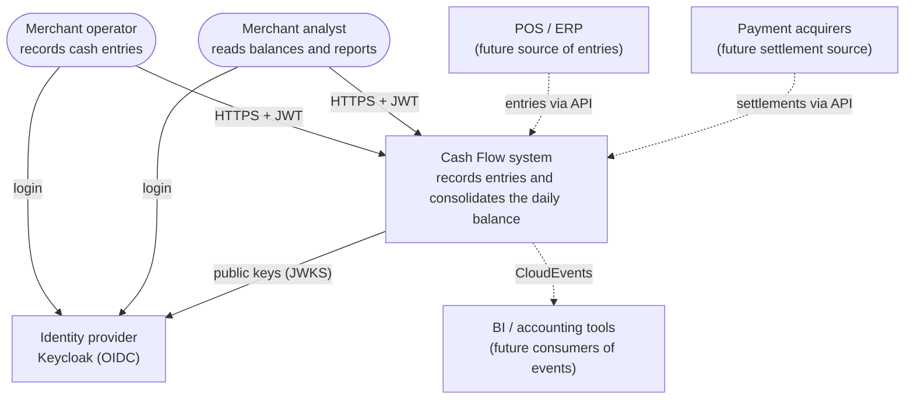
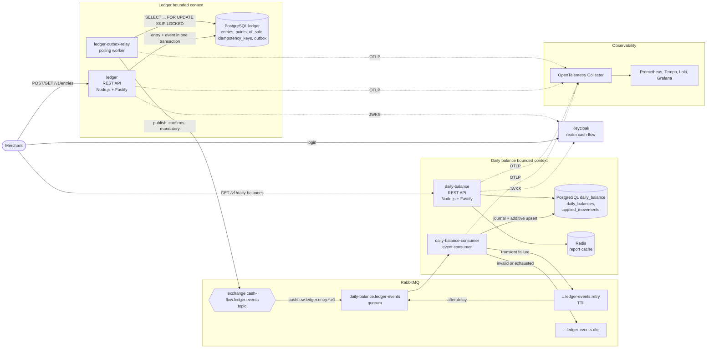
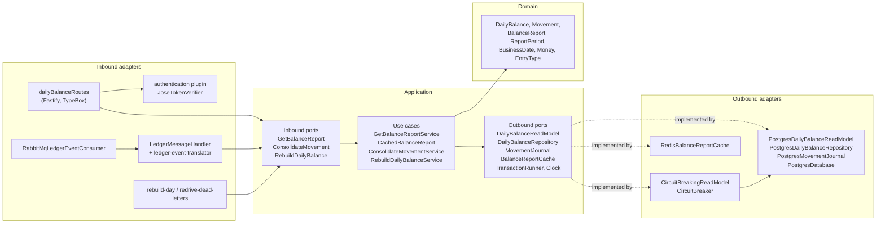
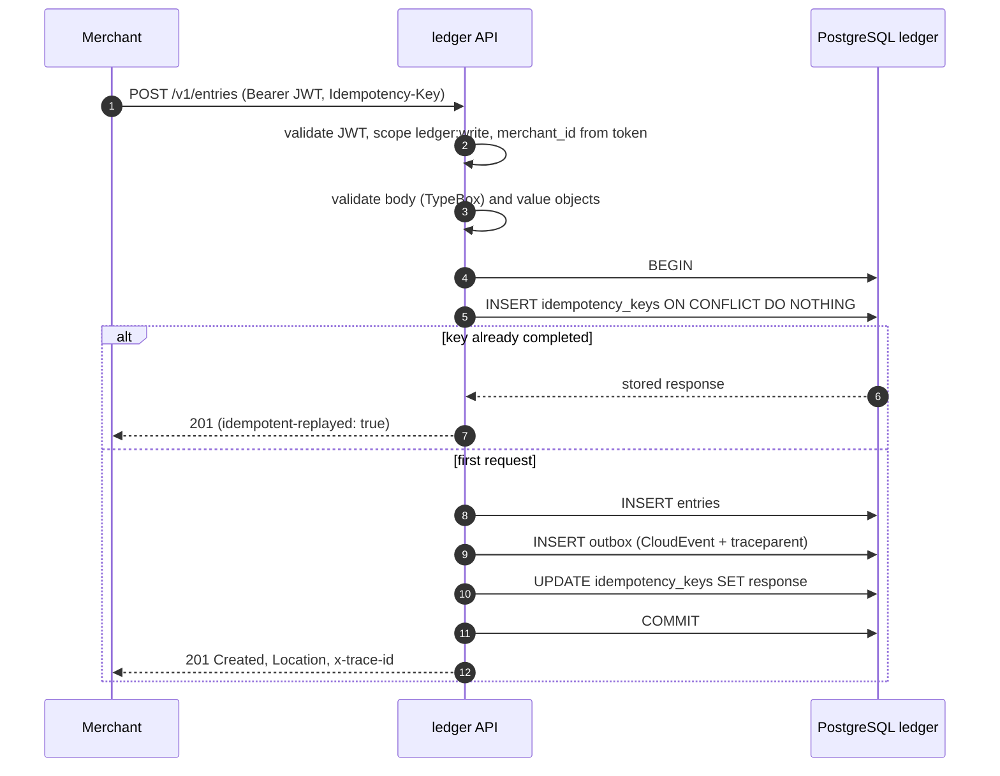
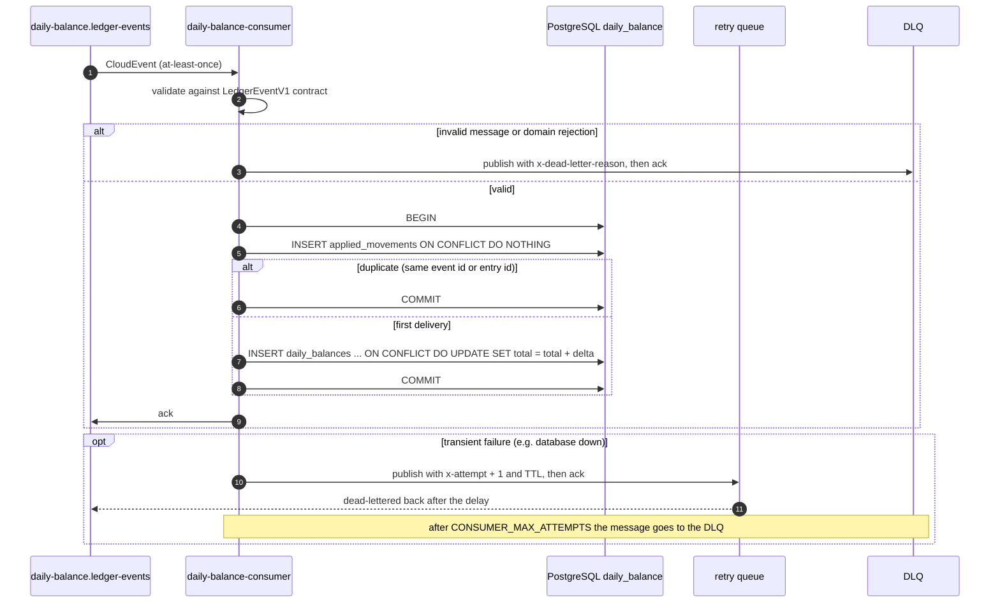
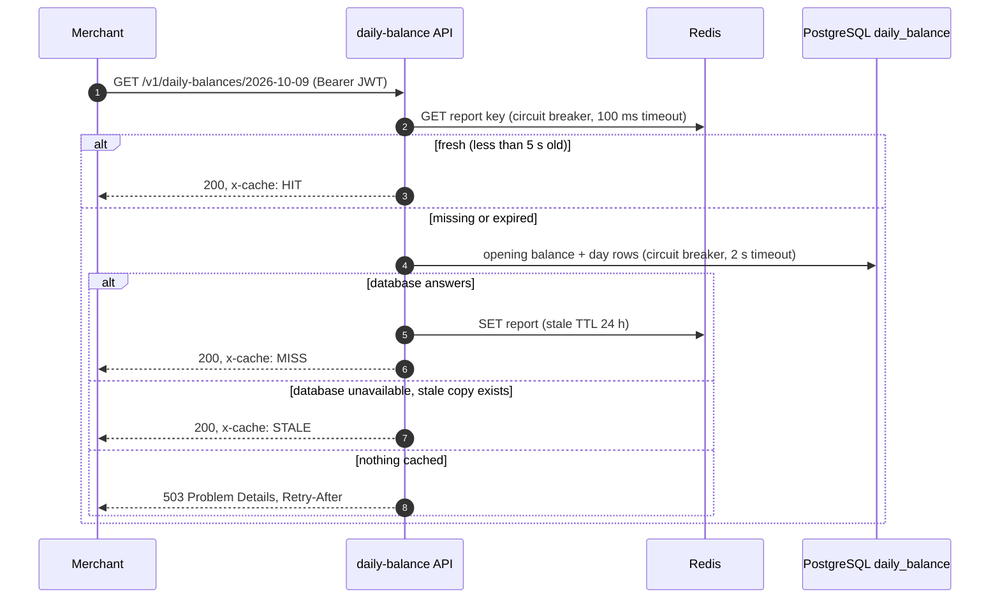
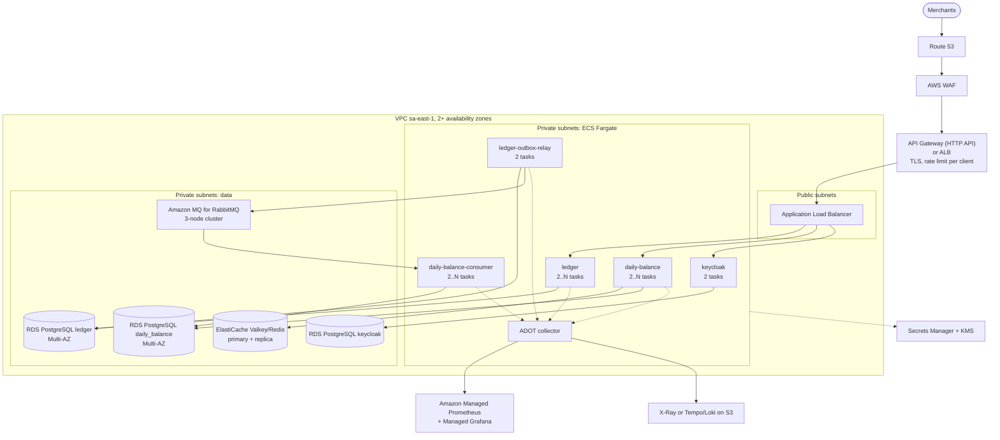

# Target Architecture

This document describes the target solution for the merchant cash flow: how it is decomposed, how the parts communicate, where it runs and how it behaves under load and failure. Each section says what is **implemented locally** (the repository, running with Docker Compose) and what is the **target in production** (AWS).

Related documents: [business domains and capabilities](01-business-domains-and-capabilities.md), [requirements](02-requirements.md), [transition architecture](04-transition-architecture.md), [cost estimate](05-cost-estimate.md), [security](06-security.md), [operations](07-operations.md), [future evolutions](08-future-evolutions.md) and the [architecture decision records](adr/).

## 1. Architectural drivers

| Driver                          | Requirement                                                            | How the architecture answers it                                                                                    |
| ------------------------------- | ---------------------------------------------------------------------- | ------------------------------------------------------------------------------------------------------------------ |
| Availability of the ledger      | NFR-01: recording entries must not depend on the daily balance service | Separate services, databases and deployables; asynchronous integration through a transactional outbox and a broker |
| Throughput of the daily balance | NFR-02: 50 req/s at peak with at most 5% of lost requests              | Materialized read model, Redis cache with stale fallback, circuit breakers, horizontally scalable stateless API    |
| Consistency of money            | Entries are never lost, duplicated or partially written                | ACID transactions, database constraints, idempotency keys, idempotent consumer, additive upserts                   |
| Durability                      | A recorded entry survives crashes of any component                     | Entry and event committed together; persistent messages with publisher confirms; quorum queues                     |
| Security                        | Each merchant sees and changes only its own data                       | OIDC with Keycloak, JWT validated locally, scopes per route, merchant taken from the token                         |
| Observability                   | Failures are detected before merchants notice                          | OpenTelemetry traces, metrics and logs; end-to-end traces through the outbox; dashboards and alert rules           |

The requirement identifiers are defined in [02-requirements.md](02-requirements.md).

## 2. System context (C4 level 1)



Dashed arrows are not implemented. They show that the published API and the event contract are the integration points for future sources and consumers, with no change to the core.

## 3. Containers (C4 level 2)



| Container                | Responsibility                                              | Scales by                        | Implemented locally |
| ------------------------ | ----------------------------------------------------------- | -------------------------------- | ------------------- |
| `ledger`                 | Record, reverse and query entries; configure points of sale | Replicas behind a load balancer  | Yes                 |
| `ledger-outbox-relay`    | Publish pending outbox events to RabbitMQ                   | Replicas (`SKIP LOCKED`)         | Yes                 |
| `daily-balance-consumer` | Consolidate ledger events into daily balances               | Competing consumers on the queue | Yes                 |
| `daily-balance`          | Serve day and period reports                                | Replicas behind a load balancer  | Yes                 |
| PostgreSQL ×2            | One database per bounded context                            | Vertical, read replicas          | Yes                 |
| RabbitMQ                 | Topic exchange, quorum queues, retry queue and DLQ          | Cluster of 3 nodes               | Single node         |
| Redis                    | Report cache with stale fallback                            | Replica, cluster mode if needed  | Single node         |
| Keycloak                 | OIDC provider, users, roles and scopes                      | Replicas with shared database    | Dev mode            |
| Observability stack      | Collector, Prometheus, Tempo, Loki, Grafana                 | Managed services in production   | Yes                 |

Each process is a separate deployable built from the same image with a different command (`node dist/main.js`, `dist/relay.js`, `dist/consumer.js`). See [ADR 0002](adr/0002-event-driven-microservices.md) and [ADR 0004](adr/0004-postgresql-database-per-service.md).

## 4. Components (C4 level 3): daily balance service

Both services follow the same hexagonal layout ([ADR 0003](adr/0003-hexagonal-architecture.md)). Dependencies always point inwards: the domain knows nothing about Fastify, PostgreSQL, RabbitMQ, Redis or OpenTelemetry.



The ledger has the same shape: `entryRoutes` and `pointOfSaleRoutes` call `RecordEntryService`, `ReverseEntryService`, `GetEntryService`, `ListEntriesService` and `ConfigurePointOfSaleService`; the `Entry` aggregate raises domain events; `PostgresEntryRepository` saves the entry and calls `OutboxWriter` in the same transaction; `PublishPendingEventsService` (driven by `PollingWorker`) reads from `PostgresOutboxStore` and publishes through `RabbitMqEventPublisher`.

## 5. Key data flows

### 5.1 Record an entry



RabbitMQ and the daily balance are not in this path. If either is down, the entry is still recorded.

### 5.2 Publish events

```mermaid
sequenceDiagram
  autonumber
  participant W as ledger-outbox-relay
  participant DB as PostgreSQL ledger
  participant X as RabbitMQ exchange
  loop every 500 ms, or immediately while there is a backlog
    W->>DB: BEGIN; SELECT pending FOR UPDATE SKIP LOCKED LIMIT 100
    W->>X: publish each event (persistent, mandatory) in the stored trace context
    X-->>W: publisher confirm, or basic.return if unroutable
    alt confirmed
      W->>DB: UPDATE outbox SET published_at
    else rejected by the broker
      W->>DB: attempts + 1, next_attempt_at with exponential backoff
    end
    W->>DB: COMMIT
  end
  Note over W,DB: infrastructure errors roll back the whole batch and the worker backs off up to 30 s
```

### 5.3 Consolidate



### 5.4 Query the daily balance



Concurrent identical misses share one database read (single-flight).

### 5.5 Reverse an entry

A reversal is a new entry of the opposite type, with the same amount, business date, point of sale and time zone, referencing the original. A unique partial index (`entries_reversal_of_uidx`) guarantees a single reversal even under concurrent requests: one gets `201`, the other `409 ENTRY_ALREADY_REVERSED`. The reversal is published as `cashflow.ledger.entry.reversed.v1` and the consumer adds it to the debit (or credit) total of the original day, so the day balance is corrected without rewriting history.

## 6. Data model

### Ledger database

| Table              | Purpose                                 | Key constraints                                                                                                                                                                                                           |
| ------------------ | --------------------------------------- | ------------------------------------------------------------------------------------------------------------------------------------------------------------------------------------------------------------------------- |
| `entries`          | Immutable cash entries                  | `amount_in_cents > 0`, `type IN ('CREDIT','DEBIT')`, `currency = 'BRL'`, FK `(merchant_id, point_of_sale_id)` to points of sale, unique partial index on `reversal_of`, index `(merchant_id, business_date, recorded_at)` |
| `points_of_sale`   | Local IANA time zone per point of sale  | PK `(merchant_id, id)`                                                                                                                                                                                                    |
| `idempotency_keys` | Request fingerprint and stored response | PK `(merchant_id, key)`                                                                                                                                                                                                   |
| `outbox`           | Events waiting to be published          | `published_at`, `attempts`, `last_error`, `next_attempt_at`; partial index `outbox_pending_idx` on pending rows                                                                                                           |

### Daily balance database

| Table               | Purpose                                            | Key constraints                                                                                                         |
| ------------------- | -------------------------------------------------- | ----------------------------------------------------------------------------------------------------------------------- |
| `daily_balances`    | Materialized balance per merchant and business day | PK `(merchant_id, business_date)`, non-negative totals, `balance_cents` generated as credits minus debits               |
| `applied_movements` | Journal of consolidated events                     | PK `event_id`, unique `entry_id`, index `(merchant_id, business_date)`; used for deduplication and for rebuilding a day |

Migrations are TypeScript modules applied at startup under `pg_advisory_lock`, so several replicas starting together are safe.

## 7. Integration contracts

### REST

| Service       | Method and route                         | Scope          |
| ------------- | ---------------------------------------- | -------------- |
| ledger        | `PUT /v1/points-of-sale/{pointOfSaleId}` | `ledger:write` |
| ledger        | `POST /v1/entries`                       | `ledger:write` |
| ledger        | `POST /v1/entries/{entryId}/reversal`    | `ledger:write` |
| ledger        | `GET /v1/entries/{entryId}`              | `ledger:read`  |
| ledger        | `GET /v1/entries?from=&to=`              | `ledger:read`  |
| daily-balance | `GET /v1/daily-balances/{businessDate}`  | `balance:read` |
| daily-balance | `GET /v1/daily-balances?from=&to=`       | `balance:read` |

Both APIs publish OpenAPI documents at `/docs`, answer errors as RFC 9457 Problem Details and return `x-trace-id` on every response.

### Events

| Item                   | Value                                                                                 |
| ---------------------- | ------------------------------------------------------------------------------------- |
| Envelope               | CloudEvents 1.0, `application/cloudevents+json`                                       |
| Exchange               | `cash-flow.ledger.events` (topic, durable)                                            |
| Types and routing keys | `cashflow.ledger.entry.recorded.v1`, `cashflow.ledger.entry.reversed.v1`              |
| Binding for consumers  | `cashflow.ledger.entry.*.v1`                                                          |
| Tracing                | `traceparent` and `tracestate` attributes (CloudEvents Distributed Tracing extension) |
| Contract               | TypeBox schemas and validator in the shared `@cash-flow/contracts` package            |
| Delivery               | At-least-once; consumers deduplicate by event `id` (also the AMQP `messageId`)        |

Versioning is in the type name. A breaking change publishes `.v2` alongside `.v1` during a transition; see [ADR 0007](adr/0007-cloudevents-shared-contracts.md).

## 8. Production deployment (target)

Primary region **sa-east-1 (São Paulo)**: the merchant and its data are in Brazil, latency to users is lowest and LGPD data residency is simpler to demonstrate.



| Concern         | Target choice                                                                                                                         | Notes                                                                                                                                      |
| --------------- | ------------------------------------------------------------------------------------------------------------------------------------- | ------------------------------------------------------------------------------------------------------------------------------------------ |
| Compute         | ECS Fargate, one ECS service per process, tasks spread across at least two AZs                                                        | Same image as local, different command; no servers to patch; autoscaling on CPU and request count (APIs) or queue depth (consumer)         |
| Edge            | Route 53, AWS WAF, API Gateway HTTP API or ALB                                                                                        | TLS termination, IP and client rate limiting as a first layer; the application limit per merchant remains as a second layer                |
| Relational data | RDS PostgreSQL 17 Multi-AZ, one instance per bounded context                                                                          | Synchronous standby, automated backups and point-in-time recovery; read replica for the daily balance if reads ever require it             |
| Messaging       | **SNS + SQS** (one topic for ledger events, one queue per consumer, DLQ through a redrive policy)                                     | Serverless and Multi-AZ by default; requires new publisher and consumer adapters; Amazon MQ is the zero-code-change alternative; see below |
| Cache           | ElastiCache for Valkey (Redis compatible), primary and replica in different AZs                                                       | The API already tolerates the cache being unavailable                                                                                      |
| Identity        | Keycloak on Fargate with its own RDS                                                                                                  | Amazon Cognito is the managed alternative; tokens are validated through JWKS, so the services do not change                                |
| Secrets         | Secrets Manager with rotation, KMS keys for RDS, MQ, ElastiCache and S3 encryption at rest                                            | No credentials in task definitions or images                                                                                               |
| Observability   | ADOT collector sidecar or service; Amazon Managed Prometheus and Managed Grafana; X-Ray or self-hosted Tempo and Loki with S3 storage | The services export OTLP only, so the backend is a collector configuration choice                                                          |

### Messaging: Amazon MQ for RabbitMQ or SNS + SQS

| Criterion           | Amazon MQ for RabbitMQ                  | SNS + SQS                                                           |
| ------------------- | --------------------------------------- | ------------------------------------------------------------------- |
| Code change         | None                                    | New publisher and consumer adapters (hexagonal ports stay the same) |
| Retry and DLQ       | Current retry queue with TTL and DLQ    | Native visibility timeout, `maxReceiveCount` and DLQ redrive        |
| Operations          | Managed broker, still sized by instance | Fully serverless, no capacity planning                              |
| Cost at this volume | Fixed cost per broker instance          | Pay per request, very low at tens of events per second              |
| Local parity        | Same as Docker Compose                  | Needs LocalStack or a cloud account for integration tests           |

**Recommendation:** use **SNS + SQS** in production. A Multi-AZ Amazon MQ cluster would cost about as much as the rest of the platform (about $625/month more in us-east-1, see [05-cost-estimate.md](05-cost-estimate.md)) for a few million messages a month, and SQS removes the broker from the operational burden. The change is confined to the adapters, which is exactly what the hexagonal architecture is for: an `SnsEventPublisher` implementing the `EventPublisher` port and an SQS consumer calling the same `LedgerMessageHandler`, with the retry queue and DLQ replaced by visibility timeout, `maxReceiveCount` and a redrive policy. Domain, use cases, outbox and event contract stay untouched ([ADR 0006](adr/0006-rabbitmq-message-broker.md)).

If time to market matters more than cost for the first release, **Amazon MQ for RabbitMQ** runs the current code with zero changes and the exact behavior validated by the tests; the migration to SNS + SQS can follow as a cost optimization.

## 9. Scalability

| Process                    | Strategy                                                                                                           |
| -------------------------- | ------------------------------------------------------------------------------------------------------------------ |
| ledger, daily-balance      | Stateless; add tasks behind the load balancer. State is in PostgreSQL and Redis                                    |
| ledger-outbox-relay        | Several replicas share the outbox through `FOR UPDATE SKIP LOCKED`; tested with three concurrent relays            |
| daily-balance-consumer     | Competing consumers on the same quorum queue; `prefetch` controls parallelism per replica                          |
| Daily balance reads        | Primary-key lookups on a materialized table, cache in front, single-flight for identical misses                    |
| Growth beyond one database | Partition `entries` and `applied_movements` by business date; shard by merchant if a single instance is not enough |

Measured on a single replica of each process, on a laptop running the whole stack ([README](../README.md#testes-de-carga-e-resiliência)):

| Scenario                     | Result                                  |
| ---------------------------- | --------------------------------------- |
| 50 req/s for 2 minutes       | 6,001 requests, 0% errors, p95 6.5 ms   |
| 400 req/s for 1 minute       | 23,955 requests, 0% errors, p95 20.9 ms |
| Consolidation lag (p50, p95) | 0.26 s, 0.5 s                           |

The required peak is reached with an 8x margin before any horizontal scaling.

## 10. Availability and resilience

| Component down         | Recording entries           | Reading balances                                               | Events                                                 |
| ---------------------- | --------------------------- | -------------------------------------------------------------- | ------------------------------------------------------ |
| daily-balance-consumer | Unaffected                  | Serves data consolidated so far                                | Accumulate in the durable queue                        |
| Daily balance database | Unaffected                  | Cached reports served as `STALE`; others `503` + `Retry-After` | Retried through the retry queue, then DLQ and redrive  |
| Redis                  | Unaffected                  | Served from the database; circuit opens after 5 failures       | Unaffected                                             |
| RabbitMQ               | Unaffected                  | Serves data consolidated so far                                | Accumulate in the outbox; relay and consumer reconnect |
| ledger-outbox-relay    | Unaffected                  | Serves data consolidated so far                                | Accumulate in the outbox                               |
| daily-balance API      | Unaffected                  | Unavailable                                                    | Still consumed                                         |
| Keycloak               | Unaffected for valid tokens | Unaffected for valid tokens                                    | Unaffected                                             |

Every row was exercised locally; the first three are part of the automated resilience tests.

| Target (production)    | Ledger                                                                                    | Daily balance                                                                                |
| ---------------------- | ----------------------------------------------------------------------------------------- | -------------------------------------------------------------------------------------------- |
| Availability objective | 99.9% monthly                                                                             | 99.5% monthly, at most 5% loss at peak                                                       |
| RPO                    | ≈ 0 (Multi-AZ synchronous standby)                                                        | ≈ 0; in the worst case the balance is rebuilt from the journal or by replaying ledger events |
| RTO                    | Minutes (Multi-AZ failover, ECS task replacement)                                         | Minutes; reads continue from the stale cache meanwhile                                       |
| Disaster recovery      | Cross-region snapshot copy (e.g. us-east-1), infrastructure as code to recreate the stack | Same; the daily balance can be fully recomputed from the ledger                              |

Health checks: `/health/live` for process liveness and `/health/ready` with dependency status (`up`, `degraded`, `down`). In the daily balance API, PostgreSQL and Redis are not critical for readiness, so a shared dependency outage does not remove every replica from the load balancer at once.

## 11. Consistency model

| Area                   | Model                                                                                                                |
| ---------------------- | -------------------------------------------------------------------------------------------------------------------- |
| Ledger                 | Strongly consistent. An entry, its idempotency record and its event are committed atomically                         |
| Ledger → daily balance | Eventually consistent, at-least-once delivery. Measured lag p95 of 0.5 s; the cache can add up to 5 s                |
| Daily balance          | Exactly-once effect: deduplication by event id and entry id in the same transaction as the additive upsert           |
| Ordering               | Not required: sums are commutative, and a reversal never depends on its original having been consolidated first      |
| Repair                 | `rebuild-day` recomputes a day from the journal; `redrive-dead-letters` reprocesses the DLQ; both are safe to repeat |

## 12. Architecture decisions

| ADR                                                         | Decision                                            |
| ----------------------------------------------------------- | --------------------------------------------------- |
| [0001](adr/0001-record-architecture-decisions.md)           | Record architecture decisions                       |
| [0002](adr/0002-event-driven-microservices.md)              | Two event-driven microservices                      |
| [0003](adr/0003-hexagonal-architecture.md)                  | Hexagonal architecture inside each service          |
| [0004](adr/0004-postgresql-database-per-service.md)         | PostgreSQL, one database per service                |
| [0005](adr/0005-transactional-outbox-with-polling-relay.md) | Transactional outbox with a polling relay           |
| [0006](adr/0006-rabbitmq-message-broker.md)                 | RabbitMQ as the message broker                      |
| [0007](adr/0007-cloudevents-shared-contracts.md)            | CloudEvents and a shared contracts package          |
| [0008](adr/0008-materialized-daily-balance.md)              | Materialized daily balance with idempotent consumer |
| [0009](adr/0009-business-date-and-time-zones.md)            | Business date and time zones per point of sale      |
| [0010](adr/0010-cache-and-circuit-breakers.md)              | Cache with stale fallback and circuit breakers      |
| [0011](adr/0011-keycloak-jwt-scopes.md)                     | Keycloak, JWT and scopes                            |
| [0012](adr/0012-opentelemetry-grafana-stack.md)             | OpenTelemetry with the Grafana stack                |
| [0013](adr/0013-nodejs-typescript-fastify.md)               | Node.js, TypeScript and Fastify                     |
