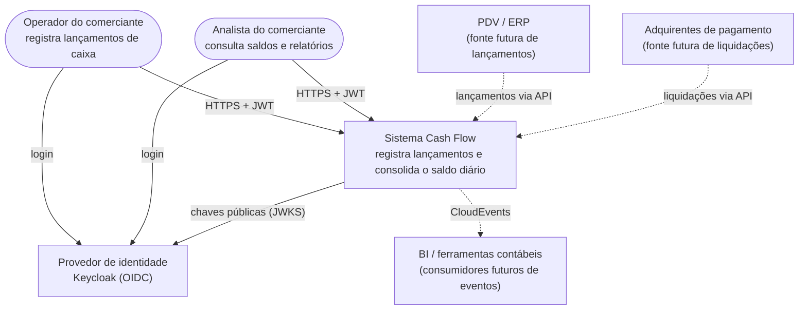
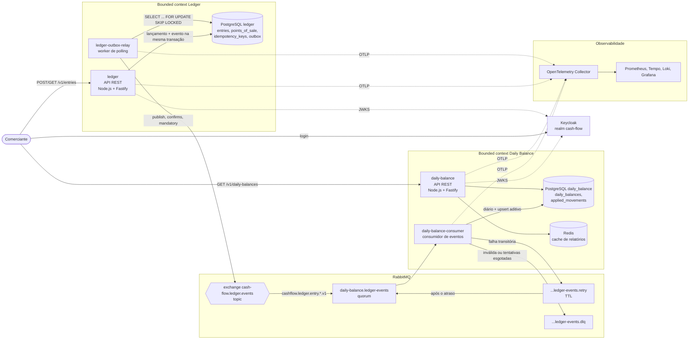
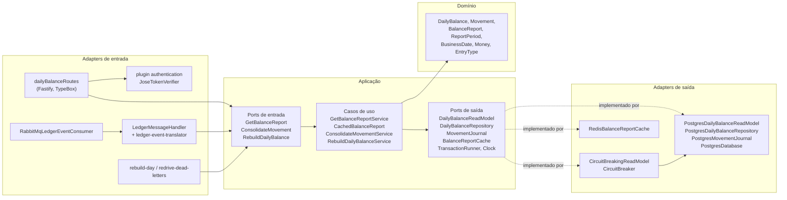
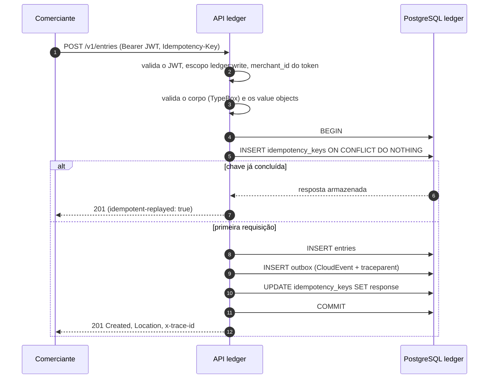
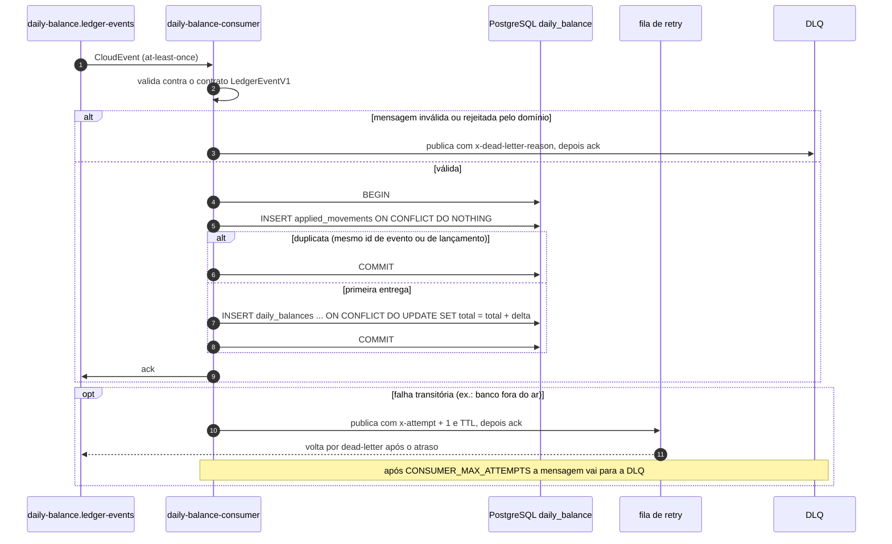
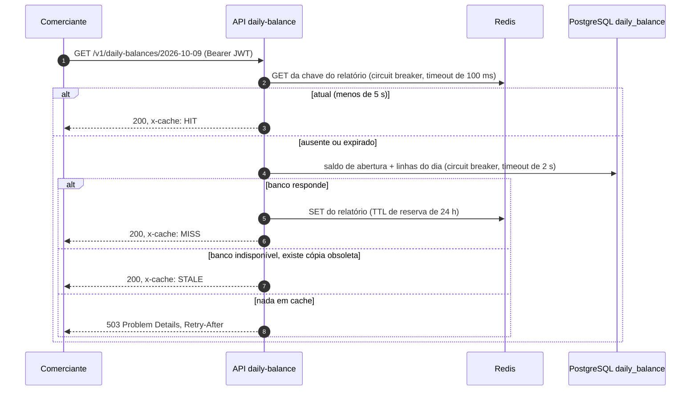
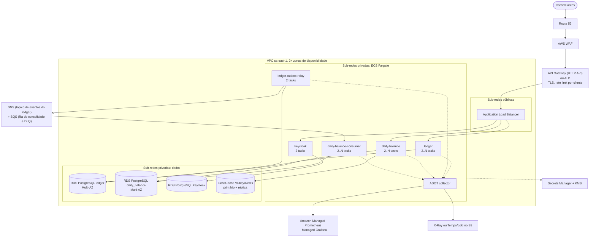

# Arquitetura Alvo

Este documento descreve a solução alvo para o fluxo de caixa do comerciante: como ela é decomposta, como as partes se comunicam, onde roda e como se comporta sob carga e diante de falhas. Cada seção indica o que está **implementado localmente** (o repositório, rodando com Docker Compose) e o que é o **alvo em produção** (AWS).

Documentos relacionados: [domínios de negócio e capacidades](01-business-domains-and-capabilities.md), [requisitos](02-requirements.md), [arquitetura de transição](04-transition-architecture.md), [estimativa de custos](05-cost-estimate.md), [segurança](06-security.md), [operação](07-operations.md), [evoluções futuras](08-future-evolutions.md) e os [registros de decisão de arquitetura](adr/).

## 1. Direcionadores arquiteturais

| Direcionador              | Requisito                                                                 | Como a arquitetura responde                                                                                                             |
| ------------------------- | ------------------------------------------------------------------------- | --------------------------------------------------------------------------------------------------------------------------------------- |
| Disponibilidade do ledger | RNF-01: registrar lançamentos não pode depender do serviço de consolidado | Serviços, bancos e unidades de deploy separados; integração assíncrona por transactional outbox e broker                                |
| Vazão do consolidado      | RNF-02: 50 req/s no pico com no máximo 5% de requisições perdidas         | Modelo de leitura materializado, cache Redis com fallback para dado obsoleto, circuit breakers, API stateless escalável horizontalmente |
| Consistência do dinheiro  | Lançamentos nunca são perdidos, duplicados ou gravados parcialmente       | Transações ACID, constraints no banco, chaves de idempotência, consumidor idempotente, upserts aditivos                                 |
| Durabilidade              | Um lançamento registrado sobrevive à queda de qualquer componente         | Lançamento e evento gravados juntos; mensagens persistentes com publisher confirms; quorum queues                                       |
| Segurança                 | Cada comerciante vê e altera apenas os próprios dados                     | OIDC com Keycloak, JWT validado localmente, escopos por rota, comerciante extraído do token                                             |
| Observabilidade           | Falhas são detectadas antes que os comerciantes percebam                  | Traces, métricas e logs com OpenTelemetry; traces ponta a ponta atravessando o outbox; dashboards e regras de alerta                    |

Os identificadores dos requisitos estão definidos em [02-requirements.md](02-requirements.md).

## 2. Contexto do sistema (C4 nível 1)



As setas tracejadas não estão implementadas. Elas mostram que a API publicada e o contrato de eventos são os pontos de integração para fontes e consumidores futuros, sem alteração no núcleo.

## 3. Containers (C4 nível 2)



| Container                | Responsabilidade                                                        | Escala por                          | Implementado localmente |
| ------------------------ | ----------------------------------------------------------------------- | ----------------------------------- | ----------------------- |
| `ledger`                 | Registrar, estornar e consultar lançamentos; configurar pontos de venda | Réplicas atrás de um load balancer  | Sim                     |
| `ledger-outbox-relay`    | Publicar no RabbitMQ os eventos pendentes do outbox                     | Réplicas (`SKIP LOCKED`)            | Sim                     |
| `daily-balance-consumer` | Consolidar os eventos do ledger em saldos diários                       | Consumidores concorrentes na fila   | Sim                     |
| `daily-balance`          | Servir relatórios do dia e do período                                   | Réplicas atrás de um load balancer  | Sim                     |
| PostgreSQL ×2            | Um banco por bounded context                                            | Vertical, réplicas de leitura       | Sim                     |
| RabbitMQ                 | Exchange topic, quorum queues, fila de retry e DLQ                      | Cluster de 3 nós                    | Nó único                |
| Redis                    | Cache de relatórios com fallback para dado obsoleto                     | Réplica, modo cluster se necessário | Nó único                |
| Keycloak                 | Provedor OIDC, usuários, papéis e escopos                               | Réplicas com banco compartilhado    | Modo dev                |
| Stack de observabilidade | Collector, Prometheus, Tempo, Loki, Grafana                             | Serviços gerenciados em produção    | Sim                     |

Cada processo é uma unidade de deploy separada, construída a partir da mesma imagem com um comando diferente (`node dist/main.js`, `dist/relay.js`, `dist/consumer.js`). Veja o [ADR 0002](adr/0002-event-driven-microservices.md) e o [ADR 0004](adr/0004-postgresql-database-per-service.md).

## 4. Componentes (C4 nível 3): serviço de consolidado

Os dois serviços seguem a mesma organização hexagonal ([ADR 0003](adr/0003-hexagonal-architecture.md)). As dependências sempre apontam para dentro: o domínio não conhece Fastify, PostgreSQL, RabbitMQ, Redis nem OpenTelemetry.



O ledger tem a mesma forma: `entryRoutes` e `pointOfSaleRoutes` chamam `RecordEntryService`, `ReverseEntryService`, `GetEntryService`, `ListEntriesService` e `ConfigurePointOfSaleService`; o agregado `Entry` emite eventos de domínio; `PostgresEntryRepository` grava o lançamento e chama o `OutboxWriter` na mesma transação; `PublishPendingEventsService` (acionado pelo `PollingWorker`) lê do `PostgresOutboxStore` e publica pelo `RabbitMqEventPublisher`.

## 5. Principais fluxos de dados

### 5.1 Registrar um lançamento



O RabbitMQ e o consolidado não estão nesse caminho. Se qualquer um deles estiver fora do ar, o lançamento continua sendo registrado.

### 5.2 Publicar eventos

```mermaid
sequenceDiagram
  autonumber
  participant W as ledger-outbox-relay
  participant DB as PostgreSQL ledger
  participant X as exchange RabbitMQ
  loop a cada 500 ms, ou imediatamente enquanto houver backlog
    W->>DB: BEGIN; SELECT pendentes FOR UPDATE SKIP LOCKED LIMIT 100
    W->>X: publica cada evento (persistent, mandatory) no contexto de trace armazenado
    X-->>W: publisher confirm, ou basic.return se não houver rota
    alt confirmado
      W->>DB: UPDATE outbox SET published_at
    else rejeitado pelo broker
      W->>DB: attempts + 1, next_attempt_at com backoff exponencial
    end
    W->>DB: COMMIT
  end
  Note over W,DB: erros de infraestrutura desfazem o lote inteiro e o worker espera até 30 s
```

### 5.3 Consolidar



### 5.4 Consultar o saldo diário



Misses idênticos e simultâneos compartilham uma única leitura no banco (single-flight).

### 5.5 Estornar um lançamento

Um estorno é um novo lançamento do tipo oposto, com o mesmo valor, data de competência, ponto de venda e fuso, referenciando o original. Um índice parcial único (`entries_reversal_of_uidx`) garante um único estorno mesmo com requisições simultâneas: uma recebe `201` e a outra `409 ENTRY_ALREADY_REVERSED`. O estorno é publicado como `cashflow.ledger.entry.reversed.v1` e o consumidor o soma ao total de débitos (ou créditos) do dia original, de modo que o saldo do dia é corrigido sem reescrever o histórico.

## 6. Modelo de dados

### Banco do ledger

| Tabela             | Finalidade                                            | Principais constraints                                                                                                                                                                                                        |
| ------------------ | ----------------------------------------------------- | ----------------------------------------------------------------------------------------------------------------------------------------------------------------------------------------------------------------------------- |
| `entries`          | Lançamentos de caixa imutáveis                        | `amount_in_cents > 0`, `type IN ('CREDIT','DEBIT')`, `currency = 'BRL'`, FK `(merchant_id, point_of_sale_id)` para pontos de venda, índice parcial único em `reversal_of`, índice `(merchant_id, business_date, recorded_at)` |
| `points_of_sale`   | Fuso IANA local de cada ponto de venda                | PK `(merchant_id, id)`                                                                                                                                                                                                        |
| `idempotency_keys` | Impressão digital da requisição e resposta armazenada | PK `(merchant_id, key)`                                                                                                                                                                                                       |
| `outbox`           | Eventos aguardando publicação                         | `published_at`, `attempts`, `last_error`, `next_attempt_at`; índice parcial `outbox_pending_idx` nas linhas pendentes                                                                                                         |

### Banco do consolidado

| Tabela              | Finalidade                                               | Principais constraints                                                                                                    |
| ------------------- | -------------------------------------------------------- | ------------------------------------------------------------------------------------------------------------------------- |
| `daily_balances`    | Saldo materializado por comerciante e dia de competência | PK `(merchant_id, business_date)`, totais não negativos, `balance_cents` gerado como créditos menos débitos               |
| `applied_movements` | Diário dos eventos consolidados                          | PK `event_id`, `entry_id` único, índice `(merchant_id, business_date)`; usado para deduplicação e para reconstruir um dia |

As migrations são módulos TypeScript aplicados na inicialização sob `pg_advisory_lock`, então várias réplicas subindo ao mesmo tempo não causam problema.

## 7. Contratos de integração

### REST

| Serviço       | Método e rota                            | Escopo         |
| ------------- | ---------------------------------------- | -------------- |
| ledger        | `PUT /v1/points-of-sale/{pointOfSaleId}` | `ledger:write` |
| ledger        | `POST /v1/entries`                       | `ledger:write` |
| ledger        | `POST /v1/entries/{entryId}/reversal`    | `ledger:write` |
| ledger        | `GET /v1/entries/{entryId}`              | `ledger:read`  |
| ledger        | `GET /v1/entries?from=&to=`              | `ledger:read`  |
| daily-balance | `GET /v1/daily-balances/{businessDate}`  | `balance:read` |
| daily-balance | `GET /v1/daily-balances?from=&to=`       | `balance:read` |

As duas APIs publicam documentos OpenAPI em `/docs`, respondem erros no formato Problem Details (RFC 9457) e retornam `x-trace-id` em toda resposta.

### Eventos

| Item                      | Valor                                                                                     |
| ------------------------- | ----------------------------------------------------------------------------------------- |
| Envelope                  | CloudEvents 1.0, `application/cloudevents+json`                                           |
| Exchange                  | `cash-flow.ledger.events` (topic, durável)                                                |
| Tipos e routing keys      | `cashflow.ledger.entry.recorded.v1`, `cashflow.ledger.entry.reversed.v1`                  |
| Binding para consumidores | `cashflow.ledger.entry.*.v1`                                                              |
| Tracing                   | Atributos `traceparent` e `tracestate` (extensão Distributed Tracing do CloudEvents)      |
| Contrato                  | Schemas TypeBox e validador no pacote compartilhado `@cash-flow/contracts`                |
| Entrega                   | At-least-once; os consumidores deduplicam pelo `id` do evento (também o `messageId` AMQP) |

O versionamento está no nome do tipo. Uma mudança incompatível publica `.v2` junto com `.v1` durante uma transição; veja o [ADR 0007](adr/0007-cloudevents-shared-contracts.md).

## 8. Implantação em produção (alvo)

Região principal **sa-east-1 (São Paulo)**: o comerciante e seus dados estão no Brasil, a latência para os usuários é a menor possível e a residência de dados exigida pela LGPD fica mais simples de demonstrar.



| Aspecto           | Escolha alvo                                                                                                                                       | Observações                                                                                                                                                                     |
| ----------------- | -------------------------------------------------------------------------------------------------------------------------------------------------- | ------------------------------------------------------------------------------------------------------------------------------------------------------------------------------- |
| Computação        | ECS Fargate, um serviço ECS por processo, tasks distribuídas em pelo menos duas AZs                                                                | Mesma imagem do ambiente local, com outro comando; sem servidores para aplicar patches; autoscaling por CPU e número de requisições (APIs) ou profundidade da fila (consumidor) |
| Borda             | Route 53, AWS WAF, API Gateway HTTP API ou ALB                                                                                                     | Terminação TLS e rate limiting por IP e por cliente como primeira camada; o limite da aplicação por comerciante continua como segunda camada                                    |
| Dados relacionais | RDS PostgreSQL 17 Multi-AZ, uma instância por bounded context                                                                                      | Standby síncrono, backups automáticos e point-in-time recovery; réplica de leitura para o consolidado se as leituras exigirem                                                   |
| Mensageria        | **SNS + SQS** (um tópico para os eventos do ledger, uma fila por consumidor, DLQ por redrive policy)                                               | Serverless e Multi-AZ por padrão; exige novos adapters de publicação e de consumo; o Amazon MQ é a alternativa sem mudança de código; veja abaixo                               |
| Cache             | ElastiCache for Valkey (compatível com Redis), primário e réplica em AZs diferentes                                                                | A API já tolera o cache indisponível                                                                                                                                            |
| Identidade        | Keycloak no Fargate com seu próprio RDS                                                                                                            | O Amazon Cognito é a alternativa gerenciada; os tokens são validados pelo JWKS, então os serviços não mudam                                                                     |
| Segredos          | Secrets Manager com rotação, chaves KMS para criptografia em repouso de RDS, MQ, ElastiCache e S3                                                  | Nenhuma credencial em task definitions ou imagens                                                                                                                               |
| Observabilidade   | ADOT collector como sidecar ou serviço; Amazon Managed Prometheus e Managed Grafana; X-Ray ou Tempo e Loki auto-hospedados com armazenamento em S3 | Os serviços exportam apenas OTLP, então o backend é uma escolha de configuração do collector                                                                                    |

### Mensageria: Amazon MQ para RabbitMQ ou SNS + SQS

| Critério             | Amazon MQ for RabbitMQ                              | SNS + SQS                                                                        |
| -------------------- | --------------------------------------------------- | -------------------------------------------------------------------------------- |
| Mudança de código    | Nenhuma                                             | Novos adapters de publicação e de consumo (os ports hexagonais continuam iguais) |
| Retry e DLQ          | Fila de retry com TTL e DLQ atuais                  | Visibility timeout, `maxReceiveCount` e redrive para DLQ nativos                 |
| Operação             | Broker gerenciado, ainda dimensionado por instância | Totalmente serverless, sem planejamento de capacidade                            |
| Custo neste volume   | Custo fixo por instância de broker                  | Pagamento por requisição, muito baixo com dezenas de eventos por segundo         |
| Paridade com o local | Igual ao Docker Compose                             | Precisa de LocalStack ou de uma conta na nuvem para testes de integração         |

**Recomendação:** usar **SNS + SQS** em produção. Um cluster Multi-AZ do Amazon MQ custaria quase o mesmo que todo o resto da plataforma (cerca de $625/mês a mais em us-east-1, veja [05-cost-estimate.md](05-cost-estimate.md)) para alguns milhões de mensagens por mês, e o SQS tira o broker da carga operacional. A mudança fica restrita aos adapters, que é exatamente para isso que serve a arquitetura hexagonal: um `SnsEventPublisher` implementando o port `EventPublisher` e um consumidor SQS chamando o mesmo `LedgerMessageHandler`, com a fila de retry e a DLQ substituídas por visibility timeout, `maxReceiveCount` e uma redrive policy. Domínio, casos de uso, outbox e contrato de eventos continuam intactos ([ADR 0006](adr/0006-rabbitmq-message-broker.md)).

Se o prazo de entrada em produção importar mais do que o custo na primeira versão, o **Amazon MQ for RabbitMQ** roda o código atual sem nenhuma mudança e com o comportamento exato validado pelos testes; a migração para SNS + SQS pode vir depois, como otimização de custo.

## 9. Escalabilidade

| Processo                     | Estratégia                                                                                                                              |
| ---------------------------- | --------------------------------------------------------------------------------------------------------------------------------------- |
| ledger, daily-balance        | Stateless; basta adicionar tasks atrás do load balancer. O estado fica no PostgreSQL e no Redis                                         |
| ledger-outbox-relay          | Várias réplicas dividem o outbox por meio de `FOR UPDATE SKIP LOCKED`; testado com três relays simultâneos                              |
| daily-balance-consumer       | Consumidores concorrentes na mesma quorum queue; o `prefetch` controla o paralelismo por réplica                                        |
| Leituras do consolidado      | Buscas por chave primária em uma tabela materializada, cache na frente e single-flight para misses idênticos                            |
| Crescimento além de um banco | Particionar `entries` e `applied_movements` por data de competência; fazer sharding por comerciante se uma instância não for suficiente |

Medido com uma única réplica de cada processo, em um notebook rodando a stack inteira ([README](../README.md#testes-de-carga-e-resiliência)):

| Cenário                           | Resultado                                       |
| --------------------------------- | ----------------------------------------------- |
| 50 req/s por 2 minutos            | 6.001 requisições, 0% de erros, p95 de 6,5 ms   |
| 400 req/s por 1 minuto            | 23.955 requisições, 0% de erros, p95 de 20,9 ms |
| Atraso da consolidação (p50, p95) | 0,26 s, 0,5 s                                   |

O pico exigido é atingido com margem de 8 vezes antes de qualquer escala horizontal.

## 10. Disponibilidade e resiliência

| Componente fora do ar  | Registro de lançamentos           | Consulta de saldos                                                          | Eventos                                           |
| ---------------------- | --------------------------------- | --------------------------------------------------------------------------- | ------------------------------------------------- |
| daily-balance-consumer | Não é afetado                     | Responde com os dados consolidados até o momento                            | Acumulam na fila durável                          |
| Banco do consolidado   | Não é afetado                     | Relatórios em cache servidos como `STALE`; os demais, `503` + `Retry-After` | Passam pela fila de retry, depois DLQ e redrive   |
| Redis                  | Não é afetado                     | Respondida pelo banco; o circuito abre após 5 falhas                        | Não são afetados                                  |
| RabbitMQ               | Não é afetado                     | Responde com os dados consolidados até o momento                            | Acumulam no outbox; relay e consumidor reconectam |
| ledger-outbox-relay    | Não é afetado                     | Responde com os dados consolidados até o momento                            | Acumulam no outbox                                |
| API daily-balance      | Não é afetado                     | Indisponível                                                                | Continuam sendo consumidos                        |
| Keycloak               | Não é afetado para tokens válidos | Não é afetada para tokens válidos                                           | Não são afetados                                  |

Todas as linhas foram exercitadas localmente; as três primeiras fazem parte dos testes automatizados de resiliência.

| Alvo (produção)             | Ledger                                                                                                  | Consolidado                                                                                        |
| --------------------------- | ------------------------------------------------------------------------------------------------------- | -------------------------------------------------------------------------------------------------- |
| Objetivo de disponibilidade | 99,9% ao mês                                                                                            | 99,5% ao mês, com no máximo 5% de perda no pico                                                    |
| RPO                         | ≈ 0 (standby síncrono Multi-AZ)                                                                         | ≈ 0; no pior caso, o saldo é reconstruído a partir do diário ou reprocessando os eventos do ledger |
| RTO                         | Minutos (failover Multi-AZ, substituição de tasks no ECS)                                               | Minutos; enquanto isso, as leituras continuam pelo cache obsoleto                                  |
| Recuperação de desastres    | Cópia de snapshots para outra região (ex.: us-east-1) e infraestrutura como código para recriar a stack | O mesmo; o consolidado pode ser inteiramente recalculado a partir do ledger                        |

Health checks: `/health/live` para a vivacidade do processo e `/health/ready` com o estado das dependências (`up`, `degraded`, `down`). Na API do consolidado, PostgreSQL e Redis não são críticos para o readiness, então a queda de uma dependência compartilhada não tira todas as réplicas do load balancer de uma vez.

## 11. Modelo de consistência

| Área                 | Modelo                                                                                                                              |
| -------------------- | ----------------------------------------------------------------------------------------------------------------------------------- |
| Ledger               | Fortemente consistente. O lançamento, seu registro de idempotência e seu evento são gravados atomicamente                           |
| Ledger → consolidado | Eventualmente consistente, com entrega at-least-once. Atraso medido com p95 de 0,5 s; o cache pode acrescentar até 5 s              |
| Consolidado          | Efeito exactly-once: deduplicação por id do evento e id do lançamento na mesma transação do upsert aditivo                          |
| Ordem                | Não é necessária: somas são comutativas, e um estorno nunca depende de o original ter sido consolidado antes                        |
| Reparo               | `rebuild-day` recalcula um dia a partir do diário; `redrive-dead-letters` reprocessa a DLQ; ambos podem ser repetidos com segurança |

## 12. Decisões de arquitetura

| ADR                                                         | Decisão                                                  |
| ----------------------------------------------------------- | -------------------------------------------------------- |
| [0001](adr/0001-record-architecture-decisions.md)           | Registrar as decisões de arquitetura                     |
| [0002](adr/0002-event-driven-microservices.md)              | Dois microsserviços orientados a eventos                 |
| [0003](adr/0003-hexagonal-architecture.md)                  | Arquitetura hexagonal dentro de cada serviço             |
| [0004](adr/0004-postgresql-database-per-service.md)         | PostgreSQL, um banco por serviço                         |
| [0005](adr/0005-transactional-outbox-with-polling-relay.md) | Transactional outbox com relay por polling               |
| [0006](adr/0006-rabbitmq-message-broker.md)                 | RabbitMQ como message broker                             |
| [0007](adr/0007-cloudevents-shared-contracts.md)            | CloudEvents e um pacote de contratos compartilhado       |
| [0008](adr/0008-materialized-daily-balance.md)              | Saldo diário materializado com consumidor idempotente    |
| [0009](adr/0009-business-date-and-time-zones.md)            | Data de competência e fusos por ponto de venda           |
| [0010](adr/0010-cache-and-circuit-breakers.md)              | Cache com fallback para dado obsoleto e circuit breakers |
| [0011](adr/0011-keycloak-jwt-scopes.md)                     | Keycloak, JWT e escopos                                  |
| [0012](adr/0012-opentelemetry-grafana-stack.md)             | OpenTelemetry com a stack do Grafana                     |
| [0013](adr/0013-nodejs-typescript-fastify.md)               | Node.js, TypeScript e Fastify                            |
