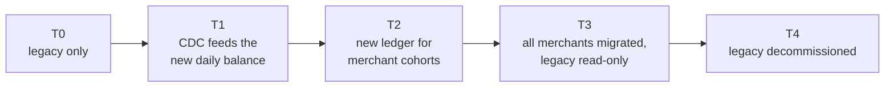
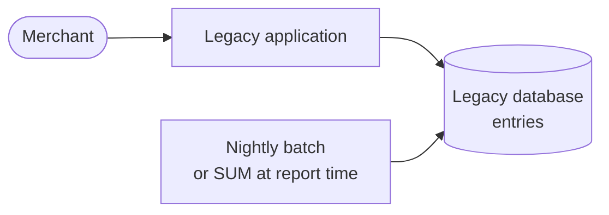
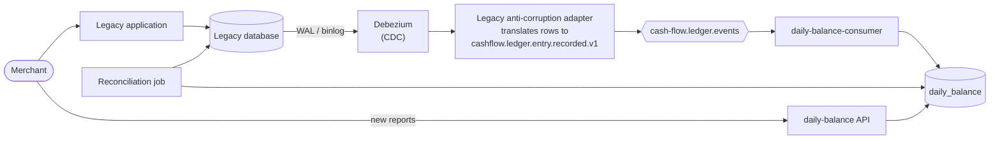
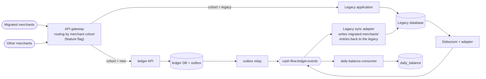
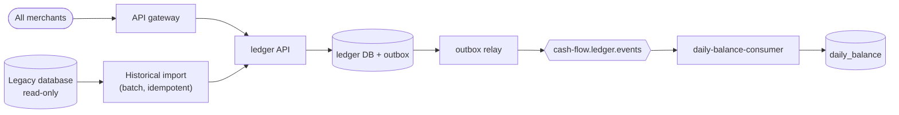
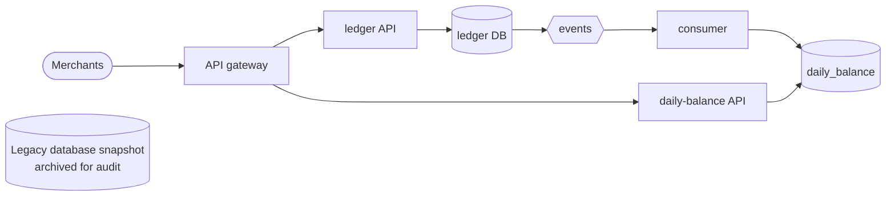

# Transition Architecture

The challenge asks for a transition architecture "if necessary, considering a legacy migration". No legacy system was described, so this document makes the assumption explicit and plans a migration that keeps the merchant operating at every step.

> **If there is no legacy (greenfield),** the [target architecture](03-target-architecture.md) can be deployed directly. In that case, sections 6 to 8 of this document (cohort rollout, rollback and exit criteria) are the go-live plan.

## 1. Assumed legacy

| Aspect        | Assumption                                                                                                                                                  |
| ------------- | ----------------------------------------------------------------------------------------------------------------------------------------------------------- |
| Application   | A monolithic back-office application (desktop or web ERP) used by the merchant to record cash entries                                                       |
| Data          | A single relational database with an entries table: amount as decimal, a date/time column in server local time, a type or signed amount                     |
| Daily balance | Computed by a nightly batch job or by `SUM` queries at report time                                                                                          |
| Pain points   | Reports slow down the whole system at peak; a failure in reporting can take down entry recording; no API for other channels; history can be edited in place |
| Constraint    | Merchants depend on it every day: no downtime window longer than a few minutes, and no change to how they work until the new screens are ready              |

These pain points are exactly what the target addresses: separate write and read sides ([ADR 0002](adr/0002-event-driven-microservices.md)), an immutable ledger and a materialized daily balance ([ADR 0008](adr/0008-materialized-daily-balance.md)).

## 2. Strategy

- **Strangler Fig:** the new services take over one capability at a time, behind a routing layer, while the legacy keeps running.
- **Anti-corruption layer:** legacy data is never read by the new domain directly. An adapter translates it into the same CloudEvents contract used by the ledger ([ADR 0007](adr/0007-cloudevents-shared-contracts.md)), so the daily balance does not know where an event came from.
- **Read side first:** the daily balance is migrated before the ledger. It carries no write risk and immediately relieves the legacy from heavy reports.
- **Per-merchant cohorts:** the write path moves merchant by merchant, with a rollback at every step.
- **No big bang:** every state below is stable and can last as long as needed.

## 3. Transition states

### T0: legacy only (current state)

Preparation work in T0, with no impact on the merchant: provision the target infrastructure, Keycloak with the merchants' users, observability, and map legacy fields to the event contract (type, amount in cents, business date, time zone).

### T1: change data capture feeds the new daily balance

| Item                      | Detail                                                                                                                                                                                            |
| ------------------------- | ------------------------------------------------------------------------------------------------------------------------------------------------------------------------------------------------- |
| Source of truth           | Still the legacy                                                                                                                                                                                  |
| What changes              | Every insert in the legacy entries table is captured by Debezium from the transaction log and translated into a CloudEvent with the legacy row id as `entryId`                                    |
| Anti-corruption adapter   | Converts decimals to cents, signed amounts to `CREDIT`/`DEBIT`, server local time to a business date in the merchant's IANA time zone, and builds a deterministic event id from the legacy row id |
| Corrections in the legacy | An update or delete of a legacy row is translated into a reversal event plus, for an update, a new recorded event: the new side remains immutable                                                 |
| Reconciliation            | A daily job compares, per merchant and business date, the legacy totals with `daily_balances`; any difference raises an alert and is investigated before moving on                                |
| What merchants see        | Optionally, the new balance report, offered first to internal users and a pilot group                                                                                                             |
| Risk                      | Low: the legacy is untouched; the new side can be dropped and rebuilt at any time                                                                                                                 |

### T2: the new ledger becomes the write path for merchant cohorts

| Item                    | Detail                                                                                                                                                                                    |
| ----------------------- | ----------------------------------------------------------------------------------------------------------------------------------------------------------------------------------------- |
| Source of truth         | The new ledger for migrated merchants; the legacy for the others                                                                                                                          |
| Routing                 | The gateway decides per `merchant_id` (from the token) using a feature flag; the merchant's client or UI calls the same entry point                                                       |
| Reverse synchronization | While legacy reports or downstream integrations still read the legacy database, a sync adapter consumes ledger events and writes them to the legacy, marked with their origin             |
| Loop prevention         | Rows written by the sync adapter carry an origin marker and are ignored by the CDC adapter, so an entry is never published twice; even if it were, the consumer deduplicates by `entryId` |
| Dual run                | During the first weeks of each cohort, the reconciliation job compares the new ledger, the legacy copy and the daily balance                                                              |
| Risk                    | Medium: limited to the cohort; rollback is a flag change                                                                                                                                  |

### T3: all merchants migrated, legacy read-only

All writes go to the new ledger. The legacy becomes read-only for consultation and audit. History is imported (section 4) so that the new ledger and the daily balance hold the full past.

### T4: legacy decommissioned

Debezium, the anti-corruption adapter, the sync adapter and the routing flag are removed. A final snapshot of the legacy database is archived (encrypted, read-only) for the legal retention period.

## 4. Historical data migration

| Step | Action                                                                                                                                                                                                                               |
| ---- | ------------------------------------------------------------------------------------------------------------------------------------------------------------------------------------------------------------------------------------ |
| 1    | Extract legacy entries per merchant and month, in order                                                                                                                                                                              |
| 2    | Translate them with the same anti-corruption rules used by the CDC adapter (cents, type, business date, time zone)                                                                                                                   |
| 3    | Import through a dedicated batch endpoint or command of the ledger that accepts past business dates without the 30-day backdating rule, with an `Idempotency-Key` derived from the legacy row id: a re-run never duplicates an entry |
| 4    | The ledger writes each entry and its event in the same transaction, preserving the original business date, so the outbox publishes history like any other event                                                                      |
| 5    | The consumer consolidates history into `daily_balances`. Its deduplication by `entryId` makes it safe even for entries that already arrived through CDC in T1                                                                        |
| 6    | If a day needs to be recomputed, the existing `rebuild-day` command recalculates it from the journal                                                                                                                                 |
| 7    | Reconcile every merchant and business date (counts and totals) between legacy and new side before declaring the merchant migrated                                                                                                    |

Throughput is controlled by the batch size and the relay; the import runs at night or throttled, so it does not compete with live traffic. The outbox lag and consumer backlog metrics ([observability](../README.md#observabilidade)) show progress.

### Cutover checklist per cohort

- [ ] History imported and reconciled for every merchant in the cohort (zero differences, or differences explained and signed off)
- [ ] Users and `merchant_id` attributes created in Keycloak; operators and viewers have the right roles
- [ ] Merchants informed of the change window and of the new report screens
- [ ] Dashboards and alerts green for the previous cohort for at least one full week
- [ ] Rollback rehearsed in staging: flag back to legacy, sync adapter catching up
- [ ] Flag switched; first entries of each merchant checked end to end with their `x-trace-id`
- [ ] Reconciliation job scheduled daily for the cohort during the dual-run period

## 5. Routing and rollout

| Wave     | Merchants       | Minimum duration | Moves on when                                                                  |
| -------- | --------------- | ---------------- | ------------------------------------------------------------------------------ |
| Pilot    | Internal and 1% | 2 weeks          | Zero reconciliation differences, no critical alert, merchant feedback positive |
| Early    | 10%             | 2 weeks          | Same, plus error budget within objectives                                      |
| Majority | 50%             | 1 week           | Same                                                                           |
| All      | 100%            | —                | Legacy write path idle for one week, then T3                                   |

The flag is evaluated per `merchant_id`, so a single merchant can be moved back without affecting the others.

## 6. Rollback per state

| State | How to roll back                                                                         | Data impact                                                                                                                            |
| ----- | ---------------------------------------------------------------------------------------- | -------------------------------------------------------------------------------------------------------------------------------------- |
| T1    | Stop Debezium and the adapter; merchants keep using legacy reports                       | None: the legacy was never changed. The new daily balance can be truncated and rebuilt                                                 |
| T2    | Switch the cohort's flag back to legacy                                                  | Entries recorded in the new ledger are already in the legacy through the sync adapter; wait for its lag to reach zero before switching |
| T3    | Re-enable legacy writes and route back by flag; keep the sync adapter running until then | Requires the sync adapter to still be in place, which is why it is only removed in T4                                                  |
| T4    | Not reversible by design; reached only after T3 has been stable for the agreed period    | Legacy snapshot is archived                                                                                                            |

## 7. Risks and mitigations

| Risk                                           | Mitigation                                                                                                                                                                                                                 |
| ---------------------------------------------- | -------------------------------------------------------------------------------------------------------------------------------------------------------------------------------------------------------------------------- |
| Divergence between legacy and new totals       | Daily reconciliation per merchant and business date with alerts; a cohort does not advance while differences are open                                                                                                      |
| Double counting (CDC, import and sync overlap) | Deterministic `entryId` from the legacy row id; the consumer deduplicates by event id and by entry id in the same transaction as the balance update                                                                        |
| Time zones in legacy dates                     | Legacy timestamps are interpreted in the server's time zone and converted to the business date in the point of sale's IANA time zone by the adapter, with tests for boundary cases (midnight, Fernando de Noronha, Manaus) |
| Legacy edits history in place                  | Updates and deletes become reversal events; the new ledger stays immutable and auditable                                                                                                                                   |
| Load on the legacy database from CDC           | Debezium reads the transaction log, not the tables; the initial snapshot runs at night or from a replica                                                                                                                   |
| Downtime during cutover                        | None required: cutover is a flag change per merchant                                                                                                                                                                       |
| Performance of the new side under real traffic | Load and resilience tests before each wave; autoscaling; the measured capacity is 8x the required peak on a single replica                                                                                                 |
| Team unfamiliar with event-driven systems      | Runbooks ([07-operations.md](07-operations.md)), dashboards, end-to-end traces and pairing during the pilot                                                                                                                |
| Incomplete mapping of legacy entry types       | Unknown types are sent to the DLQ with the reason, not silently dropped; the mapping is extended and the messages redriven                                                                                                 |

## 8. Timeline estimate

Indicative, for one squad (4 to 6 people) and an assumed legacy of moderate complexity.

| Phase                | Weeks     | Main deliverables                                                                          | Exit criteria                                                                               |
| -------------------- | --------- | ------------------------------------------------------------------------------------------ | ------------------------------------------------------------------------------------------- |
| T0 preparation       | 3–4       | Infrastructure as code, Keycloak users, observability, field mapping, adapters' test suite | Target environment passing the load and resilience tests in staging                         |
| T1 CDC and read side | 4–6       | Debezium, anti-corruption adapter, reconciliation job, new reports for pilot users         | 2 consecutive weeks with zero reconciliation differences                                    |
| T2 cohorts           | 6–8       | Gateway routing, feature flag, sync adapter, waves 1% → 10% → 50% → 100%                   | All merchants on the new ledger, error budget respected, no open reconciliation differences |
| T3 legacy read-only  | 2–4       | Historical import, full reconciliation, legacy writes disabled                             | History reconciled for every merchant; one month without legacy writes                      |
| T4 decommission      | 1–2       | Remove adapters and flags, archive legacy snapshot                                         | Legacy shut down, archive verified                                                          |
| **Total**            | **16–24** |                                                                                            |                                                                                             |

The target architecture already contains the building blocks this plan relies on: the event contract with versioning, idempotent consumption by entry id, the `rebuild-day` and `redrive-dead-letters` commands, per-merchant identity in the token and the observability needed to compare both worlds. See also [future evolutions](08-future-evolutions.md) and the [cost estimate](05-cost-estimate.md), which includes the temporary cost of running both systems in parallel.
