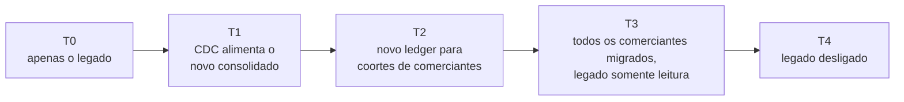
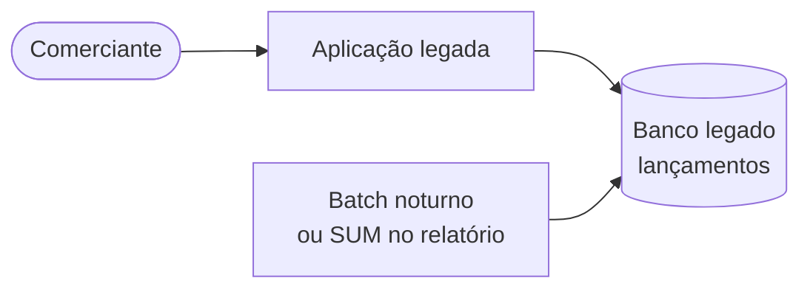
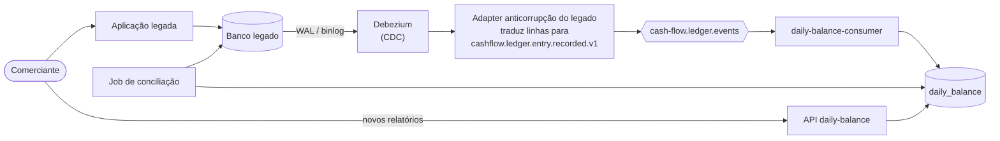
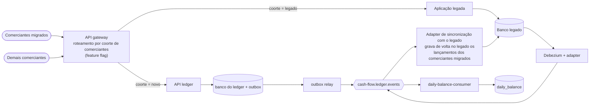
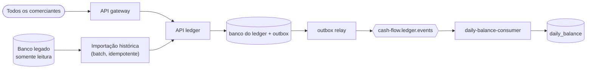
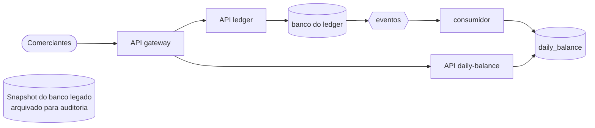

# Arquitetura de Transição

O desafio pede uma arquitetura de transição "se necessária, considerando uma migração de legado". Nenhum sistema legado foi descrito, então este documento explicita a premissa adotada e planeja uma migração que mantém o comerciante operando em todas as etapas.

> **Se não houver legado (greenfield),** a [arquitetura alvo](03-target-architecture.md) pode ser implantada diretamente. Nesse caso, as seções 5 a 8 deste documento (entrada por coortes, rollback e critérios de saída) formam o plano de entrada em produção.

## 1. Legado assumido

| Aspecto      | Premissa                                                                                                                                                                                  |
| ------------ | ----------------------------------------------------------------------------------------------------------------------------------------------------------------------------------------- |
| Aplicação    | Uma aplicação de back-office monolítica (ERP desktop ou web) usada pelo comerciante para registrar os lançamentos de caixa                                                                |
| Dados        | Um único banco relacional com uma tabela de lançamentos: valor em decimal, uma coluna de data/hora no horário local do servidor, um tipo ou um valor com sinal                            |
| Saldo diário | Calculado por um job batch noturno ou por consultas `SUM` no momento do relatório                                                                                                         |
| Problemas    | Relatórios deixam o sistema inteiro lento no pico; uma falha nos relatórios pode derrubar o registro de lançamentos; não há API para outros canais; o histórico pode ser editado no lugar |
| Restrição    | Os comerciantes dependem dele todos os dias: nenhuma janela de indisponibilidade maior que alguns minutos, e nenhuma mudança na forma de trabalhar até as novas telas estarem prontas     |

Esses problemas são exatamente o que o alvo resolve: lados de escrita e de leitura separados ([ADR 0002](adr/0002-event-driven-microservices.md)), um ledger imutável e um saldo diário materializado ([ADR 0008](adr/0008-materialized-daily-balance.md)).

## 2. Estratégia

- **Strangler Fig:** os novos serviços assumem uma capacidade por vez, atrás de uma camada de roteamento, enquanto o legado continua rodando.
- **Camada anticorrupção:** o novo domínio nunca lê os dados do legado diretamente. Um adapter os traduz para o mesmo contrato CloudEvents usado pelo ledger ([ADR 0007](adr/0007-cloudevents-shared-contracts.md)), de modo que o consolidado não sabe de onde veio um evento.
- **Lado de leitura primeiro:** o consolidado é migrado antes do ledger. Ele não traz risco de escrita e alivia o legado dos relatórios pesados imediatamente.
- **Coortes por comerciante:** o caminho de escrita migra comerciante por comerciante, com rollback possível em cada etapa.
- **Sem big bang:** cada estado abaixo é estável e pode durar o tempo que for necessário.

## 3. Estados de transição

### T0: apenas o legado (estado atual)

Trabalho de preparação em T0, sem impacto para o comerciante: provisionar a infraestrutura alvo, o Keycloak com os usuários dos comerciantes e a observabilidade, e mapear os campos do legado para o contrato de eventos (tipo, valor em centavos, data de competência, fuso).

### T1: change data capture alimenta o novo consolidado

| Item                       | Detalhe                                                                                                                                                                                                                           |
| -------------------------- | --------------------------------------------------------------------------------------------------------------------------------------------------------------------------------------------------------------------------------- |
| Fonte da verdade           | Continua sendo o legado                                                                                                                                                                                                           |
| O que muda                 | Cada inserção na tabela de lançamentos do legado é capturada pelo Debezium a partir do log de transações e traduzida em um CloudEvent, com o id da linha do legado como `entryId`                                                 |
| Adapter anticorrupção      | Converte decimais em centavos, valores com sinal em `CREDIT`/`DEBIT`, o horário local do servidor em uma data de competência no fuso IANA do comerciante, e gera um id de evento determinístico a partir do id da linha do legado |
| Correções no legado        | Um update ou delete de uma linha do legado é traduzido em um evento de estorno e, no caso de update, em um novo evento de registro: o lado novo continua imutável                                                                 |
| Conciliação                | Um job diário compara, por comerciante e data de competência, os totais do legado com `daily_balances`; qualquer diferença gera um alerta e é investigada antes de seguir                                                         |
| O que os comerciantes veem | Opcionalmente, o novo relatório de saldo, oferecido primeiro a usuários internos e a um grupo piloto                                                                                                                              |
| Risco                      | Baixo: o legado não é alterado; o lado novo pode ser descartado e reconstruído a qualquer momento                                                                                                                                 |

### T2: o novo ledger passa a ser o caminho de escrita para coortes de comerciantes

| Item                  | Detalhe                                                                                                                                                                                                                    |
| --------------------- | -------------------------------------------------------------------------------------------------------------------------------------------------------------------------------------------------------------------------- |
| Fonte da verdade      | O novo ledger para os comerciantes migrados; o legado para os demais                                                                                                                                                       |
| Roteamento            | O gateway decide por `merchant_id` (vindo do token) usando uma feature flag; o cliente ou a interface do comerciante chama o mesmo ponto de entrada                                                                        |
| Sincronização reversa | Enquanto relatórios ou integrações a jusante ainda lerem o banco legado, um adapter de sincronização consome os eventos do ledger e os grava no legado, marcados com a origem                                              |
| Prevenção de loop     | As linhas gravadas pelo adapter de sincronização trazem um marcador de origem e são ignoradas pelo adapter de CDC, então um lançamento nunca é publicado duas vezes; mesmo que fosse, o consumidor deduplica por `entryId` |
| Execução em paralelo  | Nas primeiras semanas de cada coorte, o job de conciliação compara o novo ledger, a cópia no legado e o consolidado                                                                                                        |
| Risco                 | Médio: limitado à coorte; o rollback é uma mudança de flag                                                                                                                                                                 |

### T3: todos os comerciantes migrados, legado somente leitura

Todas as escritas vão para o novo ledger. O legado passa a ser somente leitura, para consulta e auditoria. O histórico é importado (seção 4) para que o novo ledger e o consolidado contenham todo o passado.

### T4: legado desligado

O Debezium, o adapter anticorrupção, o adapter de sincronização e a flag de roteamento são removidos. Um snapshot final do banco legado é arquivado (criptografado, somente leitura) pelo prazo legal de retenção.

## 4. Migração dos dados históricos

| Passo | Ação                                                                                                                                                                                                                                                       |
| ----- | ---------------------------------------------------------------------------------------------------------------------------------------------------------------------------------------------------------------------------------------------------------- |
| 1     | Extrair os lançamentos do legado por comerciante e por mês, em ordem                                                                                                                                                                                       |
| 2     | Traduzi-los com as mesmas regras anticorrupção usadas pelo adapter de CDC (centavos, tipo, data de competência, fuso)                                                                                                                                      |
| 3     | Importar por um endpoint ou comando batch dedicado do ledger, que aceite datas de competência passadas sem a regra de 30 dias de retroatividade, com um `Idempotency-Key` derivado do id da linha do legado: uma nova execução nunca duplica um lançamento |
| 4     | O ledger grava cada lançamento e seu evento na mesma transação, preservando a data de competência original, então o outbox publica o histórico como qualquer outro evento                                                                                  |
| 5     | O consumidor consolida o histórico em `daily_balances`. A deduplicação por `entryId` garante a segurança mesmo para lançamentos que já chegaram por CDC em T1                                                                                              |
| 6     | Se for preciso recalcular um dia, o comando `rebuild-day` já existente faz isso a partir do diário                                                                                                                                                         |
| 7     | Conciliar cada comerciante e data de competência (quantidades e totais) entre o legado e o lado novo antes de declarar o comerciante migrado                                                                                                               |

A vazão é controlada pelo tamanho do lote e pelo relay; a importação roda à noite ou com limitação de ritmo, para não competir com o tráfego real. As métricas de atraso do outbox e de backlog do consumidor ([observabilidade](../README.md#observabilidade)) mostram o progresso.

### Checklist de virada por coorte

- [ ] Histórico importado e conciliado para todos os comerciantes da coorte (zero diferenças, ou diferenças explicadas e aprovadas)
- [ ] Usuários e atributos `merchant_id` criados no Keycloak; operadores e analistas com os papéis corretos
- [ ] Comerciantes informados sobre a janela de mudança e sobre as novas telas de relatório
- [ ] Dashboards e alertas sem problemas para a coorte anterior por pelo menos uma semana completa
- [ ] Rollback ensaiado em staging: flag de volta para o legado, adapter de sincronização em dia
- [ ] Flag trocada; primeiros lançamentos de cada comerciante conferidos de ponta a ponta pelo `x-trace-id`
- [ ] Job de conciliação agendado diariamente para a coorte durante o período de execução em paralelo

## 5. Roteamento e entrada em produção

| Onda    | Comerciantes  | Duração mínima | Avança quando                                                                             |
| ------- | ------------- | -------------- | ----------------------------------------------------------------------------------------- |
| Piloto  | Internos e 1% | 2 semanas      | Zero diferenças na conciliação, nenhum alerta crítico, feedback positivo dos comerciantes |
| Inicial | 10%           | 2 semanas      | O mesmo, mais o orçamento de erro dentro dos objetivos                                    |
| Maioria | 50%           | 1 semana       | O mesmo                                                                                   |
| Todos   | 100%          | —              | Caminho de escrita do legado sem uso por uma semana; então T3                             |

A flag é avaliada por `merchant_id`, então um único comerciante pode voltar para o legado sem afetar os demais.

## 6. Rollback por estado

| Estado | Como fazer o rollback                                                                                              | Impacto nos dados                                                                                                                            |
| ------ | ------------------------------------------------------------------------------------------------------------------ | -------------------------------------------------------------------------------------------------------------------------------------------- |
| T1     | Parar o Debezium e o adapter; os comerciantes continuam usando os relatórios do legado                             | Nenhum: o legado nunca foi alterado. O novo consolidado pode ser truncado e reconstruído                                                     |
| T2     | Voltar a flag da coorte para o legado                                                                              | Os lançamentos gravados no novo ledger já estão no legado pelo adapter de sincronização; esperar o atraso dele chegar a zero antes de trocar |
| T3     | Reabilitar as escritas no legado e voltar o roteamento pela flag; manter o adapter de sincronização rodando até lá | Exige que o adapter de sincronização ainda exista, e por isso ele só é removido em T4                                                        |
| T4     | Irreversível por definição; só é alcançado depois que T3 ficou estável pelo período combinado                      | O snapshot do legado é arquivado                                                                                                             |

## 7. Riscos e mitigações

| Risco                                                            | Mitigação                                                                                                                                                                                                                         |
| ---------------------------------------------------------------- | --------------------------------------------------------------------------------------------------------------------------------------------------------------------------------------------------------------------------------- |
| Divergência entre os totais do legado e do lado novo             | Conciliação diária por comerciante e data de competência, com alertas; uma coorte não avança enquanto houver diferenças em aberto                                                                                                 |
| Contagem dupla (sobreposição de CDC, importação e sincronização) | `entryId` determinístico a partir do id da linha do legado; o consumidor deduplica por id do evento e por id do lançamento na mesma transação da atualização do saldo                                                             |
| Fusos horários nas datas do legado                               | Os horários do legado são interpretados no fuso do servidor e convertidos pelo adapter para a data de competência no fuso IANA do ponto de venda, com testes para os casos de fronteira (meia-noite, Fernando de Noronha, Manaus) |
| Legado que edita o histórico no lugar                            | Updates e deletes viram eventos de estorno; o novo ledger continua imutável e auditável                                                                                                                                           |
| Carga do CDC sobre o banco legado                                | O Debezium lê o log de transações, não as tabelas; o snapshot inicial roda à noite ou a partir de uma réplica                                                                                                                     |
| Indisponibilidade durante a virada                               | Nenhuma necessária: a virada é uma mudança de flag por comerciante                                                                                                                                                                |
| Desempenho do lado novo sob tráfego real                         | Testes de carga e de resiliência antes de cada onda; autoscaling; a capacidade medida é 8 vezes o pico exigido com uma única réplica                                                                                              |
| Time pouco familiarizado com sistemas orientados a eventos       | Runbooks ([07-operations.md](07-operations.md)), dashboards, traces ponta a ponta e pareamento durante o piloto                                                                                                                   |
| Mapeamento incompleto dos tipos de lançamento do legado          | Tipos desconhecidos vão para a DLQ com o motivo, em vez de serem descartados silenciosamente; o mapeamento é estendido e as mensagens passam por redrive                                                                          |

## 8. Estimativa de cronograma

Indicativa, para um squad (4 a 6 pessoas) e um legado assumido de complexidade moderada.

| Fase                      | Semanas   | Principais entregas                                                                                                   | Critérios de saída                                                                                             |
| ------------------------- | --------- | --------------------------------------------------------------------------------------------------------------------- | -------------------------------------------------------------------------------------------------------------- |
| T0 preparação             | 3–4       | Infraestrutura como código, usuários no Keycloak, observabilidade, mapeamento de campos, suíte de testes dos adapters | Ambiente alvo passando nos testes de carga e de resiliência em staging                                         |
| T1 CDC e lado de leitura  | 4–6       | Debezium, adapter anticorrupção, job de conciliação, novos relatórios para usuários piloto                            | 2 semanas seguidas com zero diferenças na conciliação                                                          |
| T2 coortes                | 6–8       | Roteamento no gateway, feature flag, adapter de sincronização, ondas 1% → 10% → 50% → 100%                            | Todos os comerciantes no novo ledger, orçamento de erro respeitado, nenhuma diferença de conciliação em aberto |
| T3 legado somente leitura | 2–4       | Importação histórica, conciliação completa, escritas no legado desabilitadas                                          | Histórico conciliado para todos os comerciantes; um mês sem escritas no legado                                 |
| T4 desligamento           | 1–2       | Remoção dos adapters e das flags, arquivamento do snapshot do legado                                                  | Legado desligado, arquivo verificado                                                                           |
| **Total**                 | **16–24** |                                                                                                                       |                                                                                                                |

A arquitetura alvo já contém os blocos dos quais este plano depende: o contrato de eventos com versionamento, o consumo idempotente por id do lançamento, os comandos `rebuild-day` e `redrive-dead-letters`, a identidade por comerciante no token e a observabilidade necessária para comparar os dois mundos. Veja também as [evoluções futuras](08-future-evolutions.md) e a [estimativa de custos](05-cost-estimate.md), que inclui o custo temporário de manter os dois sistemas rodando em paralelo.
