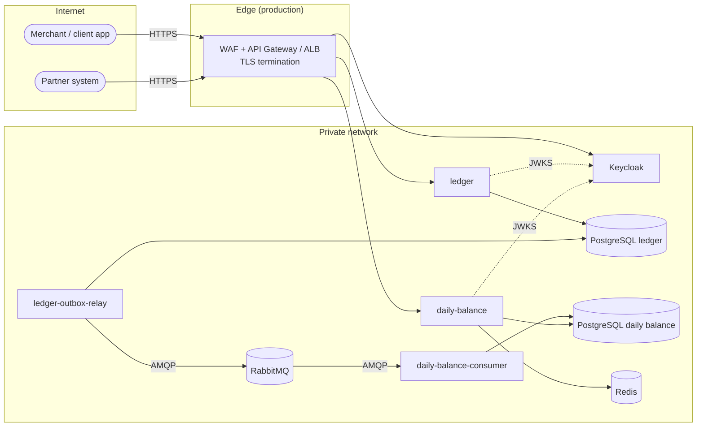
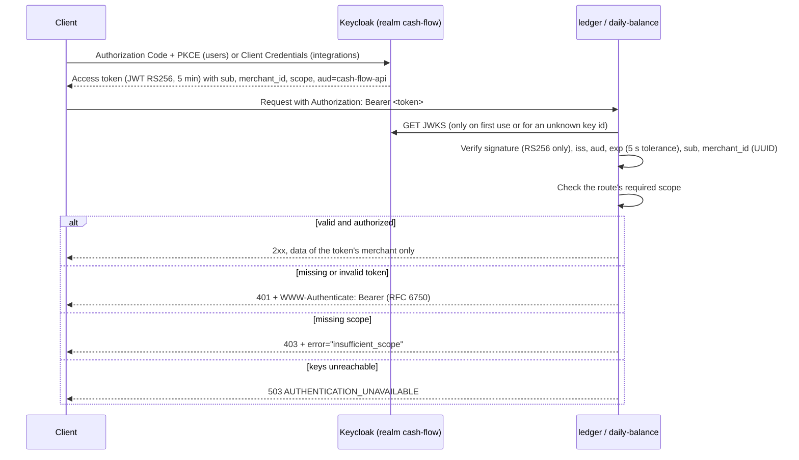

# 06 — Security

This document describes how the cash flow solution protects its data and services, and which security criteria apply to every consumer of its services, whether synchronous (HTTP APIs) or asynchronous (events). Each item has a status:

- **Implemented**: present in this repository and covered by tests or verified in the Docker Compose environment.
- **Recommended**: required before production, but outside the scope of the local environment.

Related documents: [03-target-architecture.md](03-target-architecture.md), [07-operations.md](07-operations.md), [adr/0011-keycloak-jwt-scopes.md](adr/0011-keycloak-jwt-scopes.md) and [adr/0006-rabbitmq-message-broker.md](adr/0006-rabbitmq-message-broker.md).

## 1. Assets and trust boundaries

| Asset                | Why it matters                                                                                              |
| -------------------- | ----------------------------------------------------------------------------------------------------------- |
| Ledger entries       | The source of truth of the merchant's cash flow. They must not be altered, lost or seen by another merchant |
| Daily balances       | A derived read model. Wrong values mislead the merchant, but they can be rebuilt from the movement journal  |
| Access tokens        | Bearer credentials. Whoever holds a valid token acts as the merchant until it expires                       |
| Integration events   | Carry amounts, dates and the merchant id between the services                                               |
| Credentials and keys | Database, broker, cache and identity provider secrets; token signing keys                                   |

Trust boundaries: (1) internet to edge, (2) edge to the services, (3) services to their own data stores, and (4) producer to consumer through the broker. Each service only reaches its own database. The only shared channel between the two bounded contexts is the event contract.

## 2. Authentication and authorization

### 2.1 Flow

### 2.2 Implemented controls

| Control                             | Detail                                                                                                                                                                                 | Status      |
| ----------------------------------- | -------------------------------------------------------------------------------------------------------------------------------------------------------------------------------------- | ----------- |
| Identity provider as code           | Realm in `infra/keycloak/cash-flow-realm.json`, imported on startup: client, roles, scopes, claim mappers, user profile                                                                | Implemented |
| Local token validation              | `jose` validates RS256 signatures against the JWKS. No call to Keycloak per request; keys are cached in memory                                                                         | Implemented |
| Algorithm pinning                   | Only `RS256` is accepted, which prevents `alg=none` and HMAC key-confusion attacks                                                                                                     | Implemented |
| Issuer and audience                 | `iss` must equal `AUTH_ISSUER` and `aud` must contain `cash-flow-api` (audience mapper in the realm)                                                                                   | Implemented |
| Expiration                          | 5-minute access tokens, `exp` checked with 5 s of clock tolerance                                                                                                                      | Implemented |
| Merchant identity from the token    | `merchant_id` claim (UUID). The old `x-merchant-id` header was removed, and a test proves that a spoofed header is ignored                                                             | Implemented |
| Merchant attribute protected        | The user profile declares `merchant_id` editable only by `admin`; unmanaged attributes are disabled, so users cannot change it in the account console (verified through the admin API) | Implemented |
| Scope-based authorization per route | `ledger:write`, `ledger:read` and `balance:read`, checked by a Fastify hook from the route configuration                                                                               | Implemented |
| Scopes bound to roles               | Keycloak only adds a scope to the token when the user has one of the mapped roles                                                                                                      | Implemented |
| Tenant isolation                    | Every query filters by the token's `merchant_id`; another merchant's entry returns 404, so its existence is not revealed                                                               | Implemented |
| Standard challenges                 | 401 with `WWW-Authenticate: Bearer realm="cash-flow"` and `error="invalid_token"`; 403 with `error="insufficient_scope"`                                                               | Implemented |
| Brute force protection              | Enabled in the realm (`bruteForceProtected`)                                                                                                                                           | Implemented |
| TLS required by the realm           | `sslRequired: external`: Keycloak requires HTTPS except from private networks                                                                                                          | Implemented |
| Availability without Keycloak       | Services start without Keycloak. Already issued tokens keep working while it is down; JWKS fetch failure returns 503, not 500                                                          | Implemented |
| Password grant disabled             | Enabled locally only to support the tests                                                                                                                                              | Recommended |

| Scope          | Grants                                               | `merchant-operator` | `merchant-viewer` |
| -------------- | ---------------------------------------------------- | ------------------- | ----------------- |
| `ledger:write` | Record and reverse entries, configure points of sale | yes                 | no                |
| `ledger:read`  | Read entries                                         | yes                 | yes               |
| `balance:read` | Read consolidated daily balances                     | yes                 | yes               |

## 3. Threat model (STRIDE)

| Threat                                      | Asset or flow     | Mitigation                                                                                                                                                          | Status                                  |
| ------------------------------------------- | ----------------- | ------------------------------------------------------------------------------------------------------------------------------------------------------------------- | --------------------------------------- |
| **S**poofing a merchant                     | APIs              | Merchant taken only from the signed token's `merchant_id`; header removed; attribute editable only by admins                                                        | Implemented                             |
| **S**poofing with a forged token            | APIs              | RS256 signature against the JWKS, `iss` and `aud` checks, algorithm pinned                                                                                          | Implemented                             |
| **S**poofing a producer on the broker       | Events            | Dedicated broker user per service with least privilege (section 4.2)                                                                                                | Recommended                             |
| **T**ampering with ledger history           | Entries           | Entries are immutable and corrected only by reversal; DB constraints (positive amounts, single reversal through a unique index, composite FK for the point of sale) | Implemented                             |
| **T**ampering with requests in transit      | All HTTP traffic  | TLS at the gateway or ALB; HSTS header already sent                                                                                                                 | HSTS implemented; TLS recommended       |
| **T**ampering with events                   | Events            | Contract validation (`isLedgerEventV1`); invalid messages go to the DLQ with the reason; TLS on AMQP in production                                                  | Validation implemented; TLS recommended |
| **R**epudiation of an operation             | Entries           | `recordedAt` (UTC) and time zone stored per entry; reversal references the original; trace id per request; token `sub` available for audit logging                  | Partially implemented                   |
| **I**nformation disclosure across merchants | Entries, balances | Every query filtered by merchant; 404 for entries of other merchants; cache keys include the merchant id                                                            | Implemented                             |
| **I**nformation disclosure in errors        | APIs              | Problem Details with a stable `code`; unexpected errors return only `INTERNAL_ERROR`, with details in the logs                                                      | Implemented                             |
| **I**nformation disclosure in logs          | Logs              | Fastify's default request serializer logs method, URL and remote address, not headers, so tokens are not logged; rejected tokens log only the reason                | Implemented                             |
| **D**enial of service by volume             | APIs              | Rate limiting per merchant (ledger 1,200 req/min, daily balance 6,000 req/min) returning 429 with `Retry-After`; WAF and gateway quotas in production               | App limit implemented; edge recommended |
| **D**enial of service with large payloads   | Ledger            | 16 KiB body limit (413); JSON Schema validation with `additionalProperties: false`                                                                                  | Implemented                             |
| **D**enial of service through a dependency  | Daily balance     | Circuit breakers and timeouts on Redis and PostgreSQL; stale cache fallback                                                                                         | Implemented                             |
| **D**uplicate side effects                  | Writes and events | `Idempotency-Key` stored atomically with the response; event deduplication by event id and entry id                                                                 | Implemented                             |
| **E**levation of privilege                  | APIs              | Per-route scopes; viewer role cannot obtain `ledger:write`                                                                                                          | Implemented                             |
| **E**levation inside the container          | Runtime           | Images run as the non-root `node` user; minimal `node:22-alpine` base; production dependencies only                                                                 | Implemented                             |

## 4. Security criteria for consuming the services (integration)

These criteria apply to any system that consumes the solution, whether internal or external. They are the conditions an integration must meet before it is enabled.

### 4.1 Synchronous APIs (external and partner consumers)

| Criterion                 | Rule                                                                                                                                                                               | Status                  |
| ------------------------- | ---------------------------------------------------------------------------------------------------------------------------------------------------------------------------------- | ----------------------- |
| One identity per consumer | Every integration gets its own confidential OAuth 2.0 client using **Client Credentials**. No shared clients and no user passwords in systems                                      | Recommended             |
| Least privilege           | The client receives only the scopes it needs (for example, a reporting system gets `balance:read` only)                                                                            | Model implemented       |
| Merchant binding          | A client-credentials token carries a fixed `merchant_id` through a hardcoded claim mapper, so a partner can never act for another merchant                                         | Recommended             |
| Short-lived tokens        | Access tokens of at most 5 minutes; no refresh tokens for machine clients                                                                                                          | Implemented (realm)     |
| Audience restriction      | Tokens must contain `aud=cash-flow-api`; tokens issued for other APIs are rejected                                                                                                 | Implemented             |
| Transport security        | TLS 1.2+ only. **mTLS** for B2B partners at the gateway, with certificate pinning per client                                                                                       | Recommended             |
| Network restriction       | IP allow lists per partner at the gateway or WAF                                                                                                                                   | Recommended             |
| Quotas and rate limits    | Per merchant in the application (implemented) plus per client and per IP at the gateway                                                                                            | Partially implemented   |
| Idempotency on writes     | `Idempotency-Key` is **mandatory** for integration clients on `POST` (optional for interactive users); retries return the original response                                        | Implemented (supported) |
| Contract validation       | Requests validated by JSON Schema; unknown fields rejected; the OpenAPI document at `/docs` is the contract                                                                        | Implemented             |
| Versioning                | URL versioning (`/v1`); breaking changes only in a new version, with a deprecation window announced to consumers                                                                   | Implemented (`/v1`)     |
| Optional request signing  | For high-value partners, an HMAC signature of method, path, body hash and timestamp in a header, checked at the gateway                                                            | Recommended             |
| Webhooks (if added)       | Payload signed with HMAC-SHA256 using a per-subscriber secret; timestamp and event id in the signature to prevent replay; reject events older than 5 minutes; retries with backoff | Recommended             |
| Error handling contract   | Problem Details (RFC 9457) with a stable `code`; consumers must honor `Retry-After` on 429 and 503                                                                                 | Implemented             |

### 4.2 Asynchronous integration (events)

| Criterion                    | Rule                                                                                                                                                                                                                           | Status                        |
| ---------------------------- | ------------------------------------------------------------------------------------------------------------------------------------------------------------------------------------------------------------------------------ | ----------------------------- |
| Dedicated broker credentials | One RabbitMQ user per process (relay, consumer); no shared administrator user (the local environment uses a single user)                                                                                                       | Recommended                   |
| Least-privilege permissions  | Relay: _write_ only on the exchange `cash-flow.ledger.events`. Consumer: _read_ on its queues, _write_ only on its retry queue and dead-letter exchange, _configure_ only on its own resources. Separate vhost per environment | Recommended                   |
| Encrypted transport          | `amqps://` (TLS) in production; Amazon MQ enforces it                                                                                                                                                                          | Recommended                   |
| Contract validation          | Every message validated against `LedgerEventV1` from `@cash-flow/contracts`; invalid messages go to the DLQ with `x-dead-letter-reason`                                                                                        | Implemented                   |
| Deduplication                | Consumer deduplicates by event id and entry id in the same transaction as the balance update                                                                                                                                   | Implemented                   |
| Delivery guarantees          | Publisher confirms and `mandatory` publishing; persistent messages; quorum queues                                                                                                                                              | Implemented                   |
| Data minimization            | Events carry only identifiers, type, amount, currency and business date: **no description and no personal data**                                                                                                               | Implemented                   |
| Schema evolution             | Additive changes only within a version; breaking changes create a new event type (`.v2`); producers may publish both versions during a transition                                                                              | Implemented (versioned types) |
| Traceability                 | `traceparent` attribute (CloudEvents distributed tracing) and event id as `messageId`                                                                                                                                          | Implemented                   |

### 4.3 Internal service-to-service communication

| Criterion               | Rule                                                                                                                                  | Status                     |
| ----------------------- | ------------------------------------------------------------------------------------------------------------------------------------- | -------------------------- |
| No synchronous coupling | The two bounded contexts never call each other over HTTP; they share only events                                                      | Implemented                |
| Network segmentation    | Services in private subnets; databases, broker and cache reachable only from the services that own them (security groups per service) | Recommended                |
| Database isolation      | One database per service, with its own credentials; the consumer cannot read the ledger database                                      | Implemented (separate DBs) |
| Zero trust direction    | mTLS between services through a service mesh (for example, App Mesh or Istio) if synchronous internal calls are introduced            | Recommended                |

## 5. Data protection

| Topic                                | Approach                                                                                                                                                                                                                                                                                                         | Status      |
| ------------------------------------ | ---------------------------------------------------------------------------------------------------------------------------------------------------------------------------------------------------------------------------------------------------------------------------------------------------------------- | ----------- |
| Encryption in transit                | TLS at the edge (ALB or API Gateway with ACM certificates); TLS to RDS (`sslmode=verify-full`), ElastiCache (in-transit encryption) and the broker (`amqps`)                                                                                                                                                     | Recommended |
| Encryption at rest                   | KMS customer managed keys for RDS, ElastiCache, S3 (traces and backups), EBS and CloudWatch Logs                                                                                                                                                                                                                 | Recommended |
| Backups                              | Encrypted automatic RDS backups, point-in-time recovery, retention defined by the business; restore tested periodically (see [07-operations.md](07-operations.md))                                                                                                                                               | Recommended |
| Data minimization                    | Amounts in integer cents, dates and identifiers. The free-text `description` is the only field that could contain personal data, and it is limited to 140 characters and never published in events                                                                                                               | Implemented |
| LGPD                                 | The merchant is the data controller of its customers' data. Keep data in sa-east-1; register the legal basis; log access to personal data; define retention                                                                                                                                                      | Recommended |
| Right to erasure vs immutable ledger | Ledger entries cannot be deleted without breaking the audit trail. Recommended approach: keep descriptions free of personal data by policy; if personal data must be stored, store it encrypted with a per-subject key and delete the key on request (**crypto-shredding**), leaving the financial record intact | Recommended |
| Logs                                 | No tokens, no request bodies and no descriptions in logs; only identifiers and trace ids                                                                                                                                                                                                                         | Implemented |

## 6. Secrets management

| Environment  | Approach                                                                                                                                                       | Status      |
| ------------ | -------------------------------------------------------------------------------------------------------------------------------------------------------------- | ----------- |
| Local        | Defaults in `docker-compose.yml` and `.env.example` (`cashflow`/`cashflow`, `admin`/`admin`). Development only                                                 | Implemented |
| Production   | AWS Secrets Manager with automatic rotation for database credentials; injected into ECS tasks as secrets; IAM task roles with access to only their own secrets | Recommended |
| Images       | No secrets in images or in the repository; configuration validated at startup with Zod (the service fails fast if misconfigured)                               | Implemented |
| Signing keys | Managed by Keycloak, with periodic key rotation; services pick up new keys automatically through the JWKS (unknown `kid` triggers a refetch)                   | Supported   |

## 7. Supply chain and pipeline

| Control                                                                               | Status                       |
| ------------------------------------------------------------------------------------- | ---------------------------- |
| Reproducible installs with `npm ci` and a committed lockfile                          | Implemented                  |
| Multi-stage Dockerfile, production dependencies only, `node:22-alpine`, non-root user | Implemented                  |
| Static analysis with strict TypeScript and ESLint                                     | Implemented                  |
| Dependency updates (Dependabot or Renovate)                                           | Planned for Phase 10 (CI/CD) |
| `npm audit` in the pipeline                                                           | Planned for Phase 10         |
| CodeQL code scanning                                                                  | Planned for Phase 10         |
| Trivy image and dependency scanning                                                   | Planned for Phase 10         |
| SBOM generation (CycloneDX or SPDX)                                                   | Recommended                  |
| Signed images (cosign) and verification at deploy time                                | Recommended                  |
| Pinned image versions in Compose (no `latest`)                                        | Implemented                  |

## 8. Audit and security monitoring

| Capability                | Detail                                                                                                                                | Status      |
| ------------------------- | ------------------------------------------------------------------------------------------------------------------------------------- | ----------- |
| Audit trail of the ledger | Immutable entries; corrections only through reversals that reference the original; `recordedAt` and time zone stored                  | Implemented |
| Request correlation       | `x-trace-id` on every response; `trace_id` in every log line                                                                          | Implemented |
| Rejected token logging    | Rejected tokens are logged at `warn` with the reason (without the token)                                                              | Implemented |
| Actor in audit logs       | Record the token `sub` together with the entry id when an entry is recorded or reversed                                               | Recommended |
| Security alerts           | Alerts on spikes of 401, 403 and 429 per client, on brute force lockouts in Keycloak, and on DLQ messages caused by invalid contracts | Recommended |
| Keycloak events           | Enable login and admin events and ship them to the log pipeline                                                                       | Recommended |

## 9. Production hardening checklist

| #   | Item                                                                           | Status         |
| --- | ------------------------------------------------------------------------------ | -------------- |
| 1   | JWT validation (signature, algorithm, issuer, audience, expiration, merchant)  | ✅ Implemented |
| 2   | Scope-based authorization per route and roles bound to scopes                  | ✅ Implemented |
| 3   | Merchant derived only from the token                                           | ✅ Implemented |
| 4   | Rate limiting per merchant, body size limit, input validation                  | ✅ Implemented |
| 5   | Security headers (HSTS, `nosniff`, frame options, CSP)                         | ✅ Implemented |
| 6   | Idempotency on writes and deduplication on events                              | ✅ Implemented |
| 7   | Non-root containers and separate databases per service                         | ✅ Implemented |
| 8   | TLS at the edge and to every data store and the broker                         | ⬜ Recommended |
| 9   | Encryption at rest with KMS                                                    | ⬜ Recommended |
| 10  | Secrets Manager with rotation and IAM task roles                               | ⬜ Recommended |
| 11  | WAF with managed rule sets and gateway quotas per client                       | ⬜ Recommended |
| 12  | Dedicated broker users with least-privilege permissions                        | ⬜ Recommended |
| 13  | Keycloak in production mode, password grant disabled, admin console not public | ⬜ Recommended |
| 14  | Client Credentials clients per integration, with mTLS for partners             | ⬜ Recommended |
| 15  | Dependency, code and image scanning in CI                                      | ⬜ Phase 10    |
| 16  | Security alerts (401, 403 and 429 spikes, brute force, invalid contracts)      | ⬜ Recommended |
| 17  | Private subnets and security groups per service                                | ⬜ Recommended |
| 18  | Penetration test and periodic access review                                    | ⬜ Recommended |
