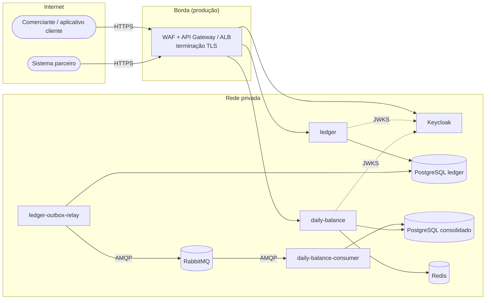
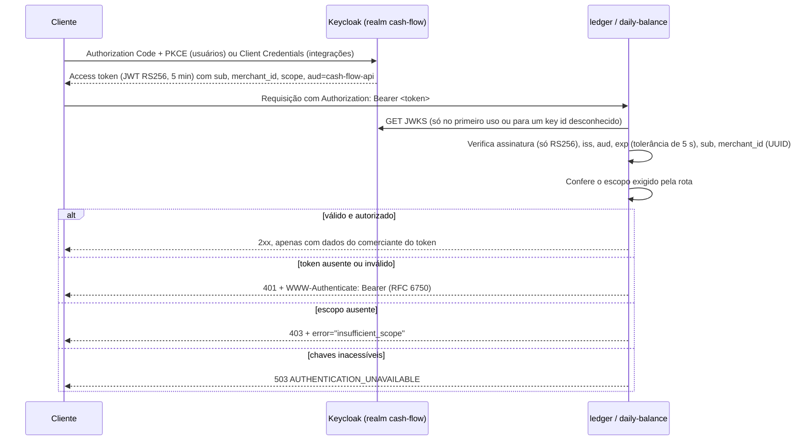

# 06 — Segurança

Este documento descreve como a solução de fluxo de caixa protege seus dados e serviços, e quais critérios de segurança se aplicam a todo consumidor dos seus serviços, seja síncrono (APIs HTTP) ou assíncrono (eventos). Cada item tem um status:

- **Implementado**: presente neste repositório e coberto por testes ou verificado no ambiente do Docker Compose.
- **Recomendado**: necessário antes de ir para produção, mas fora do escopo do ambiente local.

Documentos relacionados: [03-target-architecture.md](03-target-architecture.md), [07-operations.md](07-operations.md), [adr/0011-keycloak-jwt-scopes.md](adr/0011-keycloak-jwt-scopes.md) e [adr/0006-rabbitmq-message-broker.md](adr/0006-rabbitmq-message-broker.md).

## 1. Ativos e fronteiras de confiança

| Ativo                 | Por que importa                                                                                                                    |
| --------------------- | ---------------------------------------------------------------------------------------------------------------------------------- |
| Lançamentos do ledger | A fonte da verdade do fluxo de caixa do comerciante. Não podem ser alterados, perdidos nem vistos por outro comerciante            |
| Saldos diários        | Um modelo de leitura derivado. Valores errados enganam o comerciante, mas podem ser reconstruídos a partir do diário de movimentos |
| Tokens de acesso      | Credenciais do tipo bearer. Quem possui um token válido age como o comerciante até ele expirar                                     |
| Eventos de integração | Carregam valores, datas e o id do comerciante entre os serviços                                                                    |
| Credenciais e chaves  | Segredos do banco, do broker, do cache e do provedor de identidade; chaves de assinatura dos tokens                                |

Fronteiras de confiança: (1) da internet para a borda, (2) da borda para os serviços, (3) dos serviços para seus próprios armazenamentos de dados e (4) do produtor para o consumidor, através do broker. Cada serviço só acessa o próprio banco. O único canal compartilhado entre os dois bounded contexts é o contrato de eventos.

## 2. Autenticação e autorização

### 2.1 Fluxo

### 2.2 Controles implementados

| Controle                                 | Detalhe                                                                                                                                                                                                                 | Status       |
| ---------------------------------------- | ----------------------------------------------------------------------------------------------------------------------------------------------------------------------------------------------------------------------- | ------------ |
| Provedor de identidade como código       | Realm em `infra/keycloak/cash-flow-realm.json`, importado na subida: client, papéis, escopos, mapeadores de claims, perfil de usuário                                                                                   | Implementado |
| Validação local do token                 | `jose` valida assinaturas RS256 contra o JWKS. Não há chamada ao Keycloak por requisição; as chaves ficam em cache na memória                                                                                           | Implementado |
| Algoritmo fixado                         | Só `RS256` é aceito, o que impede ataques com `alg=none` e de confusão de chave HMAC                                                                                                                                    | Implementado |
| Emissor e audiência                      | `iss` deve ser igual a `AUTH_ISSUER` e `aud` deve conter `cash-flow-api` (audience mapper no realm)                                                                                                                     | Implementado |
| Expiração                                | Access tokens de 5 minutos, `exp` verificado com 5 s de tolerância de relógio                                                                                                                                           | Implementado |
| Identidade do comerciante vinda do token | Claim `merchant_id` (UUID). O antigo header `x-merchant-id` foi removido, e um teste prova que um header forjado é ignorado                                                                                             | Implementado |
| Atributo do comerciante protegido        | O perfil de usuário declara `merchant_id` editável apenas por `admin`; atributos não gerenciados estão desabilitados, então o usuário não consegue alterá-lo no console da conta (verificado pela API de administração) | Implementado |
| Autorização por escopo em cada rota      | `ledger:write`, `ledger:read` e `balance:read`, verificados por um hook do Fastify a partir da configuração da rota                                                                                                     | Implementado |
| Escopos vinculados a papéis              | O Keycloak só adiciona um escopo ao token quando o usuário tem um dos papéis mapeados                                                                                                                                   | Implementado |
| Isolamento entre comerciantes            | Toda consulta filtra pelo `merchant_id` do token; o lançamento de outro comerciante retorna 404, sem revelar que ele existe                                                                                             | Implementado |
| Desafios padronizados                    | 401 com `WWW-Authenticate: Bearer realm="cash-flow"` e `error="invalid_token"`; 403 com `error="insufficient_scope"`                                                                                                    | Implementado |
| Proteção contra força bruta              | Habilitada no realm (`bruteForceProtected`)                                                                                                                                                                             | Implementado |
| TLS exigido pelo realm                   | `sslRequired: external`: o Keycloak exige HTTPS, exceto a partir de redes privadas                                                                                                                                      | Implementado |
| Disponibilidade sem o Keycloak           | Os serviços sobem sem o Keycloak. Tokens já emitidos continuam funcionando enquanto ele está fora; falha ao buscar o JWKS retorna 503, não 500                                                                          | Implementado |
| Fluxo de senha desabilitado              | Habilitado localmente apenas para viabilizar os testes                                                                                                                                                                  | Recomendado  |

| Escopo         | Permite                                                      | `merchant-operator` | `merchant-viewer` |
| -------------- | ------------------------------------------------------------ | ------------------- | ----------------- |
| `ledger:write` | Registrar e estornar lançamentos, configurar pontos de venda | sim                 | não               |
| `ledger:read`  | Consultar lançamentos                                        | sim                 | sim               |
| `balance:read` | Consultar os saldos diários consolidados                     | sim                 | sim               |

## 3. Modelo de ameaças (STRIDE)

| Ameaça                                                   | Ativo ou fluxo      | Mitigação                                                                                                                                                                           | Status                                              |
| -------------------------------------------------------- | ------------------- | ----------------------------------------------------------------------------------------------------------------------------------------------------------------------------------- | --------------------------------------------------- |
| **S**poofing: se passar por um comerciante               | APIs                | Comerciante obtido apenas do `merchant_id` do token assinado; header removido; atributo editável apenas por administradores                                                         | Implementado                                        |
| **S**poofing: token forjado                              | APIs                | Assinatura RS256 contra o JWKS, verificação de `iss` e `aud`, algoritmo fixado                                                                                                      | Implementado                                        |
| **S**poofing: se passar por um produtor no broker        | Eventos             | Usuário de broker dedicado por serviço, com privilégio mínimo (seção 4.2)                                                                                                           | Recomendado                                         |
| **T**ampering: adulterar o histórico do ledger           | Lançamentos         | Lançamentos imutáveis, corrigidos apenas por estorno; constraints no banco (valores positivos, estorno único por índice único, FK composta para o ponto de venda)                   | Implementado                                        |
| **T**ampering: adulterar requisições em trânsito         | Todo o tráfego HTTP | TLS no gateway ou no ALB; o header HSTS já é enviado                                                                                                                                | HSTS implementado; TLS recomendado                  |
| **T**ampering: adulterar eventos                         | Eventos             | Validação do contrato (`isLedgerEventV1`); mensagens inválidas vão para a DLQ com o motivo; TLS no AMQP em produção                                                                 | Validação implementada; TLS recomendado             |
| **R**epudiation: negar uma operação                      | Lançamentos         | `recordedAt` (UTC) e fuso horário gravados por lançamento; o estorno referencia o original; trace id por requisição; `sub` do token disponível para log de auditoria                | Parcialmente implementado                           |
| **I**nformation disclosure: vazamento entre comerciantes | Lançamentos, saldos | Toda consulta filtrada por comerciante; 404 para lançamentos de outros comerciantes; as chaves de cache incluem o id do comerciante                                                 | Implementado                                        |
| **I**nformation disclosure: vazamento em erros           | APIs                | Problem Details com `code` estável; erros inesperados retornam apenas `INTERNAL_ERROR`, com os detalhes nos logs                                                                    | Implementado                                        |
| **I**nformation disclosure: vazamento em logs            | Logs                | O serializador padrão de requisições do Fastify registra método, URL e endereço remoto, não os headers, então os tokens não vão para o log; tokens rejeitados registram só o motivo | Implementado                                        |
| **D**enial of service: negação de serviço por volume     | APIs                | Rate limiting por comerciante (ledger 1.200 req/min, consolidado 6.000 req/min) retornando 429 com `Retry-After`; WAF e cotas no gateway em produção                                | Limite na aplicação implementado; borda recomendada |
| **D**enial of service: payloads grandes                  | Ledger              | Limite de corpo de 16 KiB (413); validação por JSON Schema com `additionalProperties: false`                                                                                        | Implementado                                        |
| **D**enial of service: através de uma dependência        | Consolidado         | Circuit breakers e timeouts no Redis e no PostgreSQL; fallback para o cache obsoleto                                                                                                | Implementado                                        |
| **D**enial of service: efeitos colaterais duplicados     | Gravações e eventos | `Idempotency-Key` gravada atomicamente com a resposta; deduplicação de eventos por id do evento e id do lançamento                                                                  | Implementado                                        |
| **E**levation of privilege: elevação de privilégio       | APIs                | Escopos por rota; o papel de visualizador não consegue obter `ledger:write`                                                                                                         | Implementado                                        |
| **E**levation of privilege: dentro do container          | Execução            | As imagens rodam com o usuário não-root `node`; base mínima `node:22-alpine`; só dependências de produção                                                                           | Implementado                                        |

## 4. Critérios de segurança para consumo dos serviços (integração)

Estes critérios valem para qualquer sistema que consuma a solução, interno ou externo. São as condições que uma integração precisa atender antes de ser habilitada.

### 4.1 APIs síncronas (consumidores externos e parceiros)

| Critério                           | Regra                                                                                                                                                                                          | Status                    |
| ---------------------------------- | ---------------------------------------------------------------------------------------------------------------------------------------------------------------------------------------------- | ------------------------- |
| Uma identidade por consumidor      | Cada integração recebe seu próprio client OAuth 2.0 confidencial usando **Client Credentials**. Nada de clients compartilhados nem de senhas de usuário em sistemas                            | Recomendado               |
| Privilégio mínimo                  | O client recebe apenas os escopos de que precisa (por exemplo, um sistema de relatórios recebe só `balance:read`)                                                                              | Modelo implementado       |
| Vínculo com o comerciante          | Um token de client credentials carrega um `merchant_id` fixo, por meio de um hardcoded claim mapper, para que um parceiro nunca possa agir em nome de outro comerciante                        | Recomendado               |
| Tokens de vida curta               | Access tokens de no máximo 5 minutos; sem refresh tokens para clients de máquina                                                                                                               | Implementado (realm)      |
| Restrição de audiência             | Os tokens precisam conter `aud=cash-flow-api`; tokens emitidos para outras APIs são rejeitados                                                                                                 | Implementado              |
| Segurança do transporte            | Apenas TLS 1.2+. **mTLS** para parceiros B2B no gateway, com certificate pinning por client                                                                                                    | Recomendado               |
| Restrição de rede                  | Listas de IPs permitidos por parceiro no gateway ou no WAF                                                                                                                                     | Recomendado               |
| Cotas e rate limits                | Por comerciante na aplicação (implementado) mais por client e por IP no gateway                                                                                                                | Parcialmente implementado |
| Idempotência nas gravações         | `Idempotency-Key` é **obrigatória** para clients de integração em `POST` (opcional para usuários interativos); retentativas devolvem a resposta original                                       | Implementado (suportado)  |
| Validação do contrato              | Requisições validadas por JSON Schema; campos desconhecidos são rejeitados; o documento OpenAPI em `/docs` é o contrato                                                                        | Implementado              |
| Versionamento                      | Versionamento na URL (`/v1`); mudanças incompatíveis só em uma nova versão, com prazo de descontinuação comunicado aos consumidores                                                            | Implementado (`/v1`)      |
| Assinatura opcional de requisições | Para parceiros de alto valor, uma assinatura HMAC de método, path, hash do corpo e timestamp em um header, verificada no gateway                                                               | Recomendado               |
| Webhooks (se forem adicionados)    | Payload assinado com HMAC-SHA256 usando um segredo por assinante; timestamp e id do evento na assinatura para impedir replay; rejeitar eventos com mais de 5 minutos; retentativas com backoff | Recomendado               |
| Contrato de tratamento de erros    | Problem Details (RFC 9457) com `code` estável; os consumidores devem respeitar `Retry-After` em 429 e 503                                                                                      | Implementado              |

### 4.2 Integração assíncrona (eventos)

| Critério                        | Regra                                                                                                                                                                                                                                     | Status                           |
| ------------------------------- | ----------------------------------------------------------------------------------------------------------------------------------------------------------------------------------------------------------------------------------------- | -------------------------------- |
| Credenciais de broker dedicadas | Um usuário do RabbitMQ por processo (relay, consumidor); nenhum usuário administrador compartilhado (o ambiente local usa um único usuário)                                                                                               | Recomendado                      |
| Permissões de privilégio mínimo | Relay: _write_ apenas no exchange `cash-flow.ledger.events`. Consumidor: _read_ nas suas filas, _write_ apenas na sua fila de espera e no seu dead-letter exchange, _configure_ apenas nos próprios recursos. Vhost separado por ambiente | Recomendado                      |
| Transporte criptografado        | `amqps://` (TLS) em produção; o Amazon MQ o exige                                                                                                                                                                                         | Recomendado                      |
| Validação do contrato           | Toda mensagem é validada contra `LedgerEventV1` de `@cash-flow/contracts`; mensagens inválidas vão para a DLQ com `x-dead-letter-reason`                                                                                                  | Implementado                     |
| Deduplicação                    | O consumidor deduplica por id do evento e id do lançamento, na mesma transação da atualização do saldo                                                                                                                                    | Implementado                     |
| Garantias de entrega            | Publisher confirms e publicação com `mandatory`; mensagens persistentes; quorum queues                                                                                                                                                    | Implementado                     |
| Minimização de dados            | Os eventos carregam apenas identificadores, tipo, valor, moeda e data de competência: **nenhuma descrição e nenhum dado pessoal**                                                                                                         | Implementado                     |
| Evolução do schema              | Apenas mudanças aditivas dentro de uma versão; mudanças incompatíveis criam um novo tipo de evento (`.v2`); os produtores podem publicar as duas versões durante uma transição                                                            | Implementado (tipos versionados) |
| Rastreabilidade                 | Atributo `traceparent` (distributed tracing do CloudEvents) e id do evento como `messageId`                                                                                                                                               | Implementado                     |

### 4.3 Comunicação interna entre serviços

| Critério                 | Regra                                                                                                                                     | Status                          |
| ------------------------ | ----------------------------------------------------------------------------------------------------------------------------------------- | ------------------------------- |
| Sem acoplamento síncrono | Os dois bounded contexts nunca se chamam por HTTP; compartilham apenas eventos                                                            | Implementado                    |
| Segmentação de rede      | Serviços em sub-redes privadas; bancos, broker e cache acessíveis apenas pelos serviços que são donos deles (security groups por serviço) | Recomendado                     |
| Isolamento dos bancos    | Um banco por serviço, com credenciais próprias; o consumidor não consegue ler o banco do ledger                                           | Implementado (bancos separados) |
| Direção zero trust       | mTLS entre serviços por meio de um service mesh (por exemplo, App Mesh ou Istio), caso sejam introduzidas chamadas internas síncronas     | Recomendado                     |

## 5. Proteção de dados

| Tema                                       | Abordagem                                                                                                                                                                                                                                                                                                                                                                     | Status       |
| ------------------------------------------ | ----------------------------------------------------------------------------------------------------------------------------------------------------------------------------------------------------------------------------------------------------------------------------------------------------------------------------------------------------------------------------- | ------------ |
| Criptografia em trânsito                   | TLS na borda (ALB ou API Gateway com certificados do ACM); TLS para o RDS (`sslmode=verify-full`), o ElastiCache (criptografia em trânsito) e o broker (`amqps`)                                                                                                                                                                                                              | Recomendado  |
| Criptografia em repouso                    | Chaves KMS gerenciadas pelo cliente para RDS, ElastiCache, S3 (traces e backups), EBS e CloudWatch Logs                                                                                                                                                                                                                                                                       | Recomendado  |
| Backups                                    | Backups automáticos e criptografados do RDS, point-in-time recovery, retenção definida pelo negócio; restauração testada periodicamente (veja [07-operations.md](07-operations.md))                                                                                                                                                                                           | Recomendado  |
| Minimização de dados                       | Valores em centavos inteiros, datas e identificadores. O campo de texto livre `description` é o único que poderia conter dados pessoais; ele é limitado a 140 caracteres e nunca é publicado em eventos                                                                                                                                                                       | Implementado |
| LGPD                                       | O comerciante é o controlador dos dados dos seus clientes. Manter os dados em sa-east-1; registrar a base legal; registrar o acesso a dados pessoais; definir a retenção                                                                                                                                                                                                      | Recomendado  |
| Direito ao esquecimento vs ledger imutável | Os lançamentos do ledger não podem ser apagados sem quebrar a trilha de auditoria. Abordagem recomendada: por política, manter as descrições livres de dados pessoais; se dados pessoais precisarem ser guardados, armazená-los criptografados com uma chave por titular e apagar a chave mediante solicitação (**crypto-shredding**), mantendo o registro financeiro intacto | Recomendado  |
| Logs                                       | Nada de tokens, corpos de requisição ou descrições nos logs; apenas identificadores e trace ids                                                                                                                                                                                                                                                                               | Implementado |

## 6. Gestão de segredos

| Ambiente             | Abordagem                                                                                                                                                            | Status       |
| -------------------- | -------------------------------------------------------------------------------------------------------------------------------------------------------------------- | ------------ |
| Local                | Valores padrão em `docker-compose.yml` e `.env.example` (`cashflow`/`cashflow`, `admin`/`admin`). Somente para desenvolvimento                                       | Implementado |
| Produção             | AWS Secrets Manager com rotação automática das credenciais de banco; injetados nas tasks do ECS como secrets; IAM task roles com acesso apenas aos próprios segredos | Recomendado  |
| Imagens              | Nenhum segredo nas imagens nem no repositório; configuração validada na subida com Zod (o serviço falha rápido se estiver mal configurado)                           | Implementado |
| Chaves de assinatura | Gerenciadas pelo Keycloak, com rotação periódica; os serviços passam a usar as novas chaves automaticamente pelo JWKS (um `kid` desconhecido dispara uma nova busca) | Suportado    |

## 7. Cadeia de suprimentos e pipeline

| Controle                                                                                    | Status                           |
| ------------------------------------------------------------------------------------------- | -------------------------------- |
| Instalações reproduzíveis com `npm ci` e lockfile versionado                                | Implementado                     |
| Dockerfile multi-stage, apenas dependências de produção, `node:22-alpine`, usuário não-root | Implementado                     |
| Análise estática com TypeScript estrito e ESLint                                            | Implementado                     |
| Atualização de dependências (Dependabot ou Renovate)                                        | Planejado para a Fase 10 (CI/CD) |
| `npm audit` no pipeline                                                                     | Planejado para a Fase 10         |
| Análise de código com CodeQL                                                                | Planejado para a Fase 10         |
| Análise de imagens e dependências com Trivy                                                 | Planejado para a Fase 10         |
| Geração de SBOM (CycloneDX ou SPDX)                                                         | Recomendado                      |
| Imagens assinadas (cosign) e verificação no deploy                                          | Recomendado                      |
| Versões de imagem fixadas no Compose (sem `latest`)                                         | Implementado                     |

## 8. Auditoria e monitoramento de segurança

| Capacidade                    | Detalhe                                                                                                                                              | Status       |
| ----------------------------- | ---------------------------------------------------------------------------------------------------------------------------------------------------- | ------------ |
| Trilha de auditoria do ledger | Lançamentos imutáveis; correções apenas por estornos que referenciam o original; `recordedAt` e fuso horário gravados                                | Implementado |
| Correlação de requisições     | `x-trace-id` em toda resposta; `trace_id` em toda linha de log                                                                                       | Implementado |
| Log de tokens rejeitados      | Tokens rejeitados são registrados em `warn` com o motivo (sem o token)                                                                               | Implementado |
| Autor nos logs de auditoria   | Registrar o `sub` do token junto com o id do lançamento quando um lançamento é registrado ou estornado                                               | Recomendado  |
| Alertas de segurança          | Alertas para picos de 401, 403 e 429 por client, para bloqueios por força bruta no Keycloak e para mensagens na DLQ causadas por contratos inválidos | Recomendado  |
| Eventos do Keycloak           | Habilitar eventos de login e de administração e enviá-los ao pipeline de logs                                                                        | Recomendado  |

## 9. Checklist de endurecimento para produção

| #   | Item                                                                                            | Status          |
| --- | ----------------------------------------------------------------------------------------------- | --------------- |
| 1   | Validação de JWT (assinatura, algoritmo, emissor, audiência, expiração, comerciante)            | ✅ Implementado |
| 2   | Autorização por escopo em cada rota e papéis vinculados a escopos                               | ✅ Implementado |
| 3   | Comerciante obtido apenas do token                                                              | ✅ Implementado |
| 4   | Rate limiting por comerciante, limite de tamanho do corpo, validação de entrada                 | ✅ Implementado |
| 5   | Headers de segurança (HSTS, `nosniff`, frame options, CSP)                                      | ✅ Implementado |
| 6   | Idempotência nas gravações e deduplicação nos eventos                                           | ✅ Implementado |
| 7   | Containers não-root e bancos separados por serviço                                              | ✅ Implementado |
| 8   | TLS na borda e para todos os armazenamentos de dados e o broker                                 | ⬜ Recomendado  |
| 9   | Criptografia em repouso com KMS                                                                 | ⬜ Recomendado  |
| 10  | Secrets Manager com rotação e IAM task roles                                                    | ⬜ Recomendado  |
| 11  | WAF com conjuntos de regras gerenciadas e cotas por client no gateway                           | ⬜ Recomendado  |
| 12  | Usuários de broker dedicados com permissões de privilégio mínimo                                | ⬜ Recomendado  |
| 13  | Keycloak em modo de produção, fluxo de senha desabilitado, console de administração não público | ⬜ Recomendado  |
| 14  | Clients de Client Credentials por integração, com mTLS para parceiros                           | ⬜ Recomendado  |
| 15  | Análise de dependências, código e imagens no CI                                                 | ⬜ Fase 10      |
| 16  | Alertas de segurança (picos de 401, 403 e 429, força bruta, contratos inválidos)                | ⬜ Recomendado  |
| 17  | Sub-redes privadas e security groups por serviço                                                | ⬜ Recomendado  |
| 18  | Teste de intrusão e revisão periódica de acessos                                                | ⬜ Recomendado  |
