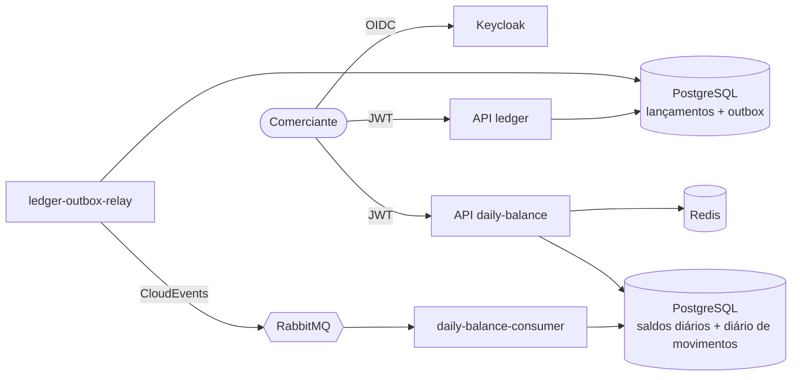

# Cash Flow — Documentação de Arquitetura

Documentação do projeto do desafio de fluxo de caixa: um comerciante registra créditos e débitos diários e consulta o saldo diário consolidado. O [README](../README.md) do repositório explica como executar a solução e resume cada decisão; os documentos abaixo aprofundam cada tema.

## Guia de leitura

| #   | Documento                                                                    | Responde                                                                                                  | Item do desafio               |
| --- | ---------------------------------------------------------------------------- | --------------------------------------------------------------------------------------------------------- | ----------------------------- |
| 1   | [Domínios de negócio e capacidades](01-business-domains-and-capabilities.md) | Quais são os domínios, os bounded contexts e as capacidades de negócio? O que significa cada termo?       | Obrigatório                   |
| 2   | [Requisitos](02-requirements.md)                                             | O que exatamente o sistema deve fazer, com quais metas de qualidade, e como cada uma é verificada?        | Obrigatório                   |
| 3   | [Arquitetura alvo](03-target-architecture.md)                                | Como a solução é estruturada, como fluem dados e eventos e como é implantada em produção?                 | Obrigatório                   |
| 4   | [Arquitetura de transição](04-transition-architecture.md)                    | Como migrar um sistema legado para a arquitetura alvo com segurança?                                      | Diferencial                   |
| 5   | [Estimativa de custos](05-cost-estimate.md)                                  | Quanto custam infraestrutura e licenças por ambiente, e como reduzir esse custo?                          | Diferencial                   |
| 6   | [Segurança](06-security.md)                                                  | Quais ameaças são tratadas e quais critérios se aplicam a serviços que consomem ou se integram às APIs?   | Diferencial                   |
| 7   | [Operação](07-operations.md)                                                 | Quais SLOs são medidos, o que fazer quando cada alerta dispara e como se recuperar de desastres?          | Diferencial (observabilidade) |
| 8   | [Evoluções futuras](08-future-evolutions.md)                                 | O que viria a seguir e quais são as limitações conhecidas hoje?                                           | Sugerido pelo desafio         |
| —   | [Registros de decisão de arquitetura (ADRs)](adr/README.md)                  | Por que cada decisão relevante foi tomada, quais alternativas foram descartadas e quais são os trade-offs | Obrigatório (justificativas)  |

## A solução em uma página

- **Dois bounded contexts, dois serviços, nenhum acoplamento síncrono.** O ledger registra lançamentos e publica eventos por meio de um Transactional Outbox; o consolidado (daily balance) consome esses eventos e mantém um modelo de leitura materializado. O ledger continua funcionando quando o consolidado está fora do ar.
- **Efeito exatamente uma vez sobre entrega pelo menos uma vez.** Nenhum evento é perdido (outbox, publisher confirms, filas duráveis) e nenhum é contado duas vezes (diário de movimentos aplicados com chave por evento e por lançamento).
- **Leituras rápidas e resilientes.** O consolidado responde a partir de um modelo pré-calculado, guardado em cache no Redis, com fallback para o último relatório conhecido quando o banco falha.
- **Requisitos verificados.** Testes automatizados comprovam os dois requisitos não funcionais do desafio: 0 falhas no ledger durante a queda completa do consolidado e 0% de perda a 50 req/s.

## Números principais

| Medida                                                   | Resultado                                                          |
| -------------------------------------------------------- | ------------------------------------------------------------------ |
| Falhas do ledger com o consolidado fora do ar por 30 s   | 0 de 900 lançamentos                                               |
| Lançamentos consolidados após a queda                    | 900 de 900, créditos iguais ao centavo                             |
| Consolidado a 50 req/s por 2 minutos                     | 6.001 requisições, 0% de falhas, p95 de 6,5 ms                     |
| Consolidado a 50 req/s com o Redis ou o banco fora do ar | 0% de falhas                                                       |
| Teste de estresse com uma única réplica                  | 400 req/s, 0% de falhas, p95 de 20,9 ms                            |
| Tempo entre o registro e a consolidação                  | p50 de 0,26 s, p95 de 0,5 s                                        |
| Testes automatizados                                     | 307 de unidade, 41 de integração, suítes de carga e de resiliência |

## Convenções

- Os diagramas são escritos em [Mermaid](https://mermaid.js.org) e renderizam diretamente no GitHub.
- A documentação está em português; código, nomes de arquivos, identificadores, comandos e métricas permanecem em inglês, como no código-fonte.
- Afirmações sobre a implementação apontam para o código que as comprova. Recomendações de produção que ainda não estão implementadas são indicadas como tal.
