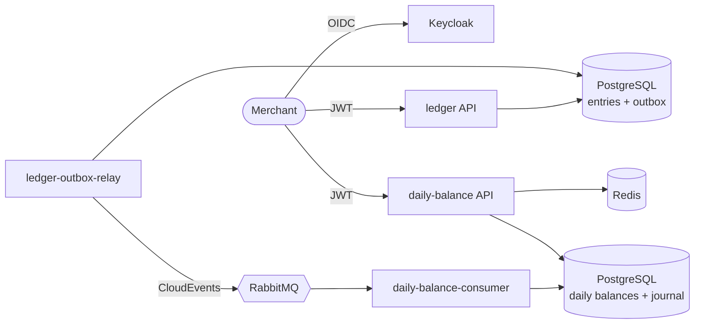

# Cash Flow — Architecture Documentation

Project documentation for the cash flow challenge: a merchant records daily credits and debits and consults the consolidated daily balance. The repository [README](../README.md) (in Portuguese) explains how to run the solution and summarizes each decision; the documents below go deeper.

## Reading guide

| #   | Document                                                                     | Answers                                                                                                   | Challenge item               |
| --- | ---------------------------------------------------------------------------- | --------------------------------------------------------------------------------------------------------- | ---------------------------- |
| 1   | [Business domains and capabilities](01-business-domains-and-capabilities.md) | What are the domains, bounded contexts and business capabilities? What does each term mean?               | Mandatory                    |
| 2   | [Requirements](02-requirements.md)                                           | What exactly must the system do, with which quality targets, and how is each one verified?                | Mandatory                    |
| 3   | [Target architecture](03-target-architecture.md)                             | How is the solution structured, how do data and events flow, and how is it deployed in production?        | Mandatory                    |
| 4   | [Transition architecture](04-transition-architecture.md)                     | How would a legacy system be migrated to the target safely?                                               | Differential                 |
| 5   | [Cost estimate](05-cost-estimate.md)                                         | How much do infrastructure and licenses cost per environment, and how can it be reduced?                  | Differential                 |
| 6   | [Security](06-security.md)                                                   | Which threats are addressed, and which criteria apply to services consuming or integrating with the APIs? | Differential                 |
| 7   | [Operations](07-operations.md)                                               | Which SLOs are measured, what to do when each alert fires, and how to recover from disasters?             | Differential (observability) |
| 8   | [Future evolutions](08-future-evolutions.md)                                 | What would come next, and what are the known limitations today?                                           | Encouraged by the challenge  |
| —   | [Architecture Decision Records](adr/README.md)                               | Why each significant decision was made, which alternatives were rejected, and the trade-offs              | Mandatory (justification)    |

## The solution in one page

- **Two bounded contexts, two services, no synchronous coupling.** The ledger records entries and publishes events through a Transactional Outbox; the daily balance consumes them and keeps a materialized read model. The ledger keeps working when the daily balance is down.
- **Exactly-once effect over at-least-once delivery.** Events are never lost (outbox, publisher confirms, durable queues) and never counted twice (journal of applied movements keyed by event and entry).
- **Fast, resilient reads.** The daily balance answers from a pre-computed model, cached in Redis, with a fallback to the last known report when its database fails.
- **Verified requirements.** Automated tests prove both non-functional requirements of the challenge: 0 ledger failures during a full daily balance outage and 0% loss at 50 req/s.

## Key numbers

| Measure                                                   | Result                                               |
| --------------------------------------------------------- | ---------------------------------------------------- |
| Ledger failures while the daily balance was down for 30 s | 0 of 900 entries                                     |
| Entries consolidated after the outage                     | 900 of 900, credits equal to the cent                |
| Daily balance at 50 req/s for 2 minutes                   | 6,001 requests, 0% failures, p95 6.5 ms              |
| Daily balance at 50 req/s with Redis or its database down | 0% failures                                          |
| Single replica stress test                                | 400 req/s, 0% failures, p95 20.9 ms                  |
| Time from recording to consolidation                      | p50 0.26 s, p95 0.5 s                                |
| Automated tests                                           | 307 unit, 41 integration, load and resilience suites |

## Conventions

- Diagrams are written in [Mermaid](https://mermaid.js.org) and render directly on GitHub.
- Code, names and technical documents are in English; the repository README is in Portuguese.
- Statements about the implementation link to the code that proves them. Production recommendations that are not implemented are marked as such.
